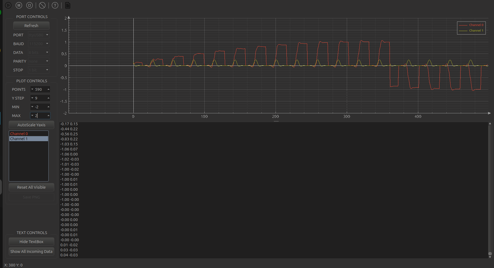

# DSP Day 1

## 1. The concept DSP in Signals
In DSP, a digital signal is represented as a sequence of discrete-time samples.
Denoted as:
$$
x[n]
$$
where:
$$
n = 0,1,2,3,\ldots,n 
$$
In this notation, `n` is the sample index, and `x[n]` is the value of the signal at the `n` sample.

In C, a digital signal is usually stored as an array.


`float32_t signal[N];`

In this example:
$$
x[0],x[1],x[2],...,x[N−1]
$$

In my code, it's represented as:

`_5hz_signal`

`inputSignal_f32_1kHz_15kHz`

`impulse_response`

## 2. Signal Length

In an embedded program, a digital signal usually has a finite length.

For example, in the code:

```c
#define HZ_5_SIG_LEN         301
#define _1kHz_15kHz_SIG_LEN  320
#define IMPULSE_RESPOND_LEN  29
```

These macros define the length of each signal:

* `_5hz_signal` has **301 samples**.
* `inputSignal_f32_1kHz_15kHz` has **320 samples**.
* `impulse_response` has **29 samples**.

The signal length determines:

* the number of samples that need to be processed,
* the amount of RAM required,
* the computation time,
* the output length after convolution.

In DSP on microcontrollers, signal length is very important because both RAM capacity and processing speed are limited.

## 3. The `_5hz_signal` Signal

The following array:

```c
float32_t _5hz_signal[HZ_5_SIG_LEN];
```

represents a **5 Hz sine signal** that has been sampled and stored in the program.

From a DSP point of view, this signal can be represented as:

$$
x[n]
$$

In this program, `_5hz_signal` is used to calculate basic statistical values, including:

* **mean**
* **variance**
* **standard deviation**

These values help describe the characteristics of the signal in the **time domain**.


## 4. Mean — Average Value

The **mean** is the average value of all samples in a signal.

For a digital signal:

$$
x[0], x[1], x[2], \ldots, x[N-1]
$$

the mean is calculated as:

$$
\mu = \frac{1}{N} \sum_{n=0}^{N-1} x[n]
$$

where:

* $\mu$ is the **mean** value,
* $N$ is the number of samples,
* $x[n]$ is the value of the signal at sample index `n`.

## Meaning of Mean

The mean indicates the **average level** of the signal.

If a signal oscillates around zero, its mean is usually close to zero.

For example, with an ideal sine wave:

$$
x[n] = \sin(\omega n)
$$

if the signal is sampled over a complete number of periods, the positive and negative values cancel each other out. Therefore:

$$
\mu \approx 0
$$

If the mean is significantly different from zero, the signal may contain a **DC offset** component.

In general:

* **Mean ≈ 0** → the signal is balanced around the zero axis.
* **Mean > 0** → the signal is shifted upward.
* **Mean < 0** → the signal is shifted downward.

```c
void mean_signals(float32_t *pSrc,uint32_t siglen,float32_t *pRes)
{
    float32_t sum =0.0f;
    for(uint32_t i =0;i<siglen;i++)
    {
        sum = sum + pSrc[i];
    }
    *pRes=sum/(float32_t)siglen;
}
```

## 5. Variance — Signal Variation

**Variance** indicates how strongly a signal varies around its mean value.

The formula for **sample variance** is:

$$
s^2 = \frac{1}{N-1} \sum_{n=0}^{N-1} \left(x[n] - \mu\right)^2
$$

where:

* $s^2$ is the **sample variance**,
* $x[n]$ is the signal sample at index `n`,
* $\mu$ is the **mean** value,
* $N$ is the number of samples.

## Meaning of Variance

Variance describes the level of variation of a signal around its mean.

In general:

* **Large variance** → the signal changes strongly around the mean.
* **Small variance** → the signal changes only slightly around the mean.

For example:

* A nearly constant signal has a **small variance**.
* A strongly oscillating signal has a **large variance**.

For sensor signals, variance can be used to evaluate the amount of fluctuation or noise in the signal.

***Note***:

* Divide by `N`     → used when the data represents the entire signal.

* Divide by `N - 1` → used when the data is only a sample used for estimation.

```c
void variance_sample_signals(float32_t *pSrc,uint32_t siglen,float32_t *pRes)
{
    float32_t sum=0.0f;
    float32_t mean=0.0f;
    mean_signals(pSrc,siglen,&mean);
    for(uint32_t i=0;i<siglen;i++)
    {
       // sum = sum + powf((pSrc[i]-mean),2);
       sum = sum + (pSrc[i]-mean)*(pSrc[i]-mean);
    }
    *pRes=sum/(float32_t)(siglen-1);
}
```

## 6. Standard Deviation

**Standard deviation** is the square root of variance:

$$
s = \sqrt{s^2}
$$

## Meaning of Standard Deviation

Standard deviation indicates the average amount of deviation of the samples from the mean value.

Compared with variance, standard deviation is easier to understand because it has the same unit as the original signal.

For example:

* A nearly flat signal has a **small standard deviation**.
* A signal with large amplitude changes has a **large standard deviation**.

In the current project:

* **mean**
* **variance**
* **standard deviation**

are the first three basic steps used to understand the statistical characteristics of a signal in the **time domain**.
```c
void standard_deviation_sample_signals(float32_t *pSrc,uint32_t siglen,float32_t *pRes)
{
    float32_t temp=0.0f;
    variance_sample_signals(pSrc,siglen,&temp);
    *pRes=sqrtf(temp);
}
```

## 7. Input Signal: 1 kHz + 15 kHz

The array:

```c
inputSignal_f32_1kHz_15kHz
```

can be understood as an input signal that contains two frequency components:

* **1 kHz**
* **15 kHz**

Mathematically, this signal can be considered as the sum of two sine waves:

$$
x[n] = x_1[n] + x_2[n]
$$

where:

$$
x_1[n]
$$

is the **1 kHz component**, and:

$$
x_2[n]
$$

is the **15 kHz component**.

The purpose of this type of signal is to test the behavior of a filter.

For example, if the filter is a **low-pass filter**:

* the **1 kHz** component may be preserved,
* the **15 kHz** component may be attenuated.

If the filter is a **high-pass filter**:

* the **1 kHz** component may be attenuated,
* the **15 kHz** component may be preserved.

Therefore, a signal containing multiple frequency components helps us observe how the filter affects each frequency component.

---

## 8. Impulse Response

The **impulse response** is the output of a system when the input is a unit impulse.

The impulse response is denoted as:

$$
h[n]
$$

The unit impulse is denoted as:

$$
\delta[n]
$$

By definition:

> If the input is $\delta[n]$, the output of the system is $h[n]$.

In other words:

$$
\delta[n] \rightarrow \text{system} \rightarrow h[n]
$$

The impulse response is very important because, for an **LTI system**, if we know $h[n]$, we can determine the output of the system for any input signal $x[n]$.

In the current code:

```c
float32_t impulse_response[IMPULSE_RESPOND_LEN];
```

represents:

$$
h[n]
$$

That means `impulse_response` is the impulse response of the filter.

---

## 9. LTI System

**LTI** stands for:

```text
Linear Time-Invariant
```

An LTI system has two main properties:

* **Linear** → the system is linear.
* **Time-Invariant** → the system does not change over time.

### Linear

A system is linear if scaling or adding input signals produces the same scaling or addition at the output.

For example, if:

$$
x_1[n] \rightarrow y_1[n]
$$

and:

$$
x_2[n] \rightarrow y_2[n]
$$

then, for a linear system:

$$
a x_1[n] + b x_2[n] \rightarrow a y_1[n] + b y_2[n]
$$

This means the system follows the principle of **superposition**.

### Time-Invariant

A system is time-invariant if its behavior does not change with time.

If the input signal is delayed by a certain number of samples, the output will also be delayed by the same number of samples.

The shape and behavior of the output remain unchanged.

---

## 10. Convolution

For an LTI system, the output is calculated by performing **convolution** between the input signal and the impulse response.

The notation is:

$$
y[n] = x[n] * h[n]
$$

The general convolution formula is:

$$
y[n] = \sum_{k=-\infty}^{\infty} x[k]h[n-k]
$$

For a **causal FIR filter** in code, the commonly used formula is:

$$
y[n] = \sum_{k=0}^{K-1} h[k]x[n-k]
$$

where:

* $x[n]$ is the **input signal**,
* $h[n]$ is the **impulse response**,
* $y[n]$ is the **output signal**,
* $K$ is the length of the impulse response.

### Intuitive Meaning

Each output sample $y[n]$ is created by taking the current input sample and several past input samples, multiplying them by the filter coefficients $h[k]$, and then summing the results.

For example, if the filter has 5 coefficients:

$$
h[0], h[1], h[2], h[3], h[4]
$$

then:

$$
y[n] = h[0]x[n] + h[1]x[n-1] + h[2]x[n-2] + h[3]x[n-3] + h[4]x[n-4]
$$

Therefore, the current output does not depend only on the current input sample. It also depends on previous input samples.

### Another Intuitive View: Shifting the Impulse Response

Another useful way to understand convolution is to look at it as **shifting copies of the impulse response**.

Each input sample $x[m]$ creates a scaled copy of the impulse response $h[n]$, shifted to the position $m$.

If the impulse response has length 3:

$$
h[0], h[1], h[2]
$$

then one input sample $x[m]$ affects three output samples:

$$
y[m], y[m+1], y[m+2]
$$

For example:

* $x[4]$ affects $y[4]$, $y[5]$, and $y[6]$.
* $x[5]$ affects $y[5]$, $y[6]$, and $y[7]$.
* $x[6]$ affects $y[6]$, $y[7]$, and $y[8]$.

Now consider the output sample:

$$
y[6]
$$

The sample $y[6]$ receives contributions from three shifted copies of the impulse response:

* the copy created by $x[4]$,
* the copy created by $x[5]$,
* the copy created by $x[6]$.

Therefore:

$$
y[6] = x[4]h[2] + x[5]h[1] + x[6]h[0]
$$

This can also be written in the standard FIR form:

$$
y[6] = h[0]x[6] + h[1]x[5] + h[2]x[4]
$$

These two forms are equivalent.

#### Visual Table

Assume the impulse response has length 3:

$$
h[0], h[1], h[2]
$$

The shifted copies can be visualized as:

```text
x[4]h[n-4]:    y[4]       y[5]       y[6]
               x[4]h[0]   x[4]h[1]   x[4]h[2]

x[5]h[n-5]:                y[5]       y[6]       y[7]
                           x[5]h[0]   x[5]h[1]   x[5]h[2]

x[6]h[n-6]:                            y[6]       y[7]       y[8]
                                       x[6]h[0]   x[6]h[1]   x[6]h[2]
```

At the column $y[6]$, we add all terms that overlap at that position:

$$
y[6] = x[4]h[2] + x[5]h[1] + x[6]h[0]
$$

So, the correct interpretation is:

> Because the impulse response has length 3, an output sample in the middle region, such as $y[6]$, can receive contributions from up to 3 input samples.

Specifically, $y[6]$ receives contributions from:

$$
x[4], x[5], x[6]
$$

It is not one impulse response passing through $y[6]$ three times. Instead, there are three different shifted copies of the impulse response, created by three different input samples, and they overlap at the same output position $y[6]$.


```c
void convolution_signals(float32_t *pSrc, float32_t *impulse_respond,float32_t *pRes,uint32_t Src_len,uint32_t imRes_len)
{
	uint32_t output_len_signals=Src_len+imRes_len-1;
	float32_t sum=0.0f;
	for(uint32_t i=0;i<output_len_signals;i++)
	{
		sum=0.0f;
		for(uint32_t j=0;j<imRes_len;j++)
		{
			sum = sum + (impulse_respond[j]*pSrc[i-j]);
			serial_plot_signals("$%.2f %.2f;",sum,impulse_respond[j]);
			pesudo_delay(100);
		}
		pRes[i]=sum;

	}
}
```
---

## 11. FIR Filter

**FIR** stands for:

```text
Finite Impulse Response
```

This means:

> The filter has a finite-length impulse response.

In the current code:

```c
#define IMPULSE_RESPOND_LEN 29
```

the `impulse_response` array has **29 samples**.

Because the impulse response has a finite length, this filter is an **FIR filter**.

It can also be called:

```text
29-tap FIR filter
```

where:

* **tap** means one filter coefficient,
* **29 taps** means 29 filter coefficients.

The coefficients are:

$$
h[0], h[1], h[2], \ldots, h[28]
$$

The FIR formula in the current project is:

$$
y[n] = \sum_{k=0}^{28} h[k]x[n-k]
$$

Written fully:

$$
y[n] = h[0]x[n] + h[1]x[n-1] + h[2]x[n-2] + \cdots + h[28]x[n-28]
$$

---

## 12. Why Is Convolution Filtering?

In DSP, **filtering** means modifying a signal for a specific purpose.

For example:

* keeping low frequencies and reducing high frequencies,
* keeping high frequencies and reducing low frequencies,
* removing noise,
* smoothing a signal,
* extracting a desired frequency range.

With an FIR filter, filtering is performed using convolution:

$$
y[n] = x[n] * h[n]
$$

where:

* $x[n]$ is the signal before filtering,
* $h[n]$ is the characteristic of the filter,
* $y[n]$ is the signal after filtering.

Therefore:

> Convolution between the input signal and the impulse response is the filtering process.

In the current project:

```text
inputSignal_f32_1kHz_15kHz
```

represents the input signal:

$$
x[n]
$$

```text
impulse_response
```

represents the FIR coefficients or impulse response:

$$
h[n]
$$

```text
convoulution_signals
```

represents the output signal after filtering:

$$
y[n]
$$

---

## 13. Output Length of Convolution

If the input signal has length:

$$
N
$$

and the impulse response has length:

$$
K
$$

then the length of the convolution output is:

$$
N_y = N + K - 1
$$

In the current project:

$$
N = 320
$$

$$
K = 29
$$

Therefore:

$$
N_y = 320 + 29 - 1 = 348
$$

So the output signal needs **348 samples**.

This is why the output array is usually declared using the form:

```c
input_length + impulse_response_length - 1
```

---

## 14. Mapping the Theory to the Current Project

The DSP theory can be mapped to the current code as follows:

| Code Component               | DSP Meaning                                                     |
| ---------------------------- | --------------------------------------------------------------- |
| `_5hz_signal`                | Signal used to calculate mean, variance, and standard deviation |
| `inputSignal_f32_1kHz_15kHz` | Input signal $x[n]$                                             |
| `impulse_response`           | Impulse response $h[n]$, also the FIR filter coefficients       |
| `convolution_signals()`      | Function that performs convolution                              |
| `convoulution_signals`       | Output signal $y[n]$ after filtering                            |

In summary:

$$
x[n] * h[n] = y[n]
$$

In the project:

```text
inputSignal_f32_1kHz_15kHz * impulse_response = convoulution_signals
```

This means the input signal is filtered by the FIR filter, and the result is stored as the output signal.


# Implement
```c
void UART_init()
{
    volatile uint32_t *RCC_APB2ENR = (volatile uint32_t *)(0x40023800 + 0x44);
    volatile uint32_t *USART_CR1   = (volatile uint32_t *)(USART1_BASE + 0x0C);
    volatile uint32_t *USART_BRR   = (volatile uint32_t *)(USART1_BASE + 0x08);
    volatile uint32_t *ISER1       = (volatile uint32_t *)(0xE000E104);

    // Bật clock USART1
    *RCC_APB2ENR |= (1 << 4);

    // Tắt USART trước khi config
    *USART_CR1 = 0;

    // BRR đúng cho 115200 @ 16MHz
    *USART_BRR = (8U << 4) | 11U;

    // Bật UE + TE + RE + RXNEIE
    *USART_CR1 = (1<<13)|(1<<3)|(1<<2)|(1<<5);

    // NVIC USART1 IRQ37
    *ISER1 |= (1 << (37 - 32));
}

void UartSend1Byte(char c)
{
	volatile uint32_t *USART_SR = (volatile uint32_t *)(USART1_BASE);
	volatile uint32_t *USART_DR = (volatile uint32_t *)(USART1_BASE + 0x04);

    // Chờ cờ TXE (Transmit data register empty) - Bit 7
	while (((*USART_SR >> 7) & 1) == 0);
	*USART_DR = (uint8_t)c;

//    // Chờ cờ TC (Transmission complete) - Bit 6
//	while (((*USART_SR >> 6) & 1) == 0);
    // Xóa cờ TC
	*USART_SR &= ~(0b1 << 6);
}

void UartSendString(char *str)
{
    // Tính strlen 1 lần thôi cho tối ưu
    uint32_t len = strlen(str);
	for(uint32_t i = 0; i < len; i++)
	{
		UartSend1Byte(str[i]);
	}
}

// Hàm ngắt
void USART1_IRQHandler()
{
	volatile uint32_t *USART_SR = (volatile uint32_t *)(USART1_BASE);
	volatile uint32_t *USART_DR = (volatile uint32_t *)(USART1_BASE + 0x04);

    // Kiểm tra xem ngắt có thực sự do RXNE gây ra không (an toàn nhất)
    if (((*USART_SR >> 5) & 1) == 1)
    {
        // Đọc DR tự động xóa cờ RXNE
        buffer[buffer_index] = *USART_DR;
        buffer_index = (buffer_index + 1) % 32; //ring buffer

        // Toggle LED để debug
        GPIO_Toggle_Pin(&hgpiod, GPIO_PIN_NO_12);
    }
}
void print(const char *fmt, ...)
{
    char buf[160];
    va_list args;
    int len;

    va_start(args, fmt);
    len = vsnprintf(buf, sizeof(buf), fmt, args);
    va_end(args);

    if (len <= 0) {
        return;
    }

    if (len > (int)sizeof(buf)) {
        len = (int)sizeof(buf);
    }

    UartSendString(buf);
   // GPIO_Toggle_Pin(&hgpiod, GPIO_PIN_NO_13);
}
void serial_plot_signals(const char *fmt, ...)
{

	    va_list args;
	    char buf[160];
	    va_start(args, fmt);
	    int len;
	       va_start(args, fmt);
	       len = vsnprintf(buf, sizeof(buf), fmt, args);
	       va_end(args);

	       if (len <= 0) {
	           return;
	       }

	       if (len > (int)sizeof(buf)) {
	           len = (int)sizeof(buf);
	       }
	       UartSendString(buf);
}
```
**Using visualization tool display result** [Serrial Plotter](https://github.com/CieNTi/serial_port_plotter)

