# I2C Driver

## Mục lục

1. [Các mode của I2C](#1-các-mode-của-i2c)
2. [I2C Physical Layer](#2-i2c-physical-layer)
3. [I2C Protocol](#3-i2c-protocol)
   - [3.3 Clock synchronization & arbitration](#33-clock-synchronization--arbitration--tranh-chấp-giữa-nhiều-controller)
   - [3.4 Clock stretching](#34-clock-stretching)
   - [3.5 Electrical specifications & pullup resistor sizing](#35-electrical-specifications--pullup-resistor-sizing)
     - [b1) Tính tRISE → RP(max)](#b1-tính-trise--rpmax)
     - [b2) Tính RP(min)](#b2-tính-rpmin)
     - [b3) Tính tLOW / tHIGH → fSCL](#b3-tính-tlow--thigh--fscl)
4. [Communication Frames](#4-communication-frames)
5. [Nâng cao I2C](#5-nâng-cao-i2c)
   - [5.1 Reserved addresses (địa chỉ dành riêng)](#51-reserved-addresses-địa-chỉ-dành-riêng)
   - [5.2 I²C buffer (bộ đệm bus)](#52-i2c-buffer-bộ-đệm-bus)
   - [5.3 10-bit addressing](#53-10-bit-addressing)
   - [5.4 Bus clear (phục hồi bus bị kẹt)](#54-bus-clear-phục-hồi-bus-bị-kẹt)
6. [Tài liệu tham khảo](#6-tài-liệu-tham-khảo)

---

## 1. Các mode của I2C

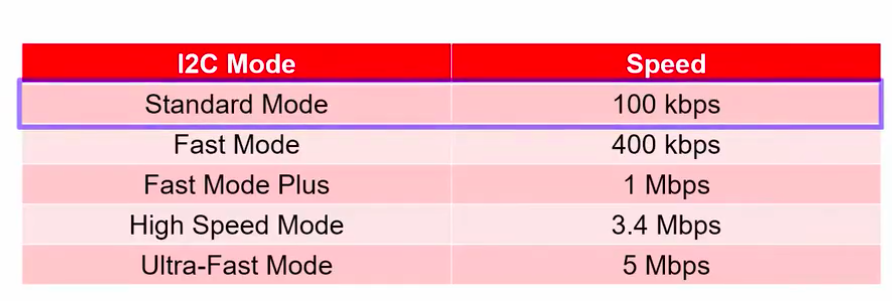

I2C hỗ trợ nhiều tốc độ truyền nhận, mỗi mode có giới hạn baud khác nhau:

| Mode                          | Tốc độ tối đa | Ghi chú                                         |
|-------------------------------|---------------|--------------------------------------------------|
| **Standard-mode (Sm)**        | 100 kbit/s    | Mode phổ thông, tương thích mọi thiết bị I2C     |
| **Fast-mode (Fm)**            | 400 kbit/s    | Tăng tốc, vẫn giữ tính tương thích ngược        |
| **Fast-mode Plus (Fm+)**      | 1 Mbit/s      | Drive mạnh hơn, cho phép line capacitance cao hơn|
| **High-speed mode (Hs)**     | 3.4 Mbit/s    | Yêu cầu electrical setup riêng, ít dùng          |
| **Ultra Fast-mode (UFm)**     | 5 Mbit/s      | Một chiều (unidirectional), không có ACK         |

### Lưu ý khi chọn mode

- **Sm / Fm / Fm+** là các mode hai chiều (bidirectional) có cơ chế ACK — **implement gần như giống nhau**, chỉ khác thông số CCR/TRISE và cấu hình `DUTY` bit trong `I2C_CCR`. Cùng dùng chung flow: START → gửi address → data → STOP.
- **UFm** truyền một chiều, không có ACK, dùng push-pull thay vì open-drain nên không an toàn bằng các mode kia — cần xử lý khác.
- **Hs-mode** (3.4 Mbit/s) có cơ chế riêng theo UM10204 §5.3: controller phát **Hs-mode Controller code** (8 bit, từ `0000 1000` đến `0000 1111`) ở tốc độ F/S để giành bus, sau đó chuyển sang tốc độ cao; SCL dùng thêm **current-source pull-up** (chỉ 1 controller được bật tại một thời điểm) để rút ngắn rise time; trong quá trình truyền Hs **không còn arbitration/clock synchronization**. STM32F4 không hỗ trợ Hs-mode nên tài liệu này không đi sâu.
- Tốc độ thực tế phụ thuộc vào **xung clock nguồn** ( Peripheral Clock PCLK1 cho STM32F4) và **duty cycle** cấu hình trong peripheral. Chi tiết tính CCR/TRISE có trong RM0090 và sẽ có sample code riêng.

---

## 2. I2C Physical Layer

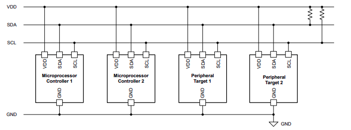

> Phần này chỉ cover **I2C tiêu chuẩn**. Các biến thể đặc biệt như **SMBus**, **PMBus**, **10-bit addressing**, **Hs-mode**... sẽ để ở mục riêng sau.

### 2.1 Two-Wire Communication

I2C dùng **2 đường truyền chung** (shared bus) cho mọi thiết bị trên bus:

- **SCL** (Serial Clock) — xung nhịp, do **controller** (master) tạo ra, dùng để clock data vào/ra target. Ngoại lệ duy nhất: target có thể **kéo SCL xuống LOW** để bắt controller chờ (clock stretching — xem 3.4), hoặc các controller khác cùng kéo SCL khi tranh chấp bus (xem 3.3).
- **SDA** (Serial Data) — đường data hai chiều, truyền config/code giữa controller và target.

Đặc điểm:

- **Half-duplex**: tại một thời điểm chỉ có 1 thiết bị (controller hoặc target) gửi data trên bus.
- **Multi-controller + multi-target**: nhiều master và nhiều slave cùng chia sẻ bus. Master bắt đầu/kết thúc giao tiếp → loại trừ bus contention.
- **Địa chỉ target**: mỗi target cần một địa chỉ 7-bit (hoặc 10-bit) **không trùng nhau trong cùng một segment bus** để truy cập độc lập. Đây là yêu cầu thiết kế hệ thống — giao thức không tự ngăn hai thiết bị trùng địa chỉ cùng tồn tại; nếu trùng, cả hai cùng ACK và gây xung đột (xem 5.2-e).
- Cả 2 đường SDA + SCL đều cần **pullup resistor** lên VDD (do kết nối **open-drain**). Ngoại lệ theo UM10204 §3.1.1: hệ thống **chỉ có 1 controller và không có thiết bị nào stretch clock** thì SCL của controller có thể dùng push-pull; còn SDA vẫn luôn open-drain.

So với SPI (full-duplex, 4 dây: SCLK + 2 data + CS), I2C đánh đổi tốc độ/độ phức tạp để chỉ dùng 2 dây.

### 2.2 Open-Drain Connection

Cả SDA và SCL dùng kết nối **open-drain** qua transistor NMOS. Thiết bị **không thể chủ động kéo đường lên cao** — chỉ có thể **kéo low** (NMOS ON) hoặc **nhả đường** (NMOS OFF) để pullup resistor kéo lên VDD. Đây là điểm khác biệt cốt lõi so với push-pull (vừa kéo high vừa kéo low).

Trạng thái mức logic trên bus hoàn toàn do NMOS ON/OFF quyết định:

#### a) NMOS ON — kéo đường LOW

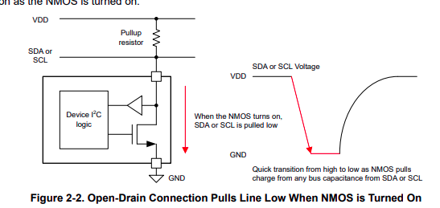

Khi NMOS **ON**, transistor dẫn dòng → dòng chạy qua pullup resistor xuống GND, kéo đường SDA/SCL xuống **mức LOW**.

- Chuyển high→low **nhanh** vì NMOS chủ động kéo (active drive), xả nhanh điện tích trên bus capacitance.
- Tốc độ chuyển phụ thuộc vào **drive strength** của NMOS và **bus capacitance**.

#### b) NMOS OFF — pullup kéo đường HIGH

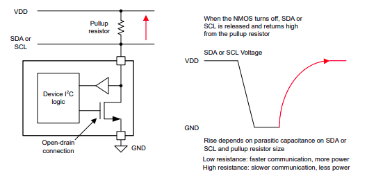

Khi NMOS **OFF**, thiết bị ngừng kéo dòng → pullup resistor kéo đường SDA/SCL lên **VDD**.

- Chuyển low→high **chậm hơn** vì đường được kéo thụ động qua resistor, phải nạp lại bus capacitance.
- Bị giới hạn bởi **RC time constant** (R = pullup resistor, C = tổng capacitance trên bus) → đây là nguyên nhân chính giới hạn tốc độ tối đa của bus và là lý do phải tính pullup resistor cẩn thận.

#### Bảng tổng kết hai trạng thái

| Trạng thái NMOS | Mức logic | Ai kéo?                     | Tốc độ chuyển              |
|-----------------|-----------|-----------------------------|-----------------------------|
| **ON**          | LOW       | NMOS kéo xuống GND          | Nhanh (NMOS active drive)  |
| **OFF**         | HIGH      | Pullup resistor kéo lên VDD | Chậm (phụ thuộc RC bus)    |

### 2.3 Vì sao open-drain là bắt buộc

I2C có nhiều thiết bị cùng chia sẻ 1 đường (multi-controller, multi-target). Nếu dùng kết nối **push-pull** (vừa kéo high vừa kéo low chủ động) thì sẽ có nguy cơ **short-circuit** khi hai thiết bị cùng lúc kéo đường về hai mức khác nhau.

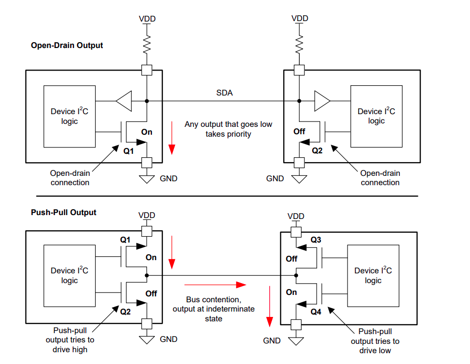

Như hình minh hoạ: một thiết bị kéo đường lên **VDD** (PMOS ON), thiết bị khác kéo đường xuống **GND** (NMOS ON) cùng lúc. Kết quả là dòng chạy thẳng từ VDD qua PMOS → NMOS xuống GND, không qua pullup resistor → **ngắn mạch (contention)**, có thể làm hỏng transistor và đường bus bị kẹt ở mức không xác định.

**Open-drain giải quyết vấn đề này** bằng cách **chỉ cho phép kéo low hoặc nhả** (không bao giờ kéo high chủ động):

- Mức HIGH: tất cả thiết bị đều nhả (NMOS OFF) → pullup resistor kéo đường lên VDD.
- Mức LOW: chỉ cần **một** thiết bị kéo low (NMOS ON) → đường bị kéo low.

Đây chính là logic **wired-AND**: đường chỉ HIGH khi **tất cả** thiết bị đều OFF; chỉ cần 1 thiết bị ON là cả đường bị LOW. Không bao giờ có tình trạng hai thiết bị đánh nhau, vì không ai "ép" đường lên high — chỉ có pullup resistor thụ động.

**Tradeoff**: vì rise time (low→high) phải đi qua pullup + bus capacitance → bị giới hạn bởi **RC time constant** → đây là lý do pullup resistor phải tính cẩn thận:
- Quá lớn → rise chậm → vi phạm spec tốc độ mode.
- Quá nhỏ → dòng qua NMOS khi ON quá cao → tiêu tốn điện + vi phạm spec mức LOW.

---

## 3. I2C Protocol

### 3.1 START and STOP condition

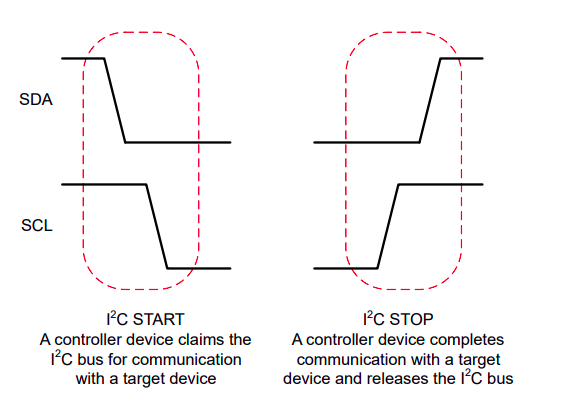

START và STOP là 2 điều kiện đặc biệt do **controller** (master) tạo ra để **chiếm bus** (START) và **nhả bus** (STOP). Chúng không phải là bit data mà là **sự thay đổi SDA trong khi SCL đang HIGH** — điều mà data bit thông thường không bao giờ làm. Controller nhận biết START hay STOP dựa vào **hướng chuyển của SDA** trong khoảng SCL HIGH đó:

| Điều kiện | SDA đổi khi SCL HIGH | Ý nghĩa           |
|-----------|----------------------|-------------------|
| **START** | High → Low           | Chiếm bus, bắt đầu|
| **STOP**  | Low → High           | Nhả bus, kết thúc |

**START condition** (controller chiếm bus):
1. Bus free: cả SDA và SCL đều HIGH (đã chờ đủ thời gian `tBUF` từ STOP trước đó).
2. Controller kéo **SDA xuống LOW** trước, giữ ít nhất `tHD;STA`.
3. Sau đó kéo **SCL xuống LOW**.
→ Khoảng chuyển high→low của SDA khi SCL đang HIGH = START. Sau đó SCL kéo low để bắt đầu clock bit đầu tiên, ép các controller khác phải giữ giao tiếp (bus đã bị chiếm).

**STOP condition** (controller nhả bus):
1. Controller nhả **SCL lên HIGH** trước.
2. Sau đó nhả **SDA lên HIGH** (giữ ít nhất `tSU;STO` giữa cạnh lên SCL và cạnh lên SDA).
→ Khoảng chuyển low→high của SDA khi SCL đang HIGH = STOP. Bus trở về free (cả 2 đường HIGH).

**Repeated START (Sr)** — START thứ hai trong cùng một giao tiếp:
1. Controller đã chiếm bus (SDA đang LOW hoặc vừa nhả sau bit ACK), SCL đang LOW.
2. Controller nhả SDA lên HIGH khi SCL vẫn LOW, chờ `tSU;STA`.
3. Nhả SCL lên HIGH, giữ `tHD;STA`, rồi kéo SDA xuống LOW khi SCL đang HIGH.
→ Sr có cùng dạng sóng với START, chỉ khác là xảy ra khi **bus đang busy** (controller đã chiếm bus) thay vì bus free. Sr cho phép bắt đầu message mới **không nhả bus** — dùng khi muốn đổi hướng truyền (write REG_ADDR rồi read) hoặc chuyển sang target khác mà không cho thiết bị khác xen vào giữa.

Sau STOP, controller phải chờ thời gian bus free tối thiểu **`tBUF`** (4.7 µs Standard / 1.3 µs Fast / 0.5 µs Fm+) trước khi phát START kế tiếp.

### 3.2 Logical Ones and Zeros

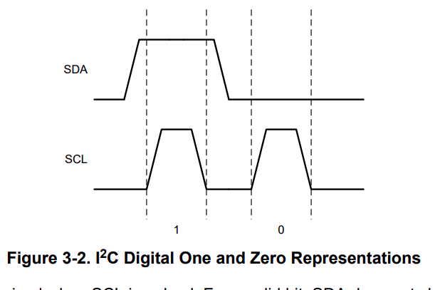

I2C truyền data theo bit, dùng SDA làm đường data và SCL làm xung clock định thời bit:

- **Logical 1**: controller **nhả SDA** (NMOS OFF) → pullup resistor kéo đường lên mức HIGH.
- **Logical 0**: controller **kéo SDA xuống** (NMOS ON) → đường ở mức LOW gần GND.

**Khi nào data hợp lệ / khi nào đổi SDA** (UM10204 §3.1.3 — data validity):

- Spec quy định theo **mức**, không quy định theo cạnh: **SDA phải ổn định trong toàn bộ khoảng SCL HIGH**. SDA **chỉ được phép đổi khi SCL đang LOW** (sau cạnh xuống của SCL, với set-up/hold time theo Table 11).
- Nếu SDA **đổi khi SCL đang HIGH** → đây không phải data bit, mà là **điều kiện điều khiển** (START, STOP hoặc repeated START — xem 3.1).
- Việc "lấy mẫu tại cạnh lên SCL" là **chi tiết implementation** của phần cứng số (nhiều peripheral dùng cạnh lên làm mốc sample nội bộ), không phải định nghĩa của protocol. Điều bắt buộc duy nhất là SDA ổn định suốt pha HIGH để bất kể receiver sample lúc nào trong pha đó cũng đọc đúng một giá trị.

> Quy tắc nhớ: **SCL HIGH = SDA phải đứng yên**; **SCL LOW = SDA được đổi** (chuẩn bị bit tiếp theo). Đổi SDA khi SCL HIGH = phát START/STOP/Sr.

**Chống nhiễu** không dựa vào việc "giữ SCL HIGH lâu hơn" mà dựa vào: ngưỡng input có **hysteresis** (noise margin `VnL = 0.1×VDD`, `VnH = 0.2×VDD` theo Table 11), SDA ổn định suốt pha HIGH, pull-up đúng giá trị và layout tốt. Nếu bus nhiễu, giải pháp là giảm `fSCL` hoặc cải thiện phần cứng — không có cơ chế protocol nào "kéo dài SCL HIGH để chống nhiễu".

### 3.3 Clock synchronization & arbitration — tranh chấp giữa nhiều controller

I2C cho phép **nhiều controller** cùng nằm trên bus. Khi 2 controller cùng muốn chiếm bus, phải có cơ chế phân giải mà không làm hỏng giao tiếp. Nhờ **open-drain + wired-AND** (đã nói ở 2.3), I2C giải quyết bằng **hai cơ chế riêng biệt** (UM10204 §3.1.7 và §3.1.8):

| Cơ chế | Diễn ra trên | Vai trò |
|--------|--------------|---------|
| **Clock synchronization** | SCL | Đồng bộ nhịp clock giữa các controller |
| **Arbitration** | SDA (khi SCL HIGH) | Quyết định controller nào được quyền tiếp tục truyền |

Hai cơ chế này **chỉ tồn tại trong hệ thống multi-controller** và **target không tham gia** vào quá trình arbitration. Trong hệ thống chỉ có 1 controller (đa số ứng dụng STM32 đơn giản) thì cả hai không bao giờ kích hoạt.

#### a) Tổng quan tranh chấp bus

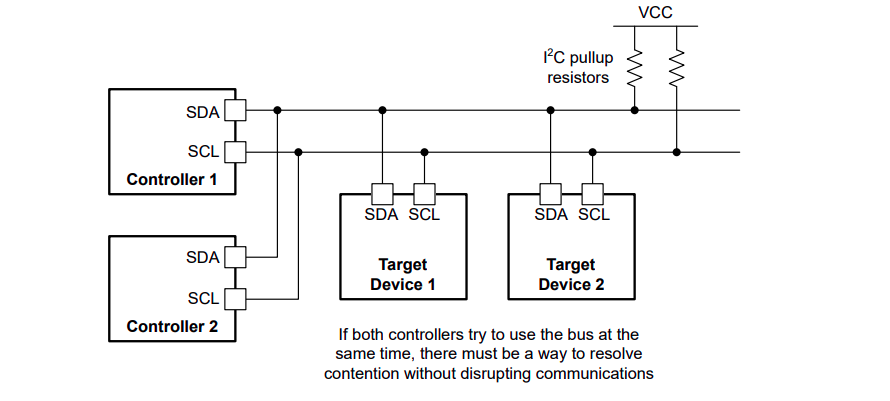

Hai controller có thể phát START gần như cùng lúc (trong cùng khoảng `tHD;STA`) → cả hai START đều hợp lệ trên bus → cần phân giải xem ai truyền tiếp.

#### b) Clock synchronization (đồng bộ xung — §3.1.7)

SCL cũng là open-drain → **wired-AND**: SCL chỉ HIGH khi **tất cả** controller đều nhả, và bị LOW ngay khi **một** controller kéo low.

| Controller 1 SCL | Controller 2 SCL | SCL bus (wired-AND) |
|-------------------|-------------------|----------------------|
| 0                 | 0                 | 0                    |
| 0                 | 1                 | 0                    |
| 1                 | 0                 | 0                    |
| 1                 | 1                 | 1                    |

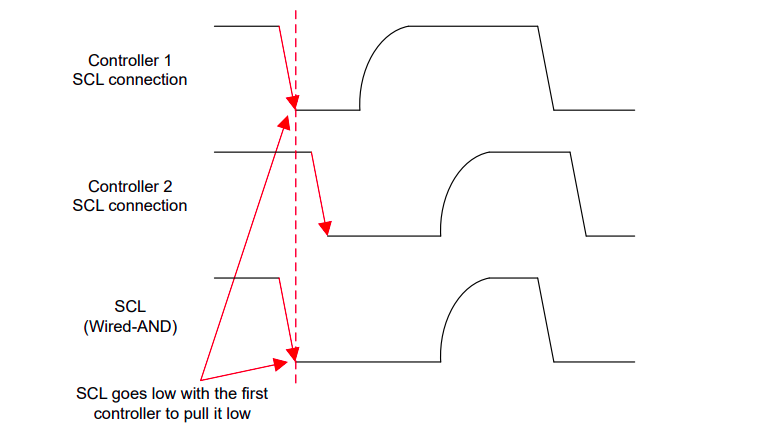

Cơ chế theo spec: cạnh xuống của SCL làm các controller **bắt đầu đếm pha LOW** của mình. Controller nào đếm xong pha LOW thì nhả SCL, nhưng nếu controller khác vẫn đang trong pha LOW thì SCL **vẫn bị giữ LOW**. Các controller có pha LOW ngắn hơn rơi vào **trạng thái chờ HIGH** (HIGH wait-state).

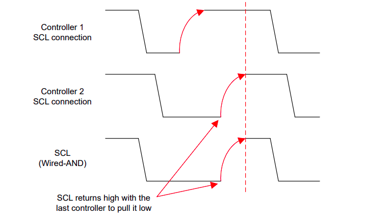

Khi **tất cả** controller đã đếm xong pha LOW, SCL được nhả và lên HIGH. Lúc này mọi controller bắt đầu đếm **pha HIGH**; controller nào đếm xong pha HIGH **trước** sẽ kéo SCL xuống LOW trước.

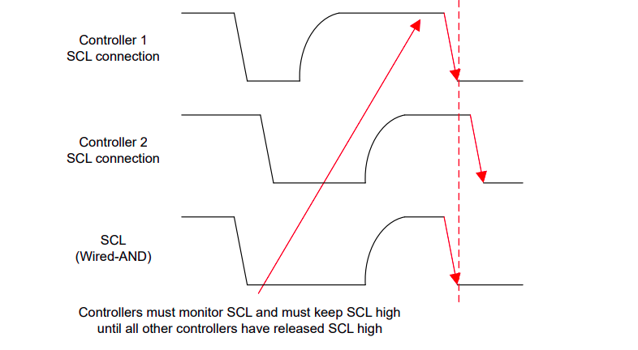

Mỗi controller phải **monitor SCL thực tế** và chỉ tiếp tục khi SCL thật sự đổi mức theo đúng nhịp tổng hợp.

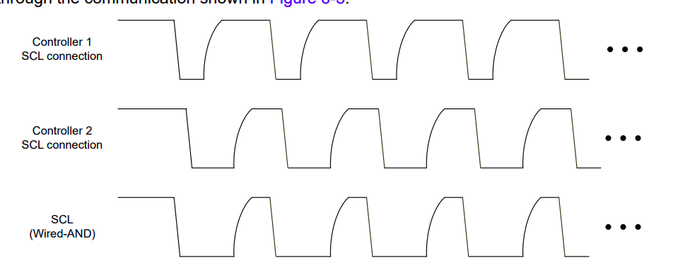

Kết quả (nguyên văn quy tắc §3.1.7):

> Pha LOW của SCL tổng hợp = pha LOW **dài nhất** trong các controller; pha HIGH = pha HIGH **ngắn nhất**.

Lưu ý: clock synchronization chỉ tạo ra nhịp clock chung — nó **không quyết định ai thắng ai thua**. Việc phân định thắng/thua là của arbitration bên dưới.

#### c) Arbitration trên SDA (§3.1.8)

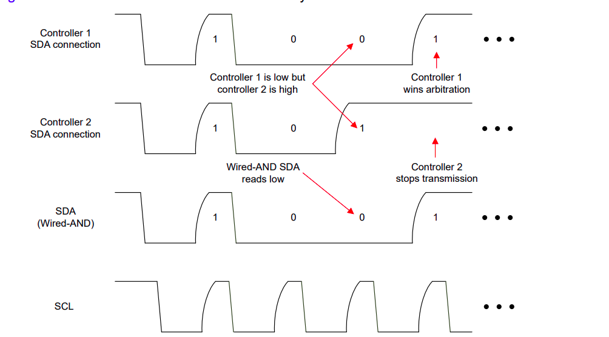

Arbitration diễn ra **bit-by-bit trên SDA, trong lúc SCL đang HIGH**:

- Mỗi bit, trong khi SCL HIGH, mỗi controller **so sánh mức SDA thực tế trên bus với bit mình vừa phát**.
- SDA là wired-AND → nếu một controller gửi **0** và controller kia gửi **1** cùng lúc, bus đọc được **0**.
- Controller nào **phát 1 nhưng đọc được 0** → biết mình **thua arbitration** → **tắt SDA output driver** (nhả bus) để không phá giao tiếp của controller thắng.
- Controller thắng tiếp tục truyền bình thường; **không mất dữ liệu nào** trong quá trình arbitration. Controller thua có thể tiếp tục tạo xung clock đến hết byte đang truyền, rồi phải **chờ bus free và truyền lại** từ đầu.
- Nếu hai controller gửi data giống hệt nhau từng bit, arbitration không phát sinh khác biệt — cả hai cùng truyền cho đến khi có bit khác nhau.
- Trường hợp đặc biệt: một controller có kèm chức năng target mà thua arbitration ngay ở address phase thì có thể chính controller thắng đang address **nó** → nó phải chuyển ngay sang target mode.

**Điều kiện không xác định (undefined condition):** arbitration đang diễn ra mà một controller phát repeated START hoặc STOP trong khi controller kia vẫn đang gửi data bit — các tổ hợp Sr+data, STOP+data, Sr+STOP đều là undefined. Thiết kế multi-controller phải tránh các tổ hợp này.

Vì quyền bus được quyết định **chỉ bởi address/data** mà các controller gửi, nên không có controller trung tâm và không có thứ tự ưu tiên trên bus.

### 3.4 Clock stretching

#### a) Clock stretching (target giữ SCL LOW)

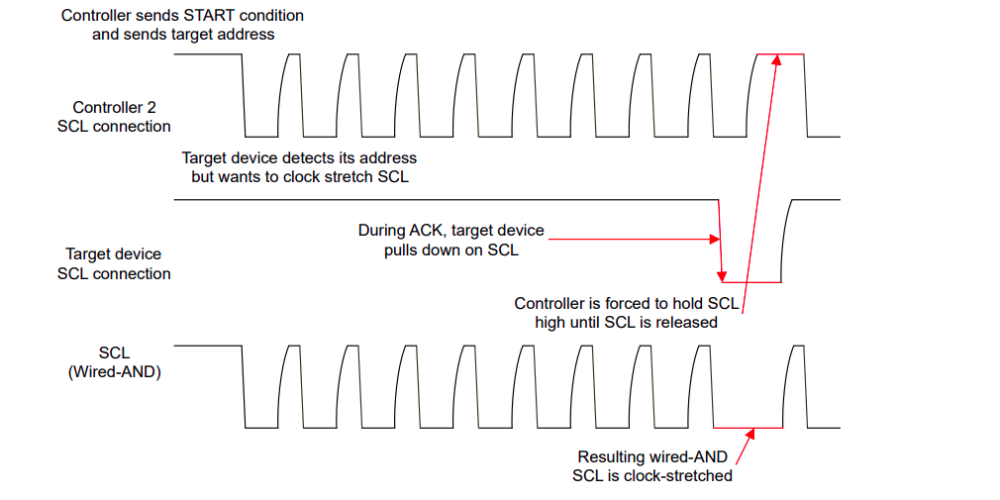

Bình thường SCL do controller điều khiển. Nhưng có những lúc target cần **chậm lại** và nó sẽ **kéo/giữ SCL ở mức LOW** để ép controller phải chờ. Đây là **lần duy nhất target được tác động lên SCL**.

Định nghĩa theo UM10204 §3.1.9:

> Clock stretching pauses a transaction by **holding the SCL line LOW**. The transaction cannot continue until the line is released HIGH again.

Stretching **luôn biểu hiện là pha LOW của SCL bị kéo dài** — không bao giờ là "giữ SCL HIGH lâu hơn". Lý do vật lý: target nối open-drain nên chỉ có 2 hành động — kéo SCL xuống LOW (NMOS ON) hoặc nhả (NMOS OFF). Target **không thể chủ động giữ đường ở HIGH** (HIGH chỉ tồn tại khi tất cả cùng nhả và pull-up kéo lên), và cũng **không thể ngăn controller kéo SCL xuống LOW**. Đòn bẩy duy nhất của target là giữ LOW: khi controller nhả SCL mong nó lên HIGH mà target vẫn kéo LOW → SCL thực tế vẫn LOW → controller thấy SCL chưa lên → phải chờ.

Clock stretching là **optional**: nhiều target không có SCL driver nên không thể stretch. Theo spec I2C: **không có giới hạn thời gian** target được phép giữ SCL LOW (các biến thể như SMBus có timeout riêng, vd 35 ms). Trên STM32F4, bit `NOSTRETCH` trong `I2C_CR1` điều khiển việc peripheral (ở target mode) có được phép stretch hay không.

Có 2 mức stretching theo spec:

**Byte level — stretch sau khi nhận xong 1 byte (phổ biến nhất):**

Target nhận xong 8 bit data + đã ACK, nhưng cần thêm thời gian trước byte kế tiếp. Nó **giữ SCL LOW sau bit ACK** cho đến khi sẵn sàng → controller rơi vào wait-state. Đây là dạng "handshake" tốc độ, dùng khi:

- Target vừa nhận address → cần thời gian đối chiếu địa chỉ, chuẩn bị mode read/write.
- Target vừa nhận data byte → cần thời gian lưu byte vào buffer/register nội, hoặc chuẩn bị byte tiếp theo để gửi lại controller.
- Nếu là ADC/DAC → cần thời gian chuyển đổi analog trước khi trả data.

**Bit level — kéo dài pha LOW của từng clock:**

Thiết bị có hardware I2C hạn chế (vd MCU bit-bang) có thể làm chậm bus bằng cách **kéo dài pha LOW của từng xung clock**. Tốc độ của controller tự thích ứng theo nhịp thật của bus.

> Controller phải chờ SCL thật sự lên HIGH rồi mới tiếp tục (đếm tHIGH chỉ bắt đầu khi SCL đọc được HIGH). Nếu cố phát tiếp trong khi target đang giữ LOW → vi phạm timing và data bị sai.

#### b) Phân tích dạng sóng với số liệu

Trích TI SBAA565: *"Khi target bắt đầu clock stretching, SCL vẫn ở low mặc dù controller đã nhả SCL. Vì target nắm clock, controller không thể tiếp tục SCL pulse cho đến khi target nhả SCL. Controller tiếp tục monitor SCL. Khi SCL thật sự lên high, controller mới đi qua ACK của target và truyền byte tiếp. Kết nối wired-AND của SCL cho thấy SCL bị kéo dài. Truyền data bị trễ do target mà không làm gián đoạn giao tiếp."*

**Khi không có clock stretching** — giả sử cấu hình danh định:

```
tLOW  = 5 µs
tHIGH = 5 µs
→ T_SCL  = tLOW + tHIGH = 10 µs
→ f_SCL  = 1 / 10 µs = 100 kHz   (đúng chuẩn Standard-mode)
```

Dạng sóng: `SCL: LOW 5 µs → HIGH 5 µs → LOW 5 µs → HIGH 5 µs ...`

> Lưu ý đơn vị: µs hoặc hàng trăm ns, không phải ns. Chu kỳ 5 ns ≈ 200 MHz, vượt xa spec I2C.

**Khi target thực hiện clock stretching** — vì open-drain, cả controller và target chỉ có 2 lựa chọn: kéo SCL low bằng NMOS, hoặc nhả để pullup kéo high. Do wired-AND:

| Controller | Target    | SCL thực tế |
|------------|-----------|-------------|
| Nhả        | Nhả       | HIGH        |
| Kéo LOW    | Nhả       | LOW         |
| Nhả        | Kéo LOW   | LOW         |
| Kéo LOW    | Kéo LOW   | LOW         |

→ Chỉ cần 1 thiết bị kéo LOW thì cả bus bị LOW.

Giả sử: `tLOW do controller = 5 µs`, `target kéo thêm = 20 µs`, `tHIGH = 5 µs`:

```
T_SCL thực tế = 5 + 20 + 5 = 30 µs
f_SCL thực tế = 1 / 30 µs ≈ 33 kHz   (chậm hơn 100 kHz danh định)
```

Target **không tạo thêm xung mới** — nó chỉ kéo dài pha LOW của cùng 1 xung. Khi controller nhả SCL nhưng target vẫn kéo LOW → SCL thực tế giữ LOW cho đến khi target mới nhả → xung clock này dài hơn bình thường, toàn bộ quá trình truyền byte bị chậm lại nhưng **không mất data** — target chỉ mượn thời gian, controller đi theo nhịp thật sự của bus.

### 3.5 Electrical specifications & pullup resistor sizing

#### a) Electrical specifications

Bảng dưới trích từ **UM10204 Table 11** — đặc tính chuẩn của bus SDA/SCL cho Sm/Fm/Fm+. Mỗi thiết bị cụ thể ghi thêm ràng buộc riêng trong datasheet của nó; hình bên dưới là ví dụ bảng electrical characteristics trong datasheet một thiết bị thật (ADS1119, TI) để thấy cách các thông số này xuất hiện ngoài thực tế.

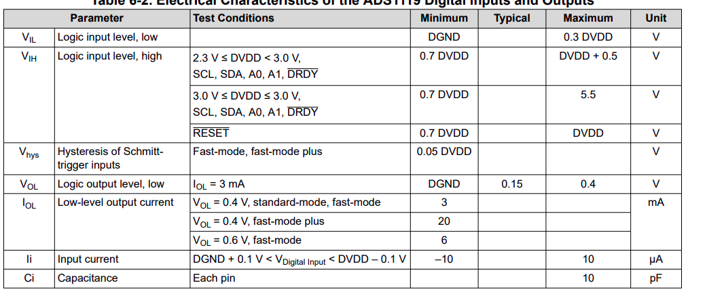

| Thông số | Ý nghĩa                                   | Standard-mode | Fast-mode | Fast-mode+ | Đơn vị |
|----------|--------------------------------------------|---------------|-----------|------------|--------|
| `fSCL`   | Tần số SCL                                 | 0–100         | 0–400     | 0–1000     | kHz    |
| `tLOW`   | Pha LOW tối thiểu của SCL                  | 4.7           | 1.3       | 0.5        | µs     |
| `tHIGH`  | Pha HIGH tối thiểu của SCL                 | 4.0           | 0.6       | 0.26       | µs     |
| `tr`     | Rise time max (cả SDA và SCL)              | 1000          | 300       | 120        | ns     |
| `tf`     | Fall time max (cả SDA và SCL)              | 300           | 300       | 120        | ns     |
| `tBUF`   | Bus free time giữa STOP và START           | 4.7           | 1.3       | 0.5        | µs     |
| `Cb`     | Tải điện dung tối đa mỗi đường bus        | 400            | 400       | 550        | pF     |
| `VIL`    | Mức vào LOW (max)                          | 0.3×VDD       | 0.3×VDD   | 0.3×VDD    | V      |
| `VIH`    | Mức vào HIGH (min)                         | 0.7×VDD       | 0.7×VDD   | 0.7×VDD    | V      |
| `VOL`    | Mức ra LOW (max)                           | 0.4           | 0.4       | 0.4        | V      |
| `IOL`    | Dòng sink tối thiểu phải đạt ở VOL         | 3 mA          | 3 mA      | **20 mA**  | —      |

Lưu ý quan trọng: **`IOL` khác nhau giữa các mode** (UM10204 §7.1) — Standard/Fast yêu cầu sink ≥ 3 mA, nhưng **Fast-mode Plus yêu cầu ≥ 20 mA**. Điều này ảnh hưởng trực tiếp đến `RP(min)` (xem 3.5-b2).

→ Spec này là cơ sở để tính pullup resistor (xem 3.5-b dưới) và chọn mode phù hợp với peripheral clock (PCLK1) của MCU.

#### a1) Phân tích thông số — ý nghĩa thực tế

Bảng spec electrical là **giới hạn tối đa/tối thiểu** của protocol, không phải giá trị dùng thực tế. Khi thiết kế board, cần hiểu rõ ý nghĩa từng thông số để chọn RP phù hợp:

**`fSCL`** — tần số danh định của mode. Đây là **tốc độ tối đa** mà mode cho phép, không phải tốc độ bắt buộc. Có thể chạy Standard-mode ở 50 kHz nếu muốn — chỉ cần đảm bảo timing không vi phạm spec.

**`tr` (rise time)** — thời gian chuyển low→high tối đa cho phép. Đây là spec "hard limit": nếu rise time thực tế > `tr` max → vi phạm protocol, data có thể bị sai. Rise time phụ thuộc vào **RP × Cb** (xem 3.5-b1).

**`Cb` (bus capacitance)** — đây là thông số **khó nắm bắt nhất** trong thực tế:

- `Cb` trong spec là **giới hạn tối đa** cho phép (400 pF Standard/Fast, 550 pF Fm+).
- `Cb` thực tế = tổng điện dung ký sinh của mọi thứ trên bus: pin của MCU + pin của mỗi target + điện dung trace trên PCB + điện dung connector.
- **Nếu thiết kế board PCB riêng**: có thể tính/tương đối biết Cb (datasheet thiết bị ghi pin capacitance ~10 pF, trace phụ thuộc độ dài ~1 pF/cm...). → tính được RP(max) chính xác.
- **Nếu dùng module rời** (LCD, sensor breakout cắm qua dây jump): Cb thực tế **rất khó biết chính xác** — phụ thuộc chiều dài dây, loại dây, connector, số thiết bị cắm. Thường không có datasheet ghi rõ. → thường phải **đo bằng LCR meter** để có giá trị Cb thực tế, hoặc **thử giá trị RP rồi kiểm sóng thực tế bằng oscilloscope** xem rise time có đạt spec không.

**`VIL` / `VIH` / `VOL`** — ngưỡng mức logic, phụ thuộc VCC. Đây là cơ sở cho công thức RP(min) (xem 3.5-b2) — nếu RP quá nhỏ, dòng qua NMOS quá lớn → VOL bị kéo cao quá 0.4 V → vi phạm spec mức LOW → thiết bị khác hiểu nhầm là HIGH.

→ Hệ quả cho thực tế: với board PCB tính kỹ, RP(max) có thể tính chính xác. Với module rời, thường chọn RP **theo khuyến nghị** (4.7 kΩ hoặc 10 kΩ phổ thông), sau đó verify bằng sóng nếu tốc độ cao.

#### b) Tính toán timing

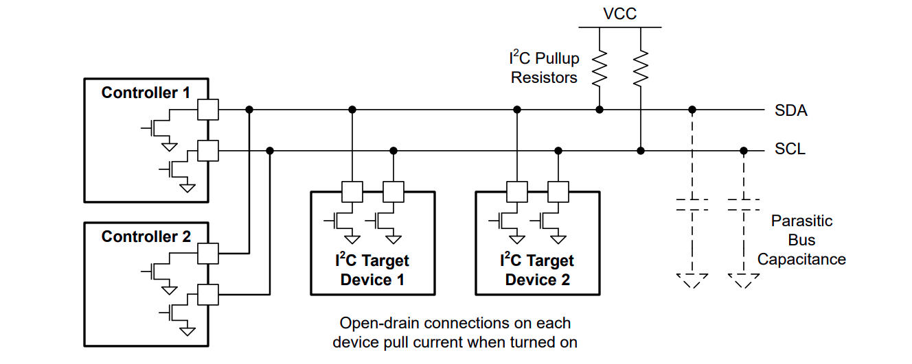

Các đại lượng cần tính khi thiết kế I2C:

- **tRISE** (rise time) → xác định **RP(max)** — không được để rise time quá chậm.
- **RP(min)** → giới hạn dưới từ VOL/IOL — không được nhỏ quá.
- **tLOW / tHIGH** (chu kỳ SCL) → xác định **fSCL** — không được để tần số quá spec.

#### b1) Tính tRISE → RP(max)

Khi NMOS OFF, điện áp trên bus nạp theo:
```
V(t) = (1 − e^(−t/RC)) × VCC
```

Rise time = thời gian V đi từ **0.3×VCC** (ngưỡng VIL max) → **0.7×VCC** (ngưỡng VIH min). Đây là 2 ngưỡng logic trong spec electrical (xem bảng 3.5-a).

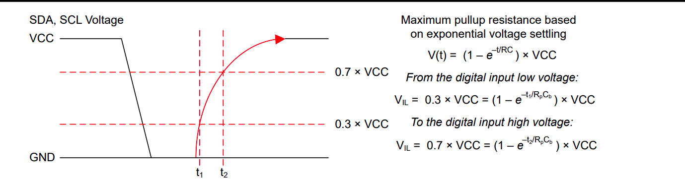

Giải mã phương trình nạp RC:

```
Tại V = 0.3×VCC:  0.3 = 1 − e^(−t1/RC)  →  t1 = −RC × ln(0.7)
Tại V = 0.7×VCC:  0.7 = 1 − e^(−t2/RC)  →  t2 = −RC × ln(0.3)

→ tRISE = t2 − t1 = RC × [ln(0.7) − ln(0.3)] = RC × ln(0.7/0.3) = RC × ln(2.333)
        ≈ RC × 0.8473
```

→ **tRISE = 0.8473 × RP × Cb** → **RP(max) = tRISE / (0.8473 × Cb)**

Bảng giá trị RP(max) cho từng mode (với Cb = 400 pF):

| Mode            | tRISE max (ns) | RP(max) (kΩ) |
|-----------------|----------------|--------------|
| Standard-mode   | 1000           | 2.95         |
| Fast-mode       | 300            | 0.88         |
| Fast-mode Plus  | 120            | 0.35         |

→ Mode càng cao, tRISE max càng nhỏ → RP(max) càng thấp → dòng qua pullup phải mạnh hơn. Cb thực tế càng cao → RP(max) càng thấp. **Nếu có đo Cb bằng LCR meter → dùng Cb thực tế** thay vì 400 pF của spec.

#### b2) Tính RP(min)

Khi NMOS ON, pin kéo về GND — dòng tải hút từ nguồn qua pullup:

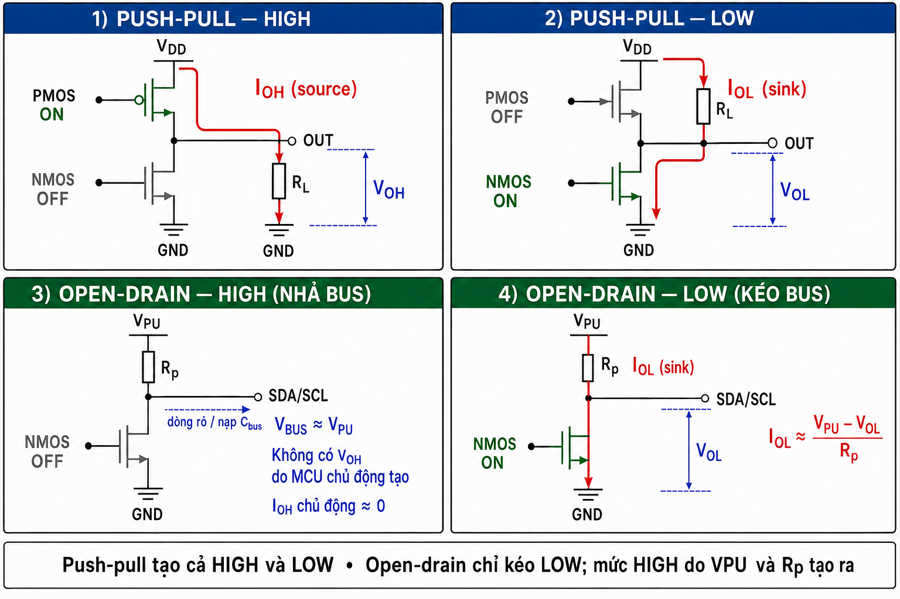

Điện áp rơi trên RP phải đủ nhỏ để pin đạt **≤ VOL** (mức thấp hợp lệ). Dòng càng mạnh thì điện áp rơi trên RP càng lớn → RP càng nhỏ thì càng khó giữ pin dưới VOL:

```
RP(min) = (VCC − VOL) / IOL
```

Trong đó:
- **VCC** — điện áp nguồn pullup.
- **VOL** — điện áp thấp tối đa khi chốt mức LOW (tra datasheet, chuẩn I2C quy 0.4 V).
- **IOL** — dòng sink tối thiểu mà thiết bị phải hút được về GND trong khi vẫn giữ pin ≤ VOL. Theo UM10204 §7.1: **3 mA cho Standard/Fast-mode, 20 mA cho Fast-mode Plus**.

→ RP phải **≥ RP(min)**: nhỏ hơn nữa thì mạch không kéo được xuống VOL, ngưỡng logic 0 không hợp lệ và NMOS vượt khả năng dòng sink (nóng/hỏng).

Với mạch ví dụ STM32F4 (VCC = 3.3 V):

```
Standard/Fast-mode:  RP(min) = (3.3 − 0.4) / 3 mA  = 0.967 kΩ = 967 Ω
Fast-mode Plus:      RP(min) = (3.3 − 0.4) / 20 mA = 0.145 kΩ = 145 Ω
```

→ Kết hợp b1:

| Mode | Cb dùng để tính | RP(min) | RP(max) | Khoảng hợp lệ |
|------|-----------------|---------|---------|----------------|
| Standard-mode | 400 pF | 967 Ω | 2.95 kΩ | **967 Ω ≤ RP ≤ 2.95 kΩ** |
| Fast-mode     | 400 pF | 967 Ω | 0.88 kΩ | **vô nghiệm** (RP(min) > RP(max)) |
| Fast-mode Plus| 550 pF | 145 Ω | 0.26 kΩ | **145 Ω ≤ RP ≤ 257 Ω** |

Khoảng Fast-mode "vô nghiệm" **không có nghĩa Fast-mode không chạy được** — nó nghĩa là với Cb = 400 pF và sink chỉ 3 mA thì không tồn tại điện trở thụ động nào thỏa cả hai ràng buộc cùng lúc. Thực tế muốn chạy Fm ở Cb cao phải: giảm Cb (layout ngắn, ít thiết bị), dùng thiết bị sink mạnh hơn 3 mA (nhiều linh kiện cho phép), hoặc chấp nhận giảm fSCL. **Luôn kiểm tra khả năng sink thực tế của mọi thiết bị trên bus**, không chỉ giá trị tối thiểu của mode.

Chọn RP trong khoảng hợp lệ theo cân bằng: gần RP(min) → rise nhanh nhưng dòng đứng (VCC/RP) lớn; gần RP(max) → tiết kiệm dòng nhưng rise chậm, dễ bị nhiễu.

#### b3) Tính tLOW / tHIGH → fSCL

Chu kỳ SCL chia làm 2 pha:
```
T_SCL = tLOW + tHIGH
fSCL = 1 / T_SCL
```

Spec I2C yêu cầu (giá trị min từ Table 11):

| Mode            | tLOW min (µs) | tHIGH min (µs) | T_SCL min (µs) | 1/T_SCL min  | fSCL max theo spec |
|-----------------|---------------|----------------|-----------------|---------------|---------------------|
| Standard-mode   | 4.7           | 4.0            | 8.7             | ~115 kHz      | **100 kHz**         |
| Fast-mode       | 1.3           | 0.6            | 1.9             | ~526 kHz      | **400 kHz**         |
| Fast-mode Plus  | 0.5           | 0.26           | 0.76            | ~1316 kHz     | **1000 kHz**        |

Lưu ý: `fSCL max` là **giới hạn độc lập** của spec (100/400/1000 kHz), không phải suy ra từ tLOW+tHIGH. Tổng tLOW+tHIGH min nhỏ hơn chu kỳ của fSCL max là để dành chỗ cho **rise time và fall time** của bus thực tế — xung SCL thực không phải vuông lý tưởng, cạnh lên/xuống chiếm một phần chu kỳ. Nếu `tr` quá lớn → ăn vào pha HIGH → vi phạm tHIGH min. Vì vậy khi ước lượng fSCL khả dụng trên bus thật, phải tính cả `tr`/`tf` và timing thực tế của controller, không chỉ cộng hai giá trị min.

**Trong STM32F4**, tLOW/tHIGH được tính từ **PCLK1** (xung clock APB1 cấp cho I2C peripheral) và **CCR** (thanh ghi `I2C_CCR`):

- **Standard-mode** (CCR ≥ 0x01, DUTY=0):
  ```
  tLOW  ≈ CCR × (1/PCLK1)
  tHIGH ≈ CCR × (1/PCLK1)
  → tỷ lệ 1:1
  ```
- **Fast-mode, DUTY=0**:
  ```
  tLOW  ≈ 2 × CCR × (1/PCLK1)   → tỷ lệ 2:1
  tHIGH ≈ 1 × CCR × (1/PCLK1)
  ```
- **Fast-mode, DUTY=1** (duty cycle 16/9):
  ```
  tLOW:tHIGH = 16:9
  ```

→ CCR càng cao → T_SCL càng dài → fSCL càng thấp. Phải chọn CCR sao cho fSCL ≤ spec mode.

#### b4) Tổng kết logic chọn RP

```
Cb (đo bằng LCR meter hoặc ước lượng)
   ↓
RP(max) = tRISE_max / (0.8473 × Cb)     ← không được vượt quá
RP(min) = (VCC − VOL) / IOL             ← không được nhỏ quá
   ↓
Chọn RP trong khoảng [RP(min), RP(max)]
   ↓
Verify thực tế: đo tRISE bằng oscilloscope
   ↓
Tính CCR:
    CCR = PCLK1 / (2 × fSCL)      (Standard)
    CCR = PCLK1 / (3 × fSCL)      (Fast, DUTY=0)
    CCR = PCLK1 / (25 × fSCL)     (Fast, DUTY=1)
    ↓

tLOW/tHIGH do CCR quyết định → fSCL ≤ spec mode
```

→ **Khoảng pullup hợp lệ cho Standard-mode, Cb=400 pF: 967 Ω ≤ RP ≤ 2.95 kΩ**. Cb thấp hơn thì RP max cao hơn (ít dòng tiêu tốn hơn).

> **Lưu ý (dạng sóng vs lập trình thực tế):** Phần dạng sóng ở 3.1–3.5 là góc nhìn electrical của protocol. Khi dùng MCU có hardware I2C peripheral (như STM32F4), ta **không tự toggle SDA/SCL** — hardware lo toàn bộ timing, sampling, arbitration, clock stretching. Pullup resistor là phần **board hardware** — phải tính trước, không flash firmware được. Chi tiết thanh ghi/flag và sample code sẽ ở file riêng.

---

## 4. Communication Frames

### 4.1 Cấu trúc frame

I2C chia data thành các **frame**. Một giao tiếp cơ bản gồm:

```
START | Address frame (7-bit addr + R/W + ACK) | Data frame(s) (8-bit data + ACK) | STOP
```

Có 2 loại frame chính:

- **Address frame** — frame đầu tiên sau START, chứa 7-bit địa chỉ target + 1 bit R/W.
- **Data frame** — các frame kế tiếp, mỗi frame 1 byte data + 1 bit ACK.

### 4.2 Address frame (7-bit + R/W + ACK)

Mỗi target có 1 địa chỉ 7-bit (hoặc 10-bit — xem 5.3) → 128 địa chỉ 7-bit (nhưng có reserved, thực tế ít hơn). Address frame gồm 9 bit:

| Bit 7 | Bit 6 | Bit 5 | Bit 4 | Bit 3 | Bit 2 | Bit 1 | Bit 0 |
|-------|-------|-------|-------|-------|-------|-------|-------|
| A6    | A5    | A4    | A3    | A2    | A1    | A0    | R/W   |

- 7 bit cao (A6:A0) = địa chỉ target.
- Bit thấp nhất = R/W: `1` = Read, `0` = Write.
- Sau 8 bit, **transmitter nhả SDA** ở clk thứ 9 để receiver kéo SDA xuống = **ACK** (xác nhận địa chỉ đúng). Nếu không có target nào ACK → bit ở mức HIGH = **NACK** → controller phát STOP hoặc repeated START (xem 4.3).

### 4.3 Data frame (8-bit + ACK) và quy tắc ACK/NACK tổng quát

Sau address frame là 1 hoặc nhiều data frame:

- Mỗi data frame = **8 bit data** (MSB trước) + 1 bit ACK ở clk thứ 9.
- **Write**: target kéo SDA low để ACK mỗi byte nhận được.
- **Read**: controller kéo SDA low để ACK mỗi byte nhận được. Controller gửi **NACK** ở byte cuối cùng để báo "đủ rồi, ngừng gửi đi" → sau đó controller phát STOP (hoặc repeated START nếu muốn bắt đầu transfer mới).

**Quy tắc tổng quát theo UM10204 §3.1.6** (đúng cho mọi hướng truyền):

- **Controller tạo mọi xung clock**, kể cả xung clock thứ 9 của bit ACK.
- Ở clk thứ 9: **transmitter nhả SDA**, **receiver quyết định mức**: kéo SDA LOW và giữ ổn định suốt pha HIGH = **ACK**; để SDA HIGH = **NACK**.
- Vậy trong controller-write: target là receiver → target phát ACK/NACK. Trong controller-read: controller là receiver → **controller phát ACK/NACK**, còn target (transmitter) nhả SDA.

**5 điều kiện dẫn đến NACK** (§3.1.6):

1. Không có receiver nào trên bus có địa chỉ được gửi → không ai ACK.
2. Receiver đang bận thực hiện chức năng real-time, chưa sẵn sàng giao tiếp.
3. Trong lúc truyền, receiver nhận data/lệnh mà nó không hiểu.
4. Trong lúc truyền, receiver không thể nhận thêm byte nào nữa.
5. Controller-receiver phải báo kết thúc transfer cho target-transmitter (NACK byte cuối).

Khi nhận NACK, controller có thể phát **STOP** để hủy transfer, hoặc **repeated START** để bắt đầu transfer mới — STOP không phải lựa chọn duy nhất.

### 4.4 Hai loại địa chỉ khi lập trình I2C

Khi viết driver hoặc dùng HAL, cần phân biệt rõ **hai loại địa chỉ khác nhau**:

| Loại địa chỉ | Tên trong code | Nằm ở đâu | Ý nghĩa |
|--------------|----------------|-----------|---------|
| Địa chỉ Target/Slave trên bus | `DEVICE_ADDR`, `SlaveAddr` | Address frame | Chọn đúng thiết bị I2C trên bus |
| Địa chỉ thanh ghi bên trong Target | `REG_ADDR`, `MemAddr` | Data frame | Chọn thanh ghi nội bộ của target |

Ví dụ STM32 muốn giao tiếp với cảm biến có địa chỉ `0x68` và đọc thanh ghi `WHO_AM_I = 0x0F`:

```
DEVICE_ADDR = 0x68    // địa chỉ thiết bị trên bus I2C
REG_ADDR    = 0x0F    // địa chỉ thanh ghi bên trong cảm biến
```

I2C hardware chỉ hiểu address frame để chọn target. Nó **không tự biết** byte `0x0F` có phải địa chỉ thanh ghi hay không. Byte đó chỉ có ý nghĩa là `REG_ADDR` nếu firmware/hardware của target được thiết kế để hiểu như vậy.

### 4.5 Bốn kiểu giao dịch phổ biến

Mỗi giao dịch I2C luôn gồm **hai phía đối ứng**: controller đóng một vai trò (transmitter hoặc receiver), target đóng vai trò ngược lại. Từ 2 vai trò × 2 trường hợp (có/không thanh ghi nội bộ) ta có **8 API = 4 cặp đối ứng**:

| Cặp | Controller API | Target API | Chuỗi trên bus | Ý nghĩa |
|-----|----------------|------------|----------------|---------|
| Truyền | `Master_Transmit()` | `Slave_Receive()` | `Address + W → Data` | Controller gửi data thô cho target |
| Nhận | `Master_Receive()` | `Slave_Transmit()` | `Address + R → Data` | Controller nhận data thô từ target |
| Ghi thanh ghi | `Mem_Write()` | `Slave_Mem_Write()` | `Address + W → Register → Data` | Controller ghi vào thanh ghi nội bộ target |
| Đọc thanh ghi | `Mem_Read()` | `Slave_Mem_Read()` | `Address + W → Register → Repeated START → Address + R → Data` | Controller đọc thanh ghi nội bộ target |

> **Ghi chú:** Các hình RM0090 (Figure 241–244) minh họa cả 7-bit và 10-bit addressing. Mục này chỉ phân tích 7-bit (chế độ phổ biến nhất).
>
> **Tham chiếu:** Chi tiết triển khai driver (code HAL polling/interrupt, state machine, callback cho cả 8 API) xem ở `i2c_driver.md` mục 5.x.

#### 4.5.1 Cặp truyền — Controller gửi ↔ Target nhận

Chuỗi trên bus:

```
S → Address + W → Data1 → Data2 → … → DataN → P
```

**Phía controller — transmitter (Figure 243):**

| Bước | Event | Ý nghĩa |
|------|-------|---------|
| 1 | `EV5` | `SB=1`: START đã phát xong. Ghi address + W vào `DR`. |
| 2 | `EV6` | `ADDR=1`: target đã ACK address. Clear bằng đọc `SR1` rồi `SR2`. |
| 3 | `EV8_1` | `TxE=1` lần đầu → ghi `Data1` vào `DR`. |
| 4 | `EV8` | `TxE=1` (lặp lại) → ghi byte kế tiếp vào `DR`. |
| 5 | `EV8_2` | `BTF=1` (sau byte cuối) → request STOP. |

**Phía target — receiver (Figure 242):**

| Bước | Event | Ý nghĩa |
|------|-------|---------|
| 1 | — | Chờ address phase. |
| 2 | `EV1` | `ADDR=1`: nhận đúng địa chỉ mình → ACK. Clear bằng đọc `SR1` rồi `SR2`. |
| 3 | `EV2` | `RxNE=1` (lần đầu) → đọc `DR` để lấy `Data1`. |
| 4 | `EV2` | `RxNE=1` (lặp lại) → đọc `DR` cho từng byte. |
| 5 | `EV4` | `STOPF=1`: controller đã phát STOP → kết thúc phiên nhận. |

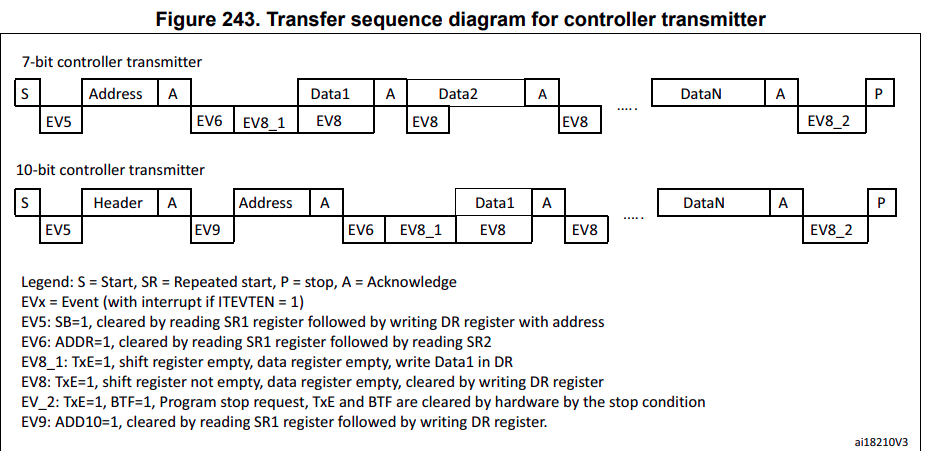

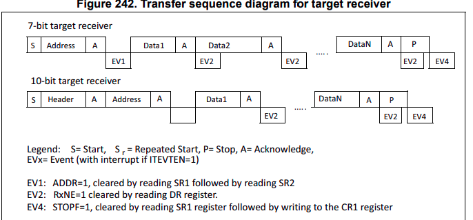

#### 4.5.2 Cặp nhận — Controller nhận ↔ Target gửi

Chuỗi trên bus:

```
S → Address + R → Data1 → Data2 → … → DataN (NACK) → P
```

**Phía controller — receiver (Figure 244):**

| Bước | Event | Ý nghĩa |
|------|-------|---------|
| 1 | `EV5` | `SB=1`: START đã phát xong. Ghi address + R vào `DR`. |
| 2 | `EV6` | `ADDR=1`: target đã ACK address. Clear bằng đọc `SR1` rồi `SR2`. |
| 3 | `EV7` | `RxNE=1` → đọc `DR` cho từng byte. |
| 4 | **`EV7_1`** | Ở **byte kế cuối**: set `ACK=0` + request STOP **trước khi** byte cuối được nhận. Controller sẽ tự động **NACK byte N** trên bus rồi phát STOP. |
| 5 | — | STOP. |

**Phía target — transmitter (Figure 241):**

| Bước | Event | Ý nghĩa |
|------|-------|---------|
| 1 | — | Chờ address phase. |
| 2 | `EV1` | `ADDR=1`: nhận đúng địa chỉ + R → biết mình được chọn để **phát**. Clear bằng đọc `SR1` rồi `SR2`. |
| 3 | `EV3_1` | `TxE=1` lần đầu → nạp `Data1` vào `DR`. |
| 4 | `EV3` | `TxE=1` (lặp lại) → nạp byte kế tiếp. |
| 5 | **`EV3_2`** | `AF=1`: nhận **NACK** từ controller → đây là tín hiệu "controller đã đủ, ngừng phát". Clear bằng ghi 0 vào bit `AF` của `SR1`. |

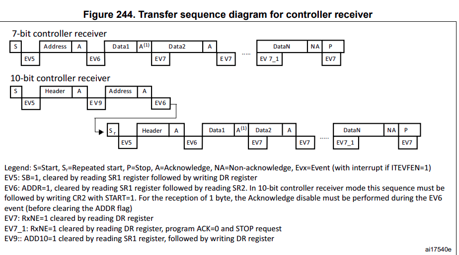

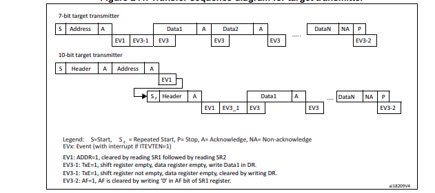

#### 4.5.3 Hai quy tắc tổng quan

**Rule 1 — Quyền kết thúc transfer luôn thuộc về controller.**

Dù controller đang gửi hay đang nhận, controller là bên duy nhất quyết định khi nào transfer kết thúc (bằng **STOP** hoặc **Repeated START**). Target không bao giờ tự dừng transfer — target chỉ phản hồi ACK/NACK theo từng byte, và có thể dùng NACK để **báo lỗi** ở chiều controller-gửi (target đang nhận, target NACK khi bận / buffer đầy / không hiểu lệnh → controller phát hiện `AF=1` và tự phát STOP để hủy transfer).

**Rule 2 — Controller-receiver NACK byte cuối để báo target dừng.**

Ở byte kế cuối (`EV7_1`), controller set `ACK=0` và request STOP **trước khi** byte cuối được ACK/NACK trên bus. Lý do: ACK/NACK cho byte N được phát đi ngay sau byte N — không thể nhận xong byte N rồi mới quyết định NACK (lúc đó phần cứng đã tự động ACK rồi). Target-transmitter nhận NACK → `EV3_2` (AF=1) → dừng phát. Nếu controller quên set `ACK=0` đúng lúc, target phát mãi → giao dịch treo, chiếm bus.

#### 4.5.4 Khi nào STM32 đóng vai target

Phần lớn ứng dụng STM32 + IC ngoại vi để STM32 ở role **controller**, IC ngoại vi ở role **target** đơn giản. STM32 chỉ đóng vai target trong các trường hợp:

- **Multi-MCU** — 2 STM32 trên cùng bus I2C, một bên controller, một bên target. Thường gặp khi một MCU chuyên xử lý cảm biến và một MCU chuyên giao tiếp user (UART/LCD).
- **Debug bridge** — STM32 trung gian giữa PC (qua USB-UART) và IC ngoại vi, mô phỏng một số byte để test firmware controller.
- **IO expander / Sensor simulation** — STM32 mô phỏng EEPROM (AT24Cxx) hoặc cảm biến để test firmware controller mà không cần IC thật.
- **Hot-swap firmware** — STM32 target đóng vai bootloader cho STM32 khác, cho phép update firmware qua I2C.
- **Slave mode đơn giản** — STM32 chỉ cần expose vài byte data cho controller đọc; dùng `Slave_Transmit()` thuần là đủ, không cần `Slave_Mem_*`.

> Code HAL tham khảo: `HAL_I2C_EnableListen_IT()`, `HAL_I2C_SlaveRxCplt()`, `HAL_I2C_SlaveTxCplt()`, `HAL_I2C_ListenCplt()`, `HAL_I2C_ErrorCallback()`. Chi tiết skeleton code cho 4 API target side xem `i2c_driver.md` mục 5.x.

Các sự kiện EV trong RM0090 (EV1–EV9) chỉ mô tả trạng thái phần cứng I2C ở mỗi vai trò. Chúng không quyết định byte data có phải địa chỉ thanh ghi hay không — điều đó do firmware target quy ước.

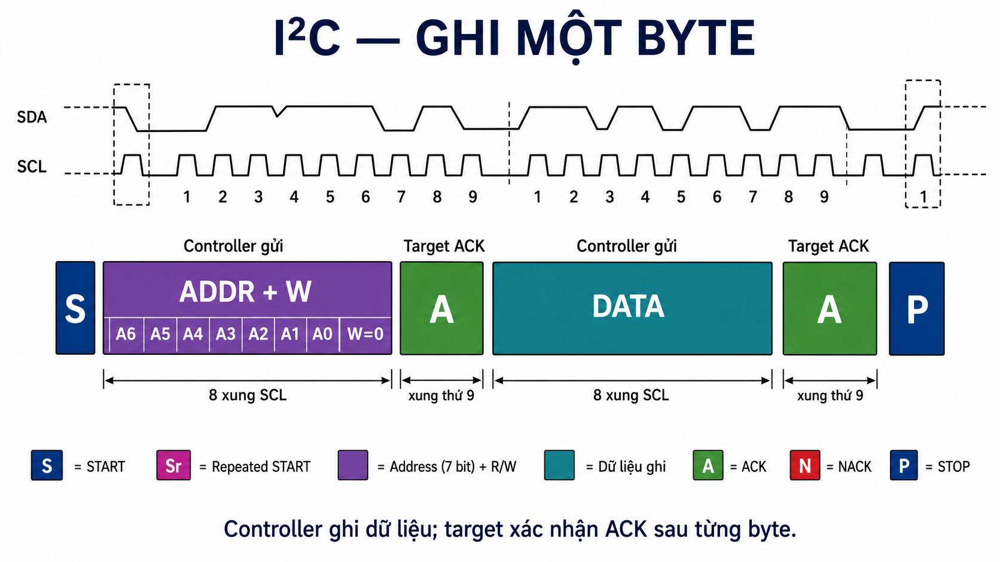

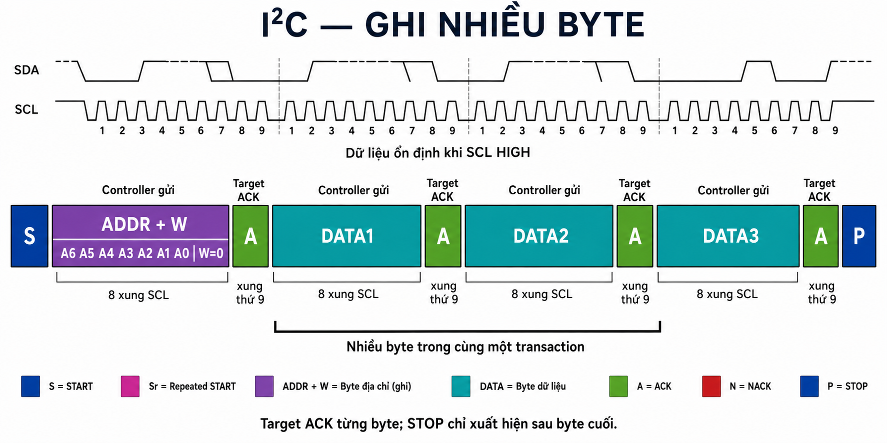

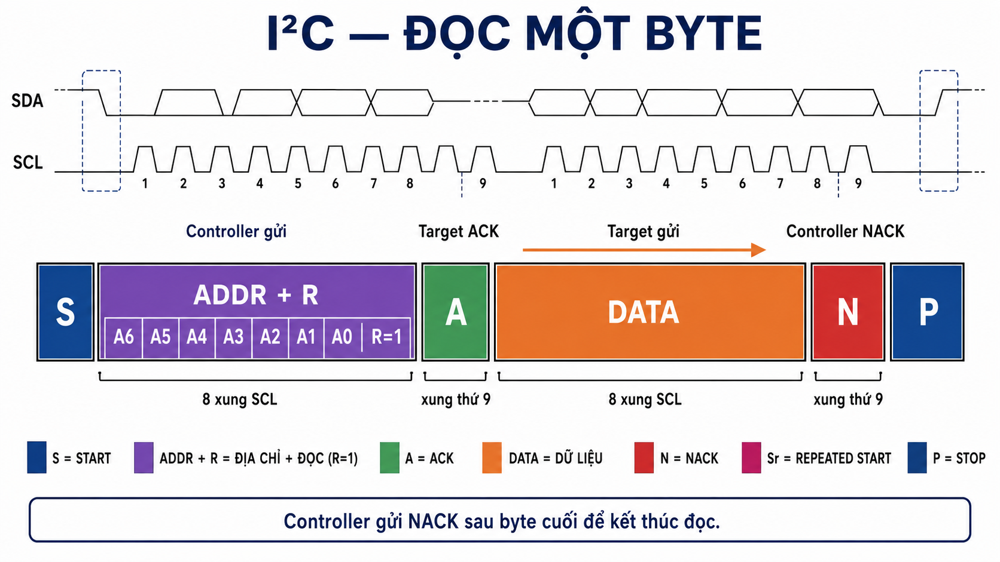

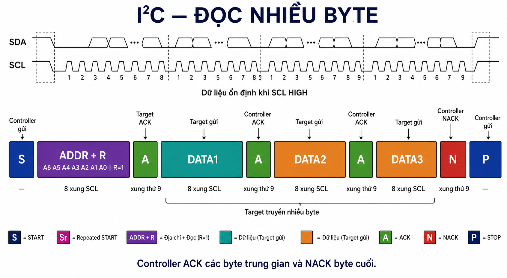

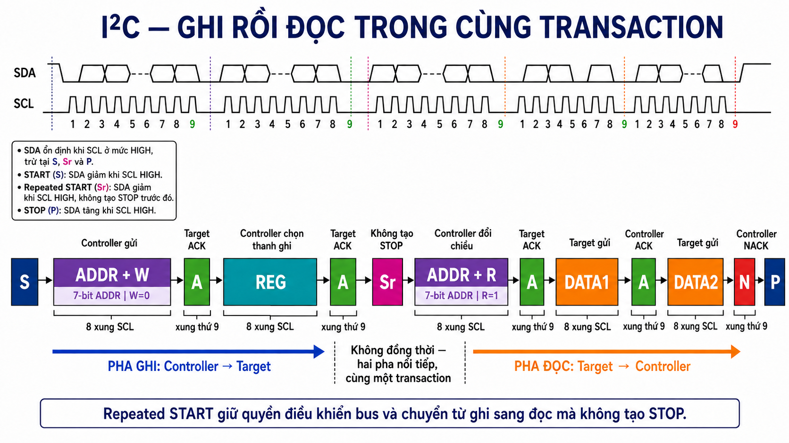

### 4.6 Flow tổng quát

```
START → [address + R/W] → ACK → [data byte 1] → ACK → ... → [data byte N] → NACK/ACK → STOP
```

- Nếu muốn **read** sau khi **write** (vd: chỉ định register rồi mới đọc), controller dùng **Repeated START** (Sr) — phát START mới mà không phát STOP, trong cùng 1 giao tiếp.
- Tổng quát: có thể có nhiều data frame liên tiếp, không giới hạn số byte giữa START và STOP (chỉ giới hạn bởi timeout hoặc target NACK).

> Trong MCU có I2C peripheral (như STM32F4), address + R/W ghi vào thanh ghi data (vd `I2C_DR`) sau khi START phát xong (flag start bit set). Mỗi byte data cũng ghi/đọc qua thanh ghi data, kèm poll flag transfer-finished để chờ byte xong trước khi nạp byte kế tiếp. Sample code sẽ để ở file riêng.

---

## 5. Nâng cao I2C

### 5.1 Reserved addresses (địa chỉ dành riêng)

#### a) Vì sao không dùng được toàn bộ 0x00–0x7F

Địa chỉ I²C chuẩn là 7-bit → về mặt lý thuyết có 128 giá trị (0x00–0x7F). Tuy nhiên, spec I²C (UM10204 §3.1.12 của NXP) **dành riêng hai nhóm 8 địa chỉ** (`0000 XXX` và `1111 XXX`) cho các mục đích đặc biệt của chính giao thức. Nếu gán nhầm các địa chỉ này cho target thông thường, bus có thể xung đột với các tính năng chuẩn (General Call, 10-bit addressing, Hs-mode, Device ID...).

Bảng reserved addresses theo **UM10204 Table 4** (lưu ý: ý nghĩa phụ thuộc cả **bit R/W**, nên bảng dùng mẫu 7-bit + R/W thay vì chỉ địa chỉ):

| Mẫu 7-bit | R/W bit | Mục đích |
|-----------|---------|----------|
| 0000 000  | 0       | General Call address |
| 0000 000  | 1       | START byte (không thiết bị nào được phép ACK byte này) |
| 0000 001  | X       | CBUS address (cho hệ thống trộn CBUS/I²C; thiết bị I²C không được đáp ứng) |
| 0000 010  | X       | Reserved cho bus format khác |
| 0000 011  | X       | Reserved cho mục đích tương lai |
| 0000 1XX  | X       | Hs-mode Controller code |
| 1111 1XX  | 1       | **Device ID** |
| 1111 0XX  | X       | Tiền tố địa chỉ 10-bit |

Giải thích nhanh một số mục quan trọng:

- **General Call (`0000 000` + W)**: cho phép controller gửi lệnh đến *tất cả* target cùng lúc (broadcast), thay vì từng target một. Ý nghĩa cụ thể nằm ở byte thứ hai (xem 5.1-b). Cùng mẫu 7-bit nhưng với R/W=1 thì đó là **START byte** — cơ chế cho MCU không có hardware I2C poll bus bằng phần mềm (§3.1.15), không phải địa chỉ target.
- **Hs-mode Controller code (`0000 1XX`)**: khi controller muốn chuyển bus sang High-speed mode (3.4 Mbit/s), nó phát mã này sau START ở tốc độ F/S để giành bus và báo cho toàn bus chuẩn bị đổi tốc độ. Lưu ý đây là **mã 8-bit** (`0000 1XXX`, 8 giá trị từ `0000 1000` đến `0000 1111`), mỗi Hs-mode controller có một mã riêng; arbitration luôn kết thúc ngay sau pha truyền Controller code này (xem mục 1).
- **Tiền tố 10-bit (`1111 0XX`)**: với thiết bị dùng địa chỉ 10-bit, byte đầu tiên mang mẫu `1111 0XX` — 2 bit `XX` là 2 bit cao nhất của địa chỉ 10-bit, 8 bit còn lại nằm ở byte thứ hai (xem 5.3). Đây là lý do 7-bit và 10-bit có thể tồn tại trên cùng một bus mà không nhầm lẫn.
- **Device ID (`1111 1XX` + R=1)**: cho phép đọc ID 3 byte (12 bit manufacturer + 9 bit part ID + 3 bit die revision) của một target mà không cần biết trước địa chỉ của nó — dùng để nhận diện thiết bị trên bus (§3.1.17). Trình tự: gửi `1111 1000` (W) → gửi địa chỉ target cần nhận diện → repeated START → gửi `1111 1001` (R) → đọc 3 byte ID. Lưu ý: không được phát STOP giữa chừng trình tự này, nếu không target state machine bị reset.

→ Kết luận: vùng địa chỉ **an toàn** để gán cho target thông thường là **0x08 đến 0x77** (112 địa chỉ khả dụng). Spec cũng ghi rõ: nếu trong một hệ thống cụ thể biết chắc một reserved address không bao giờ được dùng đúng mục đích của nó, system architect có thể dùng nó làm địa chỉ target — nhưng mặc định thì không nên.

#### b) Ví dụ General Call

Master muốn reset đồng loạt mọi thiết bị trên bus:

```
START | 0000 0000 (0x00) | ACK | <command byte> | ACK | STOP
```

- Master gửi 7-bit address = `0000000` + bit W = 0.
- Byte thực tế trên bus: `00000000` = **0x00**.
- Mọi slave có bật tính năng General Call đều ACK và đọc byte lệnh tiếp theo (vd: `0x06` = reset + ghi lại địa chỉ, `0x04` = chỉ ghi lại địa chỉ...).

Ứng dụng thực tế: reset đồng bộ, nạp lại địa chỉ, hoặc gửi một lệnh chung (vd: "sleep") đến nhiều slave chỉ bằng một transaction.

#### c) Lưu ý: địa chỉ 7-bit vs byte địa chỉ trên bus

Đây là lỗi nhầm lẫn kinh điển khi đọc datasheet. Địa chỉ slave chỉ có **7 bit**; khi truyền trên bus, phần cứng ghép thêm bit R/W thành byte thứ 8:

```
Address byte = (address_7bit << 1) | R/W
```

Ví dụ với cảm biến MPU6050 (địa chỉ 7-bit 0x68):

| Thao tác | Tính toán          | Byte trên bus |
|----------|--------------------|---------------|
| Write    | 0x68 << 1          | 0xD0          |
| Read     | (0x68 << 1) \| 1   | 0xD1          |

⚠️ **Không được coi 0xD0 là địa chỉ 7-bit** — địa chỉ thật vẫn là 0x68. Một số datasheet ghi địa chỉ dạng 8-bit (đã shift sẵn), một số ghi dạng 7-bit (chưa shift); khi lập trình cần kiểm tra kỹ driver/HAL đang expect dạng nào (vd: HAL STM32 expect địa chỉ **đã shift**, tức 0xD0).

---

### 5.2 I²C buffer (bộ đệm bus)

#### a) I²C buffer là gì

I²C buffer là một IC nằm giữa hai đoạn bus, chia một bus lớn thành các đoạn nhỏ độc lập về mặt điện:

```
Master ── Bus A ── [ I²C Buffer ] ── Bus B ── Slave(s)
```

Ví dụ linh kiện: P82B96, PCA9600, PCA9515...

Chức năng chính:

- **Cách ly điện dung (capacitance isolation)**: spec I²C giới hạn tổng bus capacitance (400 pF cho Sm/Fm, 550 pF cho Fm+). Buffer chia bus thành 2 đoạn, mỗi đoạn chỉ cần thoả giới hạn riêng → tổng hệ thống gần gấp đôi → gắn được nhiều thiết bị hơn hoặc dây dài hơn.
- **Mỗi phía có pull-up riêng**: điện trở pull-up được tính độc lập theo capacitance của từng đoạn (xem lại mục 3.5).
- **Chuyển mức điện áp (level shifting)**: một số buffer cho phép Bus A chạy 3.3V, Bus B chạy 5V.
- **Tăng khả năng drive**: buffer lái dòng mạnh hơn chân IO của MCU → kéo dài cáp (P82B96 có thể đi cáp dài hàng mét).
- **Truyền LOW hai chiều**: bên nào kéo LOW thì bên kia cũng bị kéo LOW.

#### b) Nguyên lý truyền trạng thái

Buffer hoạt động hoàn toàn ở **tầng điện**, không giải mã giao thức:

**Khi phía A kéo SDA xuống LOW:**

```
SDA_A = LOW
  → buffer phát hiện mức LOW ở đầu A
  → buffer chủ động kéo SDA_B = LOW
```

**Khi phía A nhả SDA:**

```
buffer ngừng kéo SDA_B
  → pull-up phía B kéo SDA_B lên HIGH
```

Chiều ngược lại (B → A) hoạt động tương tự. Vì bản chất open-drain của I²C là "ai kéo LOW cũng được, không ai kéo thì HIGH", nên buffer chỉ cần lan truyền trạng thái LOW qua lại là đủ.

> ⚠️ Vấn đề kỹ thuật thực tế của buffer là **chống latch-up/vòng lặp**: nếu A kéo B xuống LOW, rồi B thấy LOW lại kéo A xuống → hai bên giữ nhau ở LOW mãi. Các IC buffer thật giải quyết bằng cách dùng **hai ngưỡng điện áp khác nhau** (phân biệt "LOW do bên mình kéo" và "LOW do bên kia kéo") hoặc cơ chế offset điện áp — chi tiết này thuộc thiết kế bên trong IC, người dùng chỉ cần biết khi chọn linh kiện.

#### c) Buffer phải bảo toàn tính chất I²C

Một I²C buffer đúng nghĩa phải truyền trong suốt mọi cơ chế của protocol:

- Giao tiếp hai chiều (bidirectional).
- Open-drain / wired-AND.
- ACK/NACK (slave kéo SDA xuống ở bit thứ 9 phải truyền được về master).
- **Clock stretching** (slave kéo SCL xuống để bắt master chờ — SCL không còn là một chiều thuần tuý nên buffer phải hỗ trợ SCL hai chiều).
- Multi-master arbitration (nếu linh kiện hỗ trợ).

#### d) Reserved address có liên quan đến buffer không?

**Không.** Đây là điểm hay bị hiểu nhầm:

- Buffer làm việc ở tầng điện: `LOW phía A ↔ LOW phía B`.
- Nó **không đọc** byte address, **không quan tâm** địa chỉ nào đang được truyền trên bus.

Hệ quả:

- Buffer **không có địa chỉ riêng**.
- **Không chiếm** bất kỳ địa chỉ I²C nào trên bus.
- **Không giải quyết** được xung đột địa chỉ giữa các slave.

#### e) Bài toán trùng địa chỉ — buffer không cứu được

Giả sử hai cảm biến giống hệt nhau, cùng địa chỉ cố định 0x68, đặt ở hai phía của buffer:

```
Master ── Bus A ── [ Buffer ] ── Bus B ── Sensor 0x68
      └────────────────────────── Sensor 0x68 (cùng bus A)
```

Khi master gửi address 0x68, buffer truyền trong suốt sang Bus B → **cả hai sensor cùng ACK, cùng trả data đồng thời** → data trên bus bị trộn lẫn (wired-AND) → **xung đột địa chỉ**.

#### f) Giải pháp: I²C multiplexer/switch

Muốn dùng nhiều thiết bị trùng địa chỉ, cần một IC **có địa chỉ riêng** và **chọn kênh bằng phần mềm**, vd: TCA9548A (8 kênh), PCA9548A:

```
                ┌── Kênh 0 ── Sensor 0x68
Master ── [ TCA9548A ] ── Kênh 1 ── Sensor 0x68
                └── Kênh 2 ── ...
```

Cách dùng:

1. Master ghi vào thanh ghi control của TCA9548A (địa chỉ mặc định 0x70, đổi được bằng chân A0–A2) để chọn kênh.
2. Chỉ kênh được chọn mới được nối về phía master.
3. Master giao tiếp với sensor 0x68 trên kênh đó như bình thường.
4. Muốn nói chuyện với sensor kế tiếp → đổi kênh → lặp lại.

#### g) So sánh nhanh buffer vs multiplexer

| Tiêu chí                | I²C Buffer              | I²C Multiplexer (TCA9548A)      |
|-------------------------|-------------------------|----------------------------------|
| Tầng hoạt động          | Điện (electrical)       | Protocol (đọc/ghi thanh ghi)     |
| Có địa chỉ I²C riêng    | Không                   | Có (vd 0x70)                     |
| Cách ly capacitance     | Có                      | Có (từng kênh)                   |
| Giải quyết trùng địa chỉ| Không                   | Có (chọn kênh)                   |
| Trong suốt với master   | Hoàn toàn               | Không (phải ghi lệnh chọn kênh)  |

→ Nói ngắn gọn: **buffer chỉ lo chuyện điện**, còn **multiplexer là một thiết bị I²C thật sự** có thể được lập trình để định tuyến bus.

---

### 5.3 10-bit addressing

10-bit addressing mở rộng không gian địa chỉ; thiết bị 7-bit và 10-bit có thể nằm **cùng một bus**, và 10-bit dùng được ở mọi tốc độ (hiện ít phổ biến). Theo UM10204 §3.1.11:

- Địa chỉ 10-bit được tạo từ **2 byte đầu tiên** sau START (hoặc repeated START):
  - Byte 1: 7 bit đầu là `1111 0XX` (XX = 2 bit MSB của địa chỉ 10-bit) + bit R/W.
  - Byte 2: 8 bit còn lại của địa chỉ.
- **Write**: controller gửi cả 2 byte address rồi gửi data; target khớp cả 2 byte mới ACK (A1 có thể có nhiều target khớp mẫu `1111 0XX`, chỉ 1 target khớp byte thứ hai).

```
S | 1111 0XX + W | A1 | XXXX XXXX (8 bit thấp) | A2 | DATA ... | P
```

- **Read**: giống write đến hết A2, sau đó **repeated START** rồi gửi lại byte 1 với R/W=1 (`1111 0XX + R`); target đã được address trước đó nhận ra mình và chuyển sang transmitter mode (A3).

```
S | 1111 0XX + W | A1 | XXXX XXXX | A2 | Sr | 1111 0XX + R | A3 | DATA | A | ... | P
```

- Target 10-bit cũng phản ứng General Call như target 7-bit; START byte có thể đứng trước 10-bit addressing giống như với 7-bit.

---

### 5.4 Bus clear (phục hồi bus bị kẹt)

Theo UM10204 §3.1.16, khi bus bị kẹt (thường do target chết/treo giữ đường LOW):

- **SCL kẹt LOW**: ưu tiên dùng chân HW reset của các thiết bị I²C (nếu có); nếu không có, **cycle power** để kích hoạt mạch Power-On Reset bắt buộc bên trong thiết bị.
- **SDA kẹt LOW**: controller phát **9 xung clock** trên SCL — thiết bị đang giữ bus LOW phải nhả trong vòng 9 xung đó. Nếu vẫn không nhả → dùng HW reset hoặc cycle power.

Đây là bước nên có trong driver thực tế: nếu transaction bị timeout (vd chờ ACK hoặc chờ flag không bao giờ set), thử bus clear bằng 9 clock pulse trước khi kết luận phần cứng hỏng.

---

## 6. Tài liệu tham khảo

- **NXP UM10204 Rev. 7.0** (1 October 2021) – *I²C-bus specification and user manual* — chuẩn giao thức I²C chính thức; tài liệu này đối chiếu theo §3.1.1–§3.1.17, §5.3 (Hs-mode), Table 4 (reserved addresses), Table 11 (bus timing), §7.1 (pull-up sizing), §7.2 (vượt bus capacitance). Link gốc NXP: https://www.nxp.com/docs/en/user-guide/UM10204.pdf
- [TI SBAA565 – A Basic Guide to I2C](https://www.ti.com/lit/an/sbaa565/sbaa565.pdf) — Application note của Texas Instruments, tổng quan I2C (physical layer, protocol, examples, advanced topics).
- **ST RM0090** – *STM32F405/415, F407/417 Reference Manual*, chương I2C — mô tả thanh ghi `I2C_CR1/CR2`, `I2C_OAR1/OAR2`, `I2C_DR`, `I2C_SR1/SR2`, `I2C_CCR`, `I2C_TRISE` và timing calc cho Sm/Fm/Fm+.
