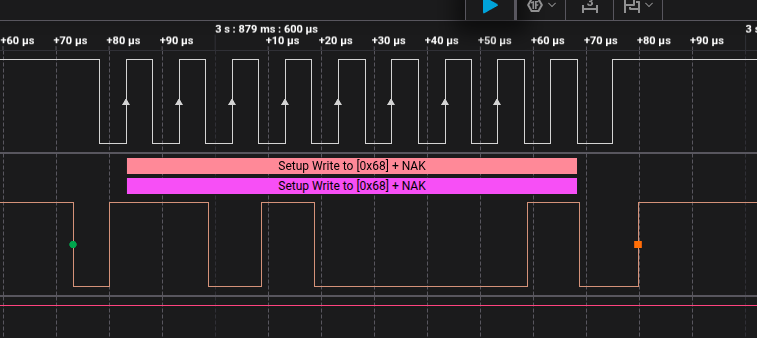

# I2C Driver — Lý thuyết

## 1. Cấu trúc OOP/HAL

Giống mô hình các driver khác trong repo (SPI, GPIO...), I2C chia làm 2 struct:

```c
I2C_Config_t    // Config struct — cấu hình I2C peripheral
I2C_Handle_t    // Handle struct — chứa base address + config
```

### Hai loại địa chỉ trong I2C

I2C có hai loại địa chỉ khác nhau:

| Loại địa chỉ | Tên gọi | Ví dụ | Ý nghĩa |
|--------------|---------|-------|---------|
| **Địa chỉ Target/Slave** | `DEVICE_ADDR` | `0x68` (MPU6050), `0x50` (EEPROM) | Địa chỉ 7-bit của thiết bị trên bus I2C |
| **Địa chỉ thanh ghi** | `REG_ADDR` | `0x0F` (WHO_AM_I), `0x28` (data) | Địa chỉ của thanh ghi bên trong thiết bị |

> **DEVICE_ADDR** nằm trên bus I2C — là thứ được gửi trong address frame (7-bit + R/W bit).
>
> **REG_ADDR** là byte đầu tiên của data payload — là thứ được firmware của Target hiểu là "địa chỉ thanh ghi".

Ví dụ: muốn đọc thanh ghi `WHO_AM_I` (0x0F) từ cảm biến có địa chỉ `0x68`:

```
Address frame:  (0x68 << 1) | 1  = 0xD1  ← DEVICE_ADDR + R/W bit
First data byte: 0x0F                    ← REG_ADDR (WHO_AM_I)
```

### Bốn kiểu giao dịch I2C trong driver

Khi viết driver theo kiểu HAL, nên tách rõ 4 kiểu giao dịch:

| Hàm | Chuỗi truyền | Ý nghĩa |
|-----|--------------|---------|
| `Master_Transmit()` | `Address + W → Data` | Gửi dữ liệu thô |
| `Master_Receive()` | `Address + R → Data` | Nhận dữ liệu thô |
| `Mem_Write()` | `Address + W → Register → Data` | Ghi vào thanh ghi bên trong target |
| `Mem_Read()` | `Address + W → Register → Repeated START → Address + R → Data` | Đọc thanh ghi bên trong target |

**STM32–STM32 trao đổi buffer:** nếu hai STM32 chỉ truyền nhận buffer, không có khái niệm thanh ghi nội bộ. Khi đó dùng `Master_Transmit()` và `Master_Receive()` là đúng.

**Target có register map:** nếu target là cảm biến, EEPROM hoặc một firmware slave được thiết kế theo bản đồ thanh ghi, muốn đọc đúng thanh ghi thì phải dùng `Mem_Read()` hoặc tự tạo sequence tương đương.

Ví dụ đọc thanh ghi `0x05`:

```
START
→ Address + Write
→ 0x05
→ REPEATED START
→ Address + Read
→ Data
→ STOP
```

`Master_Receive()` có thể chọn đúng target bằng `DEVICE_ADDR`, nhưng không tự chọn được `REG_ADDR` bên trong target. Byte `REG_ADDR` chỉ có ý nghĩa nếu firmware của target hiểu byte đó là địa chỉ thanh ghi.

Các sự kiện EV5, EV6, EV7, EV8, EV9 trong RM0009 chỉ mô tả trạng thái phần cứng I2C; chúng không quyết định byte data có phải địa chỉ thanh ghi hay không.

### I2C_Config_t — 4 trường chính

| Field              | Ý nghĩa                      | Thanh ghi STM32 | Chức năng                    |
|--------------------|------------------------------|-----------------|------------------------------|
| `I2C_SCLSpeed`     | Tốc độ bus (100k/400k)       | `CR2`, `CCR`, `TRISE` | Tạo timing SCL      |
| `I2C_DeviceAddress`| Địa chỉ của chính MCU        | `OAR1`          | Địa chỉ khi MCU là slave     |
| `I2C_ACKControl`   | Bật/tắt ACK khi nhận         | `CR1.ACK`       | Điều khiển ACK khi nhận      |
| `I2C_FMDutyCycle`  | Tỷ lệ LOW/HIGH Fast-mode     | `CCR.DUTY`      | Duty 2:1 hoặc 16:9           |

### I2C_Handle_t

| Field     | Ý nghĩa                                             |
|-----------|-----------------------------------------------------|
| `pI2Cx`   | Con trỏ tới I2C peripheral (`I2C1`, `I2C2`, `I2C3`) |
| `I2CConfig` | Struct config ở trên                              |
| *(thêm)*  | Trạng thái nội bộ TX/RX cho interrupt mode — không set thủ công |

### Vì sao không phân biệt Master/Slave trong struct config

Khác với SPI (`SPI_DeviceMode` master/slave khai báo tĩnh trong config), I2C
**không cần khai báo vai trò lúc cấu hình**:

- I2C phân biệt vai trò **theo thời điểm hoạt động**, không theo cấu hình:
  thiết bị nào phát START trên bus thì đóng vai **controller (master)** tại
  giao tiếp đó, còn lại đều là **target (slave)**.
- Do đó lúc init chỉ quan tâm: **tốc độ truyền (timing SCL)** và **địa chỉ của
  chính mình (`I2C_DeviceAddress`)** — để khi bị gọi (slave) thì biết mình có
  đúng là người được gọi không.
- **Địa chỉ của target** (sensor, LCD...) KHÔNG nằm trong struct cấu hình —
  nó được truyền làm tham số runtime khi gọi `I2C_MasterSendData(..., SlaveAddr, ...)`
  vì mỗi transaction có thể giao tiếp với target khác nhau trên cùng 1 bus.

## 2. Ánh xạ chi tiết 4 trường → thanh ghi

### a) `I2C_SCLSpeed` → `CR2.FREQ`, `CCR`, `TRISE`

Tốc độ SCL thực tế được quyết định bởi **3 thanh ghi**:

| Thanh ghi | Bit field      | Vai trò                                                        |
|-----------|----------------|----------------------------------------------------------------|
| `CR2`     | `FREQ[5:0]`    | **PCLK1 tính theo MHz** (vd PCLK1 = 42 MHz → FREQ = 42). Bắt buộc — mọi timing I2C đều lấy từ đây |
| `CCR`     | `FS` (bit 15)  | Chọn mode: `0` = Standard (100 kHz), `1` = Fast (400 kHz)      |
| `CCR`     | `CCR[11:0]`    | Số chu kỳ clock cho 1 pha LOW/HIGH của SCL → quyết định fSCL   |
| `TRISE`   | `TRISE[5:0]`   | **Rise time max** của bus (theo spec mode) + 1 — đơn vị chu kỳ PCLK1 |

**Công thức tính CCR** (đã ghi trong `i2c.md` mục 3.5-b4):

```
Standard:  CCR = PCLK1 / (2 × fSCL)          (DUTY không dùng)
Fast, DUTY=0 (2:1):    CCR = PCLK1 / (3 × fSCL)
Fast, DUTY=1 (16:9):   CCR = PCLK1 / (25 × fSCL)
```

> Lưu ý: `fSCL` nhập theo **Hz**, PCLK1 lấy theo Hz → ra CCR đúng. Nhưng `FREQ`
> trong CR2 lại nhập theo **MHz** → trong code phải `RCC_GetPLCK1Value()/1000000U`.

**Công thức TRISE**:

```
TRISE = (tr_max × PCLK1) + 1      (đơn vị chu kỳ PCLK1, làm tròn lên)
Standard:  tr_max = 1000 ns → TRISE = PCLK1(MHz) + 1
Fast:      tr_max = 300 ns  → TRISE = (300 × PCLK1) + 1  (thường cũng = PCLK1+1)
```

### b) `I2C_DeviceAddress` → `OAR1` (Own Address Register)

| Bit field | Vai trò                                             |
|-----------|-----------------------------------------------------|
| `ADD[7:1]`| Địa chỉ 7-bit của **chính MCU**                     |
| `ADD0`    | Bit LSB — `0` khi dùng 7-bit addressing             |
| `ADDMODE[15]`| Mode địa chỉ target: `0` = 7-bit, `1` = 10-bit |
| `Bit 14`     | **Luôn giữ = 1** (yêu cầu RM0009) |

Khi MCU là **target**: nhận address frame trên bus, so sánh với `OAR1` → trùng
thì ACK và bắt đầu giao tiếp. Khi MCU là **controller**: `OAR1` không dùng —
địa chỉ target được gửi trong address frame chứa trong `I2C_DR`.

### c) `I2C_ACKControl` → `CR1.ACK`

| Giá trị | Bit `ACK` | Hành vi khi nhận byte                                       |
|---------|-----------|-------------------------------------------------------------|
| Enable  | 1         | Tự động gửi ACK sau mỗi byte nhận (được)                    |
| Disable | 0         | Không gửi ACK → NACK — dùng cho byte **cuối** của chuỗi đọc |

Trong read sequence: controller phải NACK byte cuối để báo "đủ rồi" cho target
ngừng gửi. Thực tế driver thường bật ACK trong toàn transaction rồi gửi NACK
bằng cách set `POS`/chỉnh ACK trước byte cuối, hoặc dùng kỹ thuật tắt ACK ở
byte áp chót.

### d) `I2C_FMDutyCycle` → `CCR.DUTY` (chỉ dùng Fast-mode)

| Giá trị            | Bit `DUTY` | Tỷ lệ tLOW:tHIGH | Công thức CCR   |
|--------------------|------------|------------------|-----------------|
| `I2C_FM_DUTY_2`    | 0          | 2:1              | `PCLK1/(3×fSCL)`|
| `I2C_FM_DUTY_16_9` | 1          | 16:9             | `PCLK1/(25×fSCL)`|

Ở Standard-mode bit `DUTY` bị bỏ qua (tỷ lệ luôn 1:1).

## 3. Init API — trình tự khởi tạo SCL speed

Init I2C bắt đầu từ **tốc độ SCL** (`I2C_SCLSpeed`), vì tốc độ quyết định toàn
bộ timing phần cứng. Trình tự như sau:

### Bước 1 — Xác định PCLK1 (clock nguồn)

I2C trên STM32F407 nằm ở **APB1 bus** → clock cấp cho I2C là **PCLK1**.

```
Clock nguồn (HSI 16MHz / HSE 8MHz / PLL) → AHB prescaler → APB1 prescaler → PCLK1
```

### Bước 2 — Chọn `I2C_SCLSpeed` (SM hoặc FM)

`I2C_SCLSpeed` nhận 1 trong 2 giá trị mode:

| Giá trị | Tốc độ  | Chu kỳ t = 1/fSCL | Phân bố chu kỳ          |
|---------|---------|-------------------|-------------------------|
| SM      | 100 kHz | 10 µs             | tLOW = tHIGH = t/2 (5 µs) — tỷ lệ 1:1 |
| FM      | 400 kHz | 2.5 µs            | tLOW : tHIGH theo `DUTY` (2:1 hoặc 16:9) |

> SM: do tLOW = tHIGH = t/2 nên từ 100 kHz quy ra chu kỳ `t`, rồi mỗi pha
> LOW/HIGH chiếm `t/2`.

### Bước 3 — Ghi FREQ vào CR2

FREQ = **PCLK1 tính theo MHz** (vd PCLK1 = 42 MHz → FREQ = 42):

```c
CR2.FREQ = (PCLK1 / 1000000U) & 0x3F;
```

### Bước 4 — Tính CCR từ FREQ đã ghi

Đọc lại giá trị FREQ trong CR2 (hoặc dùng PCLK1) → đổi ra chu kỳ **TFREQ**:

```
TFREQ = 1 / (FREQ × 1 MHz)      // chu kỳ 1 xung PCLK1
CCR   = tLOW / TFREQ = (t/2) / TFREQ
```

Với SM: `t/2 = 1/(2×fSCL)` → suy ra công thức quen thuộc:

```
CCR = PCLK1 / (2 × fSCL)
```

Ví dụ SM, PCLK1 = 42 MHz:

```
TFREQ = 1/42 MHz ≈ 23.8 ns
tLOW  = 5 µs
CCR   = 5 µs / 23.8 ns = 210     (= 42e6 / (2 × 100e3) ✓)
```

> FM làm tương tự nhưng chia theo tỷ lệ `DUTY`: 2:1 → `CCR = PCLK1/(3×fSCL)`,
> 16:9 → `CCR = PCLK1/(25×fSCL)` (chi tiết mục 2-d).

### Bước 5 — Tính TRISE (max rise time)

TRISE giới hạn **thời gian sườn lên tối đa** của bus (do RC của pullup quyết
định, xem `i2c.md` 3.5). Giá trị = rise time spec của mode quy ra chu kỳ PCLK1,
rồi **+1**:

```
TRISE = (tr_max × PCLK1) + 1      // làm tròn lên, đơn vị chu kỳ PCLK1
```

| Mode | tr_max (spec) | Công thức rút gọn         |
|------|---------------|---------------------------|
| SM   | 1000 ns       | `TRISE = PCLK1(MHz) + 1`  |
| FM   | 300 ns        | `TRISE = (300ns × PCLK1) + 1` (thường cũng = PCLK1 + 1) |

Ví dụ PCLK1 = 42 MHz:

```
SM: TRISE = 1000 ns × 42 MHz + 1 = 42 + 1 = 43
FM: TRISE = 300 ns × 42 MHz + 1  = 12.6 + 1 ≈ 13.6 → 14
```

> Phải ghi TRISE trước khi bật PE, nếu không timing SCL sai → giao tiếp lỗi.

### Bước 6 — Cấu hình lọc nhiễu (NOISE FILTER — chỉ STM32F42xxx+)

I2C có thể lọc nhiễu trên SDA/SCL bằng 2 loại filter:

| Filter | Bit trong `CR1` | Vai trò                                    |
|--------|-----------------|--------------------------------------------|
| Analog filter (AF)  | `AF[3:0]` (và AF bit riêng) | Lọc nhiễu bằng mạch analog, không cần cấu hình thời gian |
| Digital filter (DNF) | `DNF[3:0]` | Lọc nhiễu bằng cách bỏ qua xung ngắn hơn `DNF × TPCLK1` (chu kỳ PCLK1) |

> **Quan trọng: bit AF/DNF chỉ tồn tại trên STM32F42xxx trở lên**
> (F427, F429, F43x, F44x...). **STM32F407 không có filter này** — bit không
> tồn tại trong `CR1`, ghi vào cũng vô tác dụng. Trên F407, nhiễu được xử lý
> bằng hardware bên ngoài (RC + pullup hợp lý), không qua thanh ghi.

Ví dụ F42xxx — tắt analog filter, digital filter loại xung < 4 chu kỳ PCLK1:

```c
CR1 &= ~AF;                       // bật analog filter (AF=0)
CR1 |= (4 << DNF_Pos);            // DNF = 4 → bỏ xung < 4 × TPCLK1
```

> Driver trong repo này viết cho **STM32F407** → bỏ qua bước này hoàn toàn,
> chỉ giữ để note khi port sang F42xxx+.

### Bước 7 — Cấu hình địa chỉ OAR1 (Own Address)

`OAR1` lưu **địa chỉ của chính MCU** — dùng khi MCU là target (slave) bị gọi:

| Bit field | Vai trò                                   |
|-----------|-------------------------------------------|
| `ADD[7:1]`| Địa chỉ 7-bit của MCU (từ `I2C_DeviceAddress`) |
| `ADD0`    | Bit LSB — `0` khi dùng 7-bit addressing   |
| `ADDMODE[15]`| Mode địa chỉ target: `0` = 7-bit, `1` = 10-bit |
| `Bit 14`     | **Luôn giữ = 1** (yêu cầu RM0009) |

Ghi như sau:

```c
OAR1 = (I2C_DeviceAddress << 1) | (1 << 14);
//       địa chỉ lên ADD[7:1]      Bit14=1 (bắt buộc), ADDMODE=0 → 7-bit
```

Ví dụ `I2C_DeviceAddress = 0x68`:

```
OAR1 = (0x68 << 1) | 0x4000 = 0x40D0
```

> `I2C_DeviceAddress` là địa chỉ **của MCU**, không phải của sensor. Nếu ứng
> dụng chỉ dùng MCU làm master (phổ biến nhất) thì địa chỉ này không quan trọng
> nhưng vẫn nên set.

### Bước 8 — Cấu hình ACK control (`CR1.ACK`)

`I2C_ACKControl` quyết định có tự động trả ACK sau mỗi byte nhận hay không:

| Giá trị          | Bit `ACK` (bit 10) | Khi nhận byte          |
|------------------|--------------------|------------------------|
| `I2C_ACK_ENABLE` | 1                  | Tự động trả ACK        |
| `I2C_ACK_DISABLE`| 0                  | Trả NACK — dùng cho byte cuối chuỗi đọc |

```c
CR1 |= (I2C_ACKControl << I2C_CR1_ACK_Pos);   // I2C_CR1_ACK_Pos = 10
```

> Trong init thường bật ACK (ENABLE). Khi master đọc nhiều byte, driver sẽ tắt
> ACK trước byte cuối để báo NACK — xử lý trong lúc transaction, không phải lúc
> init.

### Bước 9 — Cấu hình FMDutyCycle (`CCR.DUTY`) + mode FS

`I2C_FMDutyCycle` chỉ có ý nghĩa khi chạy **Fast-mode** (FS = 1). Đây là phần
cấu hình điều khiển của CCR (còn giá trị `CCR[11:0]` đã tính ở Bước 4):

| Bit trong `CCR` | Vai trò                                  |
|-----------------|------------------------------------------|
| `FS` (bit 15)   | `0` = Standard-mode, `1` = Fast-mode     |
| `DUTY` (bit 14) | `0` = tLOW:tHIGH = 2:1, `1` = 16:9       |
| `CCR[11:0]`     | Số chu kỳ PCLK1 (tính ở Bước 4)          |

```c
if (I2C_SCLSpeed > I2C_SCL_SPEED_SM)
{
    CCR |= (1 << I2C_CCR_FS_Pos);                      // FS = 1 → Fast-mode
    CCR |= (I2C_FMDutyCycle << I2C_CCR_DUTY_Pos);      // DUTY theo config
    CCR |= ccr_value;                                  // giá trị từ Bước 4
}
else
{
    CCR = ccr_value;                                   // FS = 0, DUTY bỏ qua
}
```

> Trong code thực tế Bước 4 + Bước 9 thường gộp chung 1 lần ghi CCR. Tách ra
> chỉ để dễ hiểu: Bước 4 tính **giá trị số**, Bước 9 set **bit điều khiển**.

### Bước 10 — Bật peripheral (`CR1.PE`)

Sau khi đã ghi xong mọi cấu hình, bật peripheral để I2C bắt đầu hoạt động:

| Bit `PE` (bit 0) | Trạng thái          |
|------------------|---------------------|
| 0                | I2C tắt (clock tạm dừng) |
| 1                | I2C hoạt động        |

```c
CR1 |= (1 << I2C_CR1_PE_Pos);
```

> **Thứ tự quan trọng**: PE phải bật **sau cùng** — mọi thanh ghi cấu hình
> (CR2, CCR, TRISE, OAR1, ACK) chỉ được ghi khi PE = 0. Nếu bật PE trước rồi
> mới đổi cấu hình → hoạt động sai, có thể làm kẹt bus.

### Tổng kết trình tự init

```
1. PCLK1 (APB1)                       → 2. chọn SM/FM
3. CR2.FREQ  = PCLK1(MHz)
4. CCR[11:0] = PCLK1/(2×fSCL) hoặc theo DUTY
5. TRISE     = (tr_max × PCLK1) + 1
6. (F42xxx+): lọc nhiễu AF/DNF — F407 bỏ qua
7. OAR1      = (DeviceAddress << 1) | (1 << 14)
8. CR1.ACK   = I2C_ACKControl
9. CCR       = FS | DUTY | CCR[11:0]
10. CR1.PE = 1 → I2C sẵn sàng
```

## 4. Write data — master gửi dữ liệu

Khi MCU là master (controller) gửi data cho slave, giao tiếp trên bus:

```
START | Address (7-bit + R/W=0) + ACK | Data byte 1 + ACK | ... | Data byte N + ACK | STOP
```

Sơ đồ sequence chi tiết (bao gồm các sự kiện EV1, EV3, EV3-1, EV3-2) được mô tả trong hình sau:


**Chú thích các sự kiện (Event):**
*   **EV1:** `ADDR=1`, được clear bằng cách đọc SR1 rồi đọc SR2.
*   **EV3:** `TxE=1`, shift register rỗng, data register rỗng, ghi Data1 vào DR.
*   **EV3-1:** `TxE=1`, shift register không rỗng, data register rỗng, ghi Data2 vào DR để clear TxE.
*   **EV3-2:** `AF=1` (ACK Failure), AF được clear bằng cách ghi 0 vào bit AF của SR1.  

***Lưu ý*** khi nhìn hình ta cần thấy rằng là cái cờ EV3-2 có NA thwucj chât người ta thêm ở đây là vì nếu gửi 1 byte mà lỡ NACK thì tức ACK failure thì cách dùng là như vậy nếu không failure ta chỉ cần chờ BTF và tạo stop.

### 4.1 Trình tự polling từng bước

| Bước | Việc làm                                   | Flag chờ | Sự kiện (Event) | Hành vi khi chưa set |
|------|--------------------------------------------|----------|-----------------|----------------------|
| 1    | Phát START (`CR2.START`)                   | —        | —               | —                    |
| 2    | Chờ START phát xong                        | `SB` (SR1) | —               | SCL bị stretch |
| 3    | Ghi địa chỉ slave + R/W=0 vào `DR`        | —        | —               | —                    |
| 4    | Chờ address được target ACK                | `ADDR` (SR1) | **EV1**         | SCL bị stretch |
| 5    | Clear ADDR (đọc SR1 rồi đọc SR2)          | —        | —               | —                    |
| 6    | Vòng lặp: chờ `TXE` → ghi byte `DR`        | `TXE` (SR1) | **EV3 / EV3-1** | —                    |
| 7    | Byte cuối: chờ `TXE` + `BTF`              | `BTF` (SR1) | —               | SCL bị stretch |
| 8    | Phát STOP (`CR2.STOP`)                     | —        | —               | —                    |
| -    | Nếu Slave không ACK (Address/Data)         | `AF` (SR1) | **EV3-2**       | Phát STOP, báo lỗi |

```c
DriverStatus_t I2C_MasterSendData(i2c_driver_t *pI2CDriver,
                                  uint8_t *pTxBuffer, uint16_t Len,
                                  uint16_t SlaveAddr, uint8_t Sr)
{
    I2C_TypeDef *pI2Cx = pI2CDriver->pI2Cx;

    /* Bước 1 — check bus idle (BUSY ở SR2) rồi phát START */
    while (I2C_GetFlagStatus(pI2CDriver, FLAG_I2C_SR2_BUSY) == FLAG_SET);
    I2C_GenerateSTART(pI2CDriver);

    /* Bước 2 — chờ SB = 1 */
    while (I2C_GetFlagStatus(pI2CDriver, FLAG_I2C_SR1_SB) != FLAG_SET);

    /* Bước 3 — gửi địa chỉ slave, R/W = 0 (write) */
    pI2Cx->DR = (SlaveAddr << 1) & ~0x1;   /* hoặc (SlaveAddr << 1) | I2C_WRITE */

    /* Bước 4 — chờ ADDR = 1 (target đã ACK địa chỉ) — EV1 */
    while (I2C_GetFlagStatus(pI2CDriver, FLAG_I2C_SR1_ADDR) != FLAG_SET)
    {
        /* Kiểm tra lỗi ACK Failure (EV3-2) */
        if (I2C_GetFlagStatus(pI2CDriver, FLAG_I2C_SR1_AF) == FLAG_SET)
        {
            I2C_ClearFlag(pI2CDriver, FLAG_I2C_SR1_AF);
            I2C_GenerateSTOP(pI2CDriver);
            return STATUS_ERROR;
        }
    }

    /* Bước 5 — clear ADDR: đọc SR1 rồi đọc SR2 (đúng thứ tự bắt buộc) */
    (void)pI2Cx->SR1;
    (void)pI2Cx->SR2;

    /* Bước 6 — gửi từng byte, chờ TXE trước mỗi lần ghi DR (EV3 / EV3-1) */
    while (Len > 0U)
    {
        while (I2C_GetFlagStatus(pI2CDriver, FLAG_I2C_SR1_TXE) != FLAG_SET)
        {
            /* Kiểm tra lỗi ACK Failure (EV3-2) */
            if (I2C_GetFlagStatus(pI2CDriver, FLAG_I2C_SR1_AF) == FLAG_SET)
            {
                I2C_ClearFlag(pI2CDriver, FLAG_I2C_SR1_AF);
                I2C_GenerateSTOP(pI2CDriver);
                return STATUS_ERROR;
            }
        }
        pI2Cx->DR = *pTxBuffer++;
        Len--;
    }

    /* Bước 7 — chờ BTF để đảm bảo byte cuối đã shift xong */
    while (I2C_GetFlagStatus(pI2CDriver, FLAG_I2C_SR1_BTF) != FLAG_SET);

    /* Bước 8 — phát STOP */
    I2C_GenerateSTOP(pI2CDriver);

    return STATUS_OK;
}
```

### 4.2 Giải thích chi tiết từng bước

**Bước 2 — `SB` (Start Bit, SR1 bit 0):** set khi START đã thật sự phát trên
bus. Cho tới khi SB được clear, SCL bị **clock stretching** (giữ low) — phần
cứng kéo SCL xuống để ngăn master tiếp tục khi phần mềm chưa sẵn sàng.

**Bước 4 — `ADDR` (SR1 bit 1):** set khi address frame xong và target đã ACK.
Nếu không có target nào trả lời → bit `AF` (Acknowledge Failure) set thay vì
ADDR → phải phát STOP và trả lỗi.

**Bước 5 — Clear ADDR:** quy định của ST — đọc **SR1 rồi SR2** (bắt buộc đúng
thứ tự) để clear ADDR. Nếu quên, SCL vẫn bị stretch vĩnh viễn → bus treo.

**Bước 6 — `TXE` (SR1 bit 7):** Data Register rỗng → được ghi byte mới. Điểm
quan trọng: sau khi ghi `DR`, phần cứng mới shift byte ra từ từ — phải chờ TXE
set lại (DR rỗng) trước khi ghi byte kế, nếu không byte cũ chưa gửi xong sẽ bị
ghi đè. Các sự kiện **EV3** (shift rỗng) và **EV3-1** (shift không rỗng) được
xử lý trong vòng lặp này.

**Bước 7 — `BTF` (Byte Transfer Finished, SR1 bit 2):** set khi **cả DR lẫn
shift register đều rỗng** — tức byte cuối đã ra hết trên bus. Chờ TXE trước,
ghi byte cuối vào DR, rồi chờ BTF để chắc chắn byte đã shift xong. Khi BTF = 1,
SCL bị stretch — chính lúc này tạo STOP an toàn.

**Bước 8 — STOP:** phát bằng `CR2.STOP`. Master **không cần chờ** STOP xong
(ác START — phải chờ SB). Phát STOP tự động clear BTF.

> **`Sr` (Repeated Start)** — tham số dùng khi muốn *write rồi đọc trong cùng
> transaction* (vd: ghi register address rồi đọc data). Ở cuối write sequence,
> thay vì STOP, phát START lần nữa (Repeated START) và đổi R/W=1. Chi tiết ở
> mục receive data.

### 4.3 So sánh START và STOP khi polling

| Điều kiện | START | STOP |
|-----------|-------|------|
| Set bit tại | `CR2.START` (bit 13) | `CR2.STOP` (bit 14) |
| Có phải chờ hoàn tất? | **Có** — chờ `SB` set | **Không** — cứ phát là xong |
| Clear tự động | SB clear khi đọc SR1 | STOP tự clear khi phát xong |
| Clear bằng tay | — | `I2C_ClearFlag(pI2CDriver, FLAG_I2C_SR1_AF)` |

## 5. Receive data — master nhận dữ liệu

Khi MCU là master (controller) nhận data từ slave, giao tiếp trên bus:

```
START | Address (7-bit + R/W=1) + ACK | Data byte 1 + ACK | Data byte 2 + ACK | ... | Data byte N + NACK | STOP
```

Sơ đồ sequence chi tiết (bao gồm các sự kiện EV1, EV2, EV4) được mô tả trong hình sau:


**Chú thích các sự kiện (Event):**
*   **EV1:** `ADDR=1`, được clear bằng cách đọc SR1 rồi đọc SR2 (giống EV1 ở write).
*   **EV2:** `RxNE=1` — DR đã có data từ shift register, đọc DR để clear RxNE.
*   **EV4:** `STOPF=1` — chỉ dùng khi MCU là **slave** nhận STOP từ master. Khi MCU là master tự phát STOP thì không có EV4.

### 5.1 Vì sao read phức tạp hơn write

Khi **write**, master hoàn toàn chủ động: muốn gửi bao nhiêu byte cũng được,
gửi xong phát STOP là xong.

Khi **read**, slave mới là bên gửi data — master chỉ cung cấp clock. Nhưng master
là bên quyết định **kết thúc** transaction, nên phải báo cho slave biết "đủ rồi,
ngừng gửi". Cách báo: master trả **NACK** (không ACK) sau byte cuối cùng, rồi
phát STOP.

Vấn đề: NACK phải được set **trước khi byte cuối được nhận**, vì ACK/NACK của
byte N được phát đi ngay sau byte N — không thể nhận xong byte N rồi mới quyết
định NACK (lúc đó phần cứng đã tự động ACK rồi). Do đó driver phải tính trước
byte nào là cuối và chuẩn bị NACK trước.

### 5.2 Trình tự polling từng bước

| Bước | Việc làm                                             | Flag chờ | Sự kiện | Hành vi khi chưa set |
|------|------------------------------------------------------|----------|---------|----------------------|
| 1    | Phát START (`CR2.START`)                             | —        | —       | —                    |
| 2    | Chờ START phát xong                                  | `SB` (SR1) | —     | SCL bị stretch       |
| 3    | Ghi địa chỉ slave + R/W=1 vào `DR`                   | —        | —       | —                    |
| 4    | Chờ address được target ACK                          | `ADDR` (SR1) | **EV1** | SCL bị stretch     |
| 5    | Clear ADDR (đọc SR1 rồi đọc SR2)                     | —        | —       | —                    |
| 6    | Vòng lặp: chờ `RXNE` → đọc `DR` → lưu vào buffer    | `RXNE` (SR1) | **EV2** | SCL bị stretch   |
| 7    | **Trước byte cuối**: tắt ACK (`CR1.ACK = 0`)         | —        | —       | —                    |
| 8    | Byte cuối: chờ `RXNE` → đọc `DR` → phát STOP         | `RXNE` (SR1) | **EV2** | —                  |
| -    | Nếu Slave không ACK address                          | `AF` (SR1) | —       | Phát STOP, báo lỗi   |

### 5.3 Xử lý NACK theo số byte cần đọc

Cách chuẩn bị NACK khác nhau tùy đọc **1 byte** hay **nhiều hơn 1 byte**:

**Trường hợp Len = 1 (đọc đúng 1 byte):**

Phải tắt ACK **ngay sau khi clear ADDR** — trước khi byte đầu (và duy nhất) được
nhận:

```
START → Address+R/W=1 → ADDR=1 → tắt ACK ngay → clear ADDR → chờ RXNE → đọc DR → STOP
```

**Trường hợp Len > 1 (đọc nhiều byte):**

Duy trì ACK cho các byte đầu, chỉ tắt ACK khi còn **đúng 1 byte chưa đọc**:

```
START → Address+R/W=1 → ADDR=1 → clear ADDR
  → byte 1: chờ RXNE → đọc DR (ACK tự động)
  → byte 2: chờ RXNE → đọc DR (ACK tự động)
  → ...
  → còn 1 byte: tắt ACK → chờ RXNE → đọc DR (NACK tự động) → STOP
```

```c
DriverStatus_t I2C_MasterReceiveData(i2c_driver_t *pI2CDriver,
                                     uint8_t *pRxBuffer, uint16_t Len,
                                     uint16_t SlaveAddr, uint8_t Sr)
{
    I2C_TypeDef *pI2Cx = pI2CDriver->pI2Cx;

    /* Bước 1 — check bus idle rồi phát START */
    while (I2C_GetFlagStatus(pI2CDriver, FLAG_I2C_SR2_BUSY) == FLAG_SET);
    I2C_GenerateSTART(pI2CDriver);

    /* Bước 2 — chờ SB = 1 */
    while (I2C_GetFlagStatus(pI2CDriver, FLAG_I2C_SR1_SB) != FLAG_SET);

    /* Bước 3 — gửi địa chỉ slave, R/W = 1 (read) */
    pI2Cx->DR = (SlaveAddr << 1) | 0x1;   /* hoặc (SlaveAddr << 1) | I2C_READ */

    /* Bước 4 — chờ ADDR = 1 (target đã ACK địa chỉ) — EV1 */
    while (I2C_GetFlagStatus(pI2CDriver, FLAG_I2C_SR1_ADDR) != FLAG_SET)
    {
        if (I2C_GetFlagStatus(pI2CDriver, FLAG_I2C_SR1_AF) == FLAG_SET)
        {
            I2C_ClearFlag(pI2CDriver, FLAG_I2C_SR1_AF);
            I2C_GenerateSTOP(pI2CDriver);
            return STATUS_ERROR;
        }
    }

    /* Trường hợp chỉ đọc 1 byte: tắt ACK ngay TRƯỚC khi clear ADDR */
    if (Len == 1U)
    {
        I2C_ManageAck(pI2CDriver, I2C_ACK_DISABLE);
    }

    /* Bước 5 — clear ADDR: đọc SR1 rồi đọc SR2 */
    (void)pI2Cx->SR1;
    (void)pI2Cx->SR2;

    /* Nếu Len == 1: phát STOP ngay sau clear ADDR (byte duy nhất đang vào) */
    if (Len == 1U && Sr == I2C_STOP)
    {
        I2C_GenerateSTOP(pI2CDriver);
    }

    /* Bước 6-8 — vòng lặp đọc từng byte */
    while (Len > 0U)
    {
        /* Khi còn đúng 1 byte chưa đọc: tắt ACK để NACK byte cuối */
        if (Len == 1U)
        {
            I2C_ManageAck(pI2CDriver, I2C_ACK_DISABLE);
            if (Sr == I2C_STOP)
            {
                I2C_GenerateSTOP(pI2CDriver);
            }
        }

        /* Bước 6 — chờ RXNE = 1 (EV2) */
        while (I2C_GetFlagStatus(pI2CDriver, FLAG_I2C_SR1_RXNE) != FLAG_SET);

        /* Đọc data từ DR — tự động clear RXNE */
        *pRxBuffer++ = (uint8_t)pI2Cx->DR;
        Len--;
    }

    /* Khôi phục ACK về trạng thái ban đầu cho transaction sau */
    I2C_ManageAck(pI2CDriver, I2C_ACK_ENABLE);

    return STATUS_OK;
}
```

### 5.4 Giải thích chi tiết từng bước

**Bước 3 — Address frame với R/W=1:** khác write ở bit LSB = 1 thay vì 0. Target
nhận address, thấy R/W=1 → biết master muốn đọc → chuẩn bị data để gửi.

**Bước 5 — Clear ADDR (giống write):** đọc SR1 rồi SR2. Sau khi clear, target
bắt đầu shift data byte đầu tiên ra bus.

**Bước 6 — `RXNE` (Receive Not Empty, SR1 bit 6):** set khi shift register đã
nhận xong 1 byte và chuyển vào DR. Đọc `DR` tự động clear RXNE. Cho tới khi
RXNE được clear, SCL bị stretch — phần cứng giữ SCL low để target không gửi
byte kế khi phần mềm chưa đọc xong byte trước.

**Bước 7 — Tắt ACK trước byte cuối:** đây là điểm khác biệt cốt lõi giữa read
và write. `I2C_ManageAck(pI2CDriver, I2C_ACK_DISABLE)` ghi 0 vào `CR1.ACK`.
Khi byte cuối được nhận, phần cứng thấy ACK=0 → tự động phát NACK thay vì ACK.
Target nhận NACK → biết master đủ rồi → ngừng gửi.

**Bước 8 — STOP sau NACK:** sau khi đọc byte cuối (kèm NACK), phát STOP để kết
thúc transaction. Thứ tự: NACK trước, STOP sau.

> **Khôi phục ACK cuối hàm:** vì `CR1.ACK` bị tắt trong quá trình đọc, phải bật
> lại trước khi return — nếu không transaction sau (cả read lẫn write) sẽ bị lỗi
> vì master không bao giờ ACK.

### 5.5 So sánh write và read

| Đặc điểm              | Write (Master Send)          | Read (Master Receive)          |
|-----------------------|------------------------------|--------------------------------|
| Bit R/W trong address | 0                            | 1                              |
| Ai gửi data           | Master → Slave               | Slave → Master                 |
| Ai gửi ACK            | Slave ACK mỗi byte           | Master ACK mỗi byte (trừ cuối) |
| Flag chờ data         | `TXE` (DR rỗng)              | `RXNE` (DR có data)            |
| Thao tác với DR       | Ghi `DR = data`              | Đọc `data = DR`                |
| Byte cuối đặc biệt    | Chờ `BTF` rồi STOP           | Tắt ACK (NACK) trước, rồi STOP |
| Xử lý ACK             | Không cần                    | Phải tắt ACK trước byte cuối   |

### 5.6 `Mem_Read` — write register rồi read data bằng Repeated START

Nhiều cảm biến yêu cầu: **ghi register address trước, rồi đọc data từ register
đó** — nhưng không được phát STOP giữa 2 phase (nếu STOP, sensor quên register
vừa ghi). Giải pháp: **Repeated Start** (Sr).

```
START | Addr + W | Register Address | Sr (Repeated START) | Addr + R | Data 1 | ... | Data N | STOP
```

**Trường hợp Sr = I2C_NO_STOP** (dùng khi cần **write rồi read trong cùng transaction**):

Khi gọi `I2C_MasterSendData(..., Sr = I2C_NO_STOP)`, hàm **không phát STOP** ở cuối phase write. Bus vẫn đang chiếm, nên hàm `I2C_MasterReceiveData` sẽ phát **Repeated START** (START mới trong khi bus đang active) thay vì START đầu tiên.

Đây chính là bản chất của `HAL_I2C_Mem_Read()`:

```
Address + W → Register Address → Repeated START → Address + R → Data
```

I2C peripheral không tự biết byte đầu tiên là địa chỉ thanh ghi. Driver chỉ gửi byte `REG_ADDR` như một data byte bình thường; target phải được thiết kế để hiểu byte đó là địa chỉ thanh ghi cần đọc.

### 5.7 Hàm mẫu — `I2C_MemReadData`

Để thuận tiện cho pattern phổ biến "ghi register address rồi đọc data", driver có thể cung cấp hàm `Mem_Read` riêng thay vì bắt application tự gọi 2 hàm `MasterSend` + `MasterReceive`:

```c
DriverStatus_t I2C_MemReadData(i2c_driver_t *pI2CDriver,
                               uint16_t SlaveAddr,
                               uint8_t MemAddr,
                               uint8_t *pRxBuffer,
                               uint16_t Len)
{
    DriverStatus_t status;

    /* 1. WRITE phase — gửi địa chỉ thanh ghi, nhưng không phát STOP */
    status = I2C_MasterSendData(pI2CDriver, &MemAddr, 1U, SlaveAddr, I2C_NO_STOP);
    if (status != STATUS_OK)
    {
        return status;
    }

    /* 2. READ phase — Repeated START + đọc data từ thanh ghi vừa chọn */
    status = I2C_MasterReceiveData(pI2CDriver, pRxBuffer, Len, SlaveAddr, I2C_STOP);

    return status;
}
```

**Ví dụ — đọc 2 byte từ register 0x28 của cảm biến:**

```c
uint8_t data[2];
I2C_MemReadData(&i2c1_handle,
                0x50,       /* SlaveAddr / DEVICE_ADDR */
                0x28,       /* MemAddr / REG_ADDR      */
                data,
                2U);
```

**Lưu ý khi implement thực tế:**

- Hàm trên là **vỏ bọc** gọi 2 hàm nền: `I2C_MasterSendData` và `I2C_MasterReceiveData`.
- `MemAddr` chỉ là data byte đầu tiên của write phase; ý nghĩa "địa chỉ thanh ghi" nằm ở firmware/hardware của target.
- `I2C_MasterReceiveData()` đọc dữ liệu thô từ target hiện tại; nó không biết và không chọn register.

### 5.8 Hàm mẫu — `I2C_MemWriteData`

Ghi thanh ghi đơn giản hơn đọc thanh ghi vì không cần Repeated START. Master gửi `REG_ADDR` trước, sau đó gửi data cần ghi:

```
START | Addr + W | Register Address | Data 1 | ... | Data N | STOP
```

```c
DriverStatus_t I2C_MemWriteData(i2c_driver_t *pI2CDriver,
                                uint16_t SlaveAddr,
                                uint8_t MemAddr,
                                uint8_t *pTxBuffer,
                                uint16_t Len)
{
    uint8_t buffer[I2C_MEM_WRITE_MAX_LEN + 1U];

    if (Len > I2C_MEM_WRITE_MAX_LEN)
    {
        return STATUS_ERROR;
    }

    buffer[0] = MemAddr;
    for (uint16_t i = 0; i < Len; i++)
    {
        buffer[i + 1U] = pTxBuffer[i];
    }

    return I2C_MasterSendData(pI2CDriver, buffer, Len + 1U, SlaveAddr, I2C_STOP);
}
```

Ví dụ ghi 1 byte `0x80` vào register `0x20`:

```c
uint8_t value = 0x80;
I2C_MemWriteData(&i2c1_handle,
                 0x50,       /* SlaveAddr / DEVICE_ADDR */
                 0x20,       /* MemAddr / REG_ADDR      */
                 &value,
                 1U);
```

> `I2C_MEM_WRITE_MAX_LEN` chỉ là giới hạn buffer ví dụ. Khi viết code thật có thể dùng buffer do caller cấp, buffer static, hoặc gửi `MemAddr` rồi gửi từng byte data trong cùng transaction để tránh cấp phát thêm.

## 6. Test cases nhỏ

Phần này ghi lại các test case nhỏ khi chạy driver thật và đối chiếu với waveform/logic analyzer. Mỗi test case nên có:

- Đoạn code test.
- Ảnh waveform.
- Kết quả decode trên bus.
- Kết luận lỗi hoặc hành vi đúng.

### Test case 1 — Master Send tới địa chỉ `0x68` nhưng nhận NACK

Đoạn code test:

```c
GPIO_Toggle_Pin(&hgpiod, GPIO_PIN_NO_13);
status1 = I2C_MasterSendData(&hi2c1,
                             (uint8_t *)"hello lucas",
                             strlen("hello lucas"),
                             0x68,
                             I2C_STOP);
delay_ms(200);
```

Waveform đo được:



Kết quả decode:

```
Setup Write to [0x68] + NAK
```

Ý nghĩa:

- Master đã phát START và gửi address frame với `DEVICE_ADDR = 0x68`, bit R/W = 0.
- Byte address trên bus tương ứng là `(0x68 << 1) | 0 = 0xD0`.
- Sau address byte, master nhả SDA ở clock ACK thứ 9.
- Không có target nào kéo SDA xuống LOW để ACK, nên logic analyzer decode là `NAK`.
- Vì address phase đã bị NACK, payload `"hello lucas"` không được truyền như một transaction hợp lệ.

Kết luận:

`status1` nên trả về `STATUS_ERROR` nếu driver có kiểm tra `AF` (Acknowledge Failure) đúng cách trong lúc chờ `ADDR`.

Các nguyên nhân thường gặp:

- Không có thiết bị thật ở địa chỉ `0x68` trên bus.
- Thiết bị có địa chỉ khác `0x68`.
- Dây `SCL/SDA` nối sai hoặc thiếu GND chung.
- Pull-up resistor chưa có hoặc giá trị không phù hợp.
- Target chưa được cấp nguồn hoặc chưa init chế độ I2C.
- Nhầm địa chỉ 7-bit và địa chỉ 8-bit đã shift.

Điểm cần nhớ:

`0x68` trong API driver đang là **địa chỉ 7-bit**. Driver sẽ tự shift trái và ghép bit R/W:

```c
pI2Cx->DR = (SlaveAddr << 1) & ~0x1;   /* Write */
```

Vì vậy không truyền `0xD0` vào tham số `SlaveAddr` nếu driver đang expect địa chỉ 7-bit.

## 7. Interrupt mode — truyền nhận không blocking

Các hàm polling như `I2C_MasterSendData()` và `I2C_MasterReceiveData()` giữ CPU trong vòng `while` để chờ từng flag (`SB`, `ADDR`, `TXE`, `RXNE`, `BTF`). Cách này dễ hiểu nhưng CPU bị kẹt trong transaction.

Interrupt mode chuyển phần chờ flag sang ISR:

```
Application gọi API non-blocking
→ Driver lưu buffer/length/state vào handle
→ Driver bật I2C interrupt
→ Hardware set flag khi có event
→ ISR xử lý từng bước truyền/nhận
→ Xong transaction thì callback báo hoàn tất
```

### 7.1 Ba nhóm ngắt của I2C

STM32F4 I2C có 3 bit enable ngắt chính trong `CR2`:

| Bit | Tên | Nhóm flag liên quan | Vai trò |
|-----|-----|---------------------|---------|
| `ITEVTEN` | Event interrupt enable | `SB`, `ADDR`, `BTF`, `STOPF` | Bật ngắt sự kiện I2C chính |
| `ITBUFEN` | Buffer interrupt enable | `TXE`, `RXNE` | Bật ngắt khi data register rỗng/có data |
| `ITERREN` | Error interrupt enable | `AF`, `BERR`, `ARLO`, `OVR`, `TIMEOUT` | Bật ngắt lỗi |

Tách ra như vậy vì không phải lúc nào cũng muốn ngắt theo từng byte. Ví dụ:

- Muốn xử lý `SB`, `ADDR`, `BTF` thì bật `ITEVTEN`.
- Muốn ISR chạy khi `TXE/RXNE` đổi trạng thái thì bật thêm `ITBUFEN`.
- Muốn bắt lỗi NACK, bus error, arbitration lost thì bật `ITERREN`.

### 7.2 Các flag quan trọng trong interrupt mode

| Flag | Thanh ghi | Hướng | Ý nghĩa trong ISR |
|------|-----------|-------|-------------------|
| `SB` | `SR1` | Master TX/RX | START đã phát xong, ghi address vào `DR` |
| `ADDR` | `SR1` | Master TX/RX | Target đã ACK address, clear bằng đọc `SR1` rồi `SR2` |
| `TXE` | `SR1` | TX | `DR` rỗng, ghi byte kế tiếp |
| `RXNE` | `SR1` | RX | `DR` có byte mới, đọc vào buffer |
| `BTF` | `SR1` | TX/RX | Byte transfer finished, thường dùng để kết thúc TX an toàn |
| `STOPF` | `SR1` | Slave | Master đã phát STOP khi MCU đang làm slave |
| `AF` | `SR1` | TX/RX | Acknowledge Failure, thường là target NACK |

> Trong master mode, `STOPF` không dùng để báo STOP do chính master phát. `STOPF` chủ yếu dùng khi MCU là slave và master bên ngoài kết thúc transaction.

### 7.3 State cần thêm vào `I2C_Handle_t`

Polling function nhận buffer và length trong stack của hàm. Interrupt function thì khác: API return ngay, nên driver phải lưu context vào handle.

Ví dụ các trường cần có:

```c
{
    I2C_TypeDef *pI2Cx;
    I2C_Config_t I2CConfig;

    uint8_t *pTxBuffer;
    uint8_t *pRxBuffer;
    uint32_t TxLen;
    uint32_t RxLen;
    uint8_t TxRxState;
    uint8_t DevAddr;
    uint8_t Sr;
} i2c_driver_t;
```

State cơ bản:

| State | Ý nghĩa |
|-------|---------|
| `I2C_READY` | Driver rảnh, có thể bắt đầu transaction mới |
| `I2C_BUSY_IN_TX` | Đang master transmit bằng interrupt |
| `I2C_BUSY_IN_RX` | Đang master receive bằng interrupt |

### 7.4 API non-blocking mẫu

Transmit interrupt API không tự gửi hết data ngay. Nó chỉ lưu context, phát START, bật ngắt rồi return:

```c
DriverStatus_t I2C_MasterSendDataIT(i2c_driver_t *pI2CDriver,
                                    uint8_t *pTxBuffer,
                                    uint32_t Len,
                                    uint8_t SlaveAddr,
                                    uint8_t Sr)
{
    if (pI2CDriver->TxRxState != I2C_READY)
    {
        return STATUS_BUSY;
    }

    pI2CDriver->pTxBuffer = pTxBuffer;
    pI2CDriver->TxLen = Len;
    pI2CDriver->TxRxState = I2C_BUSY_IN_TX;
    pI2CDriver->DevAddr = SlaveAddr;
    pI2CDriver->Sr = Sr;

    I2C_GenerateSTART(pI2CDriver);

    pI2CDriver->pI2Cx->CR2 |= (1U << I2C_CR2_ITEVTEN_Pos);
    pI2CDriver->pI2Cx->CR2 |= (1U << I2C_CR2_ITBUFEN_Pos);
    pI2CDriver->pI2Cx->CR2 |= (1U << I2C_CR2_ITERREN_Pos);

    return STATUS_OK;
}
```

Receive interrupt API tương tự, nhưng state là `I2C_BUSY_IN_RX` và lưu `pRxBuffer/RxLen`:

```c
DriverStatus_t I2C_MasterReceiveDataIT(i2c_driver_t *pI2CDriver,
                                       uint8_t *pRxBuffer,
                                       uint32_t Len,
                                       uint8_t SlaveAddr,
                                       uint8_t Sr)
{
    if (pI2CDriver->TxRxState != I2C_READY)
    {
        return STATUS_BUSY;
    }

    pI2CDriver->pRxBuffer = pRxBuffer;
    pI2CDriver->RxLen = Len;
    pI2CDriver->TxRxState = I2C_BUSY_IN_RX;
    pI2CDriver->DevAddr = SlaveAddr;
    pI2CDriver->Sr = Sr;

    I2C_GenerateSTART(pI2CDriver);

    pI2CDriver->pI2Cx->CR2 |= (1U << I2C_CR2_ITEVTEN_Pos);
    pI2CDriver->pI2Cx->CR2 |= (1U << I2C_CR2_ITBUFEN_Pos);
    pI2CDriver->pI2Cx->CR2 |= (1U << I2C_CR2_ITERREN_Pos);

    return STATUS_OK;
}
```

### 7.5 Luồng ISR event cho Master Transmit

Với `I2C_BUSY_IN_TX`, ISR xử lý các flag theo thứ tự:

| Flag | Việc làm |
|------|----------|
| `SB` | Ghi `(DevAddr << 1) | 0` vào `DR` |
| `ADDR` | Clear bằng đọc `SR1` rồi `SR2` |
| `TXE` | Nếu còn data, ghi byte kế vào `DR` |
| `BTF` + `TXE` | Nếu hết data, phát STOP nếu `Sr == I2C_STOP`, rồi close TX |

Skeleton ISR event:

```c
void I2C_EV_IRQHandling(i2c_driver_t *pI2CDriver)
{
    I2C_TypeDef *pI2Cx = pI2CDriver->pI2Cx;
    uint32_t sr1 = pI2Cx->SR1;
    uint32_t sr2 = pI2Cx->SR2;

    if ((sr1 & (1U << I2C_SR1_SB_Pos)) != 0U)
    {
        if (pI2CDriver->TxRxState == I2C_BUSY_IN_TX)
        {
            pI2Cx->DR = (pI2CDriver->DevAddr << 1) & ~0x1U;
        }
        else if (pI2CDriver->TxRxState == I2C_BUSY_IN_RX)
        {
            pI2Cx->DR = (pI2CDriver->DevAddr << 1) | 0x1U;
        }
    }

    if ((sr1 & (1U << I2C_SR1_ADDR_Pos)) != 0U)
    {
        (void)pI2Cx->SR1;
        (void)pI2Cx->SR2;
    }

    if ((sr1 & (1U << I2C_SR1_TXE_Pos)) != 0U)
    {
        if (pI2CDriver->TxRxState == I2C_BUSY_IN_TX && pI2CDriver->TxLen > 0U)
        {
            pI2Cx->DR = *pI2CDriver->pTxBuffer++;
            pI2CDriver->TxLen--;
        }
    }

    (void)sr2;
}
```

> Skeleton trên chỉ minh họa ý tưởng. Code thật cần kiểm tra bit enable `ITEVTEN/ITBUFEN`, xử lý `BTF`, đóng transaction, gọi callback và xử lý RX 1 byte/nhiều byte cẩn thận.

### 7.6 Close transaction và callback

Khi truyền xong, driver cần:

1. Tắt các bit interrupt không còn dùng.
2. Phát STOP nếu `Sr == I2C_STOP`.
3. Reset `TxRxState = I2C_READY`.
4. Clear buffer pointer/length nếu cần.
5. Gọi callback báo application biết transaction xong.

Ví dụ callback event:

```c
typedef enum
{
    I2C_EV_TX_CMPLT,
    I2C_EV_RX_CMPLT,
    I2C_ERROR_AF,
    I2C_ERROR_BERR,
    I2C_ERROR_ARLO,
    I2C_ERROR_OVR
} I2C_AppEvent_t;

void I2C_ApplicationEventCallback(i2c_driver_t *pI2CDriver,
                                  I2C_AppEvent_t AppEvent)
{
    /* Application tự override/hook hàm này */
}
```

### 7.7 Error interrupt

Error interrupt xử lý các lỗi trong `SR1`:

| Flag lỗi | Ý nghĩa | Cách xử lý thường dùng |
|----------|---------|------------------------|
| `AF` | NACK từ target | Clear `AF`, phát STOP nếu cần, callback `I2C_ERROR_AF` |
| `BERR` | Bus error, START/STOP sai vị trí | Clear `BERR`, close transaction |
| `ARLO` | Arbitration lost trong multi-master | Clear `ARLO`, nhường bus |
| `OVR` | Overrun/underrun do đọc/ghi DR không kịp | Clear `OVR`, close transaction |
| `TIMEOUT` | Timeout do SCL bị giữ low quá lâu | Clear `TIMEOUT`, recover bus nếu cần |

Trong test case `Setup Write to [0x68] + NAK`, nếu chạy bằng interrupt mode thì lỗi tương ứng là `AF`. ISR error phải clear `AF`, đóng transaction và báo callback `I2C_ERROR_AF`.
