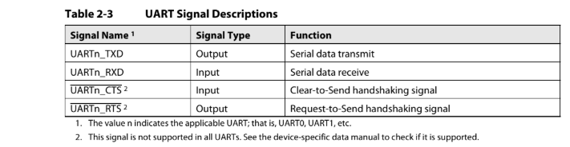
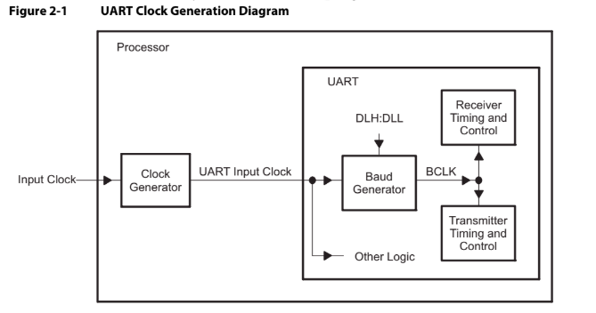
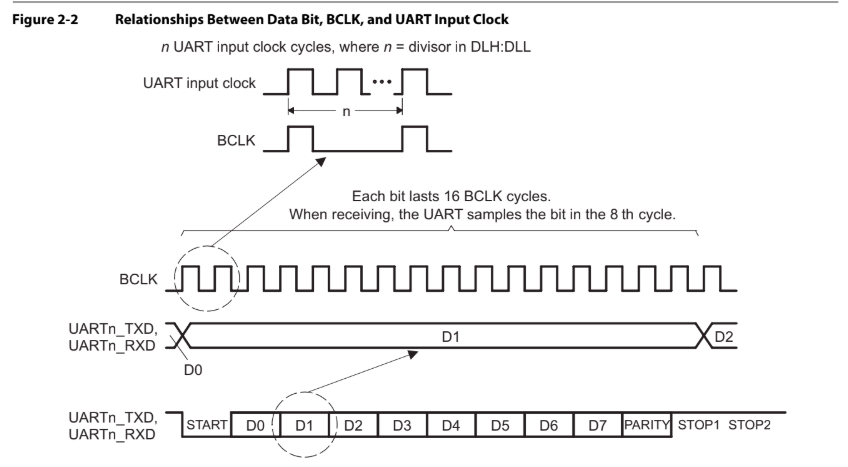
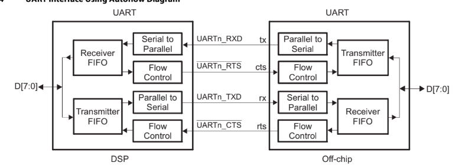
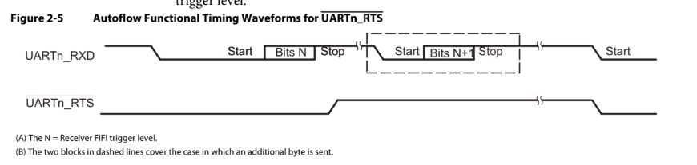
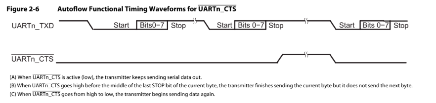

# UART/USART Driver

## Mục lục

1. [Các khái niệm cơ bản](#1-các-khái-niệm-cơ-bản)
   - [1.1 UART là gì](#11-uart-là-gì)
   - [1.2 UART vs USART](#12-uart-vs-usart)
   - [1.3 Đặt tên USART vs UART trong các họ MCU](#13-đặt-tên-usart-vs-uart-trong-các-họ-mcu)
2. [UART Physical Layer](#2-uart-physical-layer)
   - [2.1 UART signals](#21-uart-signals)
   - [2.2 Cross-connect TX↔RX](#22-cross-connect-txrx)
   - [2.3 Logic levels và trạng thái đường](#23-logic-levels-và-trạng-thái-đường)
   - [2.4 Open-drain vs push-pull](#24-open-drain-vs-push-pull)
3. [UART Frame Format](#3-uart-frame-format)
4. [Baud rate & clocking](#4-baud-rate--clocking)
   - [4.1 Clock generation](#41-clock-generation)
   - [4.2 BCLK và oversampling](#42-bclk-và-oversampling)
5. [Flow control](#5-flow-control)
   - [5.1 Autoflow wiring](#51-autoflow-wiring)
   - [5.2 RTS behavior](#52-rts-behavior)
   - [5.3 CTS behavior](#53-cts-behavior)
6. [Các mode nâng cao](#6-các-mode-nâng-cao)
7. [Driver design theory](#7-driver-design-theory)
8. [Tài liệu tham khảo](#8-tài-liệu-tham-khảo)

---

## 1. Các khái niệm cơ bản

### 1.1 UART là gì

UART (Universal Asynchronous Receiver/Transmitter) là peripheral đảm nhận việc chuyển đổi dữ liệu giữa CPU và thiết bị ngoại vi:

- **Chiều nhận**: chuyển chuỗi bit nối tiếp từ thiết bị ngoại vi thành byte dữ liệu song song để CPU đọc (serial-to-parallel).
- **Chiều phát**: chuyển byte dữ liệu song song từ CPU thành chuỗi bit nối tiếp để đưa ra ngoài (parallel-to-serial).

Ngoài chức năng chuyển đổi, UART còn có hai khả năng chính:

- **Điều khiển**: các thanh ghi cấu hình cho phép thiết lập tốc độ truyền, định dạng khung dữ liệu và chế độ hoạt động của đường truyền mà phần mềm không phải can thiệp từng bit.
- **Hệ thống ngắt**: UART có thể phát ngắt tới CPU theo từng sự kiện (có byte mới nhận, truyền xong, lỗi đường truyền...). Hệ thống ngắt này cấu hình được, cho phép phần mềm chỉ tham gia khi thực sự cần — thay vì CPU phải liên tục hỏi vòng (poll) trạng thái đường truyền, UART tự báo khi có việc cần xử lý. Nhờ đó giảm tối đa phần mềm quản lý đường truyền.

Hai đặc tính nền tảng khác của UART:

- **FIFO buffering**: bộ đệm nhận/phát cho phép lưu nhiều byte cùng lúc (chuẩn TL16C550 dùng FIFO 16 byte, mỗi byte trong receiver FIFO kèm thêm bit trạng thái lỗi). Nhờ FIFO, CPU không cần đọc/ghi từng byte ngay thời điểm byte vừa tới — phần cứng giữ byte trong bộ đệm cho đến khi CPU sẵn sàng xử lý.
- **Programmable baud generator**: bộ chia clock lập trình được, nhận clock đầu vào và chia theo hệ số cấu hình để tạo ra clock tham chiếu cho logic thu/phát. Đây là cơ sở để thiết lập tốc độ truyền (baud rate) — chi tiết công thức ở mục [4. Baud rate & clocking](#4-baud-rate--clocking).

### 1.2 UART vs USART

UART và USART đều làm chức năng **asynchronous** giống nhau (không có clock chung, dùng start bit + oversampling để đồng bộ như đã mô tả ở 4.2). Điểm khác biệt nằm ở chữ "S":

- **UART** = **Universal Asynchronous Receiver/Transmitter** — chỉ hỗ trợ chế độ asynchronous.
- **USART** = **Universal Synchronous/Asynchronous Receiver/Transmitter** — hỗ trợ cả **asynchronous** lẫn **synchronous** trên cùng một peripheral.

Ở chế độ **synchronous**, USART xuất thêm một **clock** ra chân `CK` (clock pin) để đồng bộ với thiết bị ngoài. Receiver không cần tự đồng bộ nhờ start bit + oversampling nữa — nó lấy mẫu dữ liệu theo clock mà transmitter cấp, nên không có vùng dung sai lệch clock. Đổi lại, cần thêm 1 chân `CK` và phải kéo dây đồng bộ cùng dữ liệu.

Khi nào dùng synchronous:

- Cần baud cao mà **PCLK không đủ để chạy oversampling 16×** (PCLK quá thấp so với baud mong muốn). Synchronous dùng clock thẳng từ transmitter, baud rate có thể lên tới PCLK (cao hơn nhiều so với PCLK/16 của async).
- Giao tiếp với IC ngoài **bắt buộc synchronous** (SPI-like, codec, FPGA...).
- Cần deterministic timing (không có skew do oversampling).

Khi nào không cần synchronous (asynchronous là đủ):

- Giao tiếp với PC (USB-UART, RS-232), module Bluetooth/Wi-Fi (UART), GPS, debug console — tất cả đều chạy async.
- Khoảng cách ngắn trên board, baud không quá cao.

Trên các MCU hiện đại (STM32, NXP, TI…), peripheral thường được đặt tên `USART` thay vì `UART` để phản ánh khả năng hỗ trợ synchronous mode — dù trong ứng dụng thông thường (debug console, GPS, Bluetooth) vẫn chỉ dùng async. Việc cụ thể instance nào hỗ trợ sync hay không tra trong reference manual của MCU đó.

### 1.3 Đặt tên USART vs UART trong các họ MCU

Cách đặt tên khác nhau giữa các vendor — không có quy ước chung:

- **STM32F4**: `USART1/2/3/6` (full feature) và `UART4/5` (giảm tính năng).
- **NXP LPC**: thường dùng `USART` cho mọi instance, có/không hỗ trợ sync tuỳ từng chip cụ thể.
- **TI Tiva / MSP432**: `UART` cho mọi instance.
- **Renesas RA**: `SCI` (Serial Communication Interface) cho cả async/sync.

Dù tên gọi khác nhau, khái niệm "có hỗ trợ synchronous mode (xuất clock CK) hay không" là phân biệt cốt lõi. Khi phát triển driver cho một MCU mới, bước đầu tiên là tra reference manual để biết từng instance có hỗ trợ async-only hay cả sync.

## 2. UART Physical Layer

### 2.1 UART signals



UART giao tiếp với bên ngoài qua tối đa 4 tín hiệu:

| Signal | Direction | Function |
|--------|-----------|----------|
| UARTn_TXD | Output | Serial data transmit — đưa dữ liệu nối tiếp ra ngoài |
| UARTn_RXD | Input | Serial data receive — nhận dữ liệu nối tiếp từ ngoài |
| UARTn_CTS | Input | Clear-to-Send — tín hiệu bắt tay (handshaking) từ thiết bị đối phương |
| UARTn_RTS | Output | Request-to-Send — tín hiệu bắt tay đẩy ra phía đối phương |

Trong đó **TXD và RXD là bắt buộc** — mọi UART đều có. **CTS và RTS chỉ có trên UART hỗ trợ hardware flow control**; không phải instance nào cũng có. Khi chọn thiết bị cần tra device-specific data manual để biết instance nào hỗ trợ.

Việc instance nào hỗ trợ RTS/CTS (do có hardware flow control hay không) và chân GPIO cụ thể nào mang chức năng TXD/RXD/RTS/CTS tra trong reference manual của MCU và datasheet pin alternate function. Trên các MCU hiện đại, chân thường nằm ở nhiều port khác nhau cho cùng một instance (để dễ reroute khi layout board).

### 2.2 Cross-connect TX↔RX

Khi nối hai UART với nhau, TXD và RXD phải **chéo**:

```
Device A                         Device B
TXD  ----------------------------> RXD
RXD  <---------------------------- TXD
```

TXD là output của A → vào RXD (input) của B; RXD của A nhận từ TXD (output) của B. Nối thẳng TXD↔TXD là sai phổ biến — hai output đẩy đường cùng lúc, ngắn mạch ngắn hạn khi hai bên ở mức khác nhau và không thông tin nào tới được bên kia.

Khoảng cách truyền phụ thuộc vào baud và độ méo cho phép: baud thấp (≤ 9600) UART có thể truyền vài chục mét qua dây đơn giản; baud cao (≥ 1 Mbaud) chỉ nên dùng trên board (vài chục cm). Muốn truyền xa cần transceiver RS-232/RS-485 ngoài để chuyển sang mức điện áp đối xứng.

### 2.3 Logic levels và trạng thái đường

Mức logic UART là CMOS/TTL chuẩn:

| Mức | Ý nghĩa |
|-----|---------|
| HIGH (mark) | VCC của MCU (1.8V / 3.3V / 5V tuỳ thiết kế) |
| LOW  (space) | GND |

Hai trạng thái đặc biệt:

- **Idle state** — khi không truyền bit nào, đường duy trì ở mức **HIGH**. Đây là quy ước mặc định, làm "mốc" để receiver phát hiện khi transmitter bắt đầu gửi.
- **Start bit** — bit đầu tiên của frame, **luôn LOW**. Sườn xuống HIGH → LOW đánh dấu bắt đầu một frame; receiver phát hiện sườn này để đồng bộ nhịp lấy mẫu.

Cuối frame: **stop bit** luôn HIGH. Khi stop bit kết thúc, đường trở về HIGH (idle) sẵn sàng cho frame kế tiếp.

→ Quy ước HIGH-idle / LOW-start có nguồn gốc từ chuẩn từ xa (telegraph: mark = current ON, space = current OFF). HIGH-idle cũng có lợi điểm thực tế: nếu đường bị đứt, receiver đọc liên tục LOW → dễ phát hiện lỗi thay vì tưởng nhầm idle.

### 2.4 Open-drain vs push-pull

UART dùng **push-pull** (CMOS totem-pole) output, khác hẳn I²C dùng open-drain:

- **Push-pull**: TXD output có cả PMOS (kéo HIGH) và NMOS (kéo LOW). Tại mỗi thời điểm chỉ một trong hai dẫn → đường được drive chủ động về HIGH hoặc LOW.
- **Open-drain**: chỉ có NMOS — thiết bị chỉ kéo được LOW; HIGH do pullup resistor ngoài kéo lên.

Tại sao UART dùng push-pull:

- UART là **point-to-point** (1 transmitter ↔ 1 receiver), không có multi-drop hay arbitration → không có nguy cơ hai output đẩy đường cùng lúc như I²C, push-pull không gây short-circuit.
- Push-pull cho **tốc độ chuyển trạng thái nhanh hơn** — cả high→low và low→high đều do transistor chủ động kéo, không phụ thuộc RC pullup. Đây là điều kiện để baud cao (≥ 1 Mbaud).
- **Không cần pullup resistor ngoài** — tiết kiệm linh kiện, đơn giản layout board.

Hệ quả: UART TTL/CMOS chỉ truyền được khoảng cách ngắn. Muốn truyền xa cần transceiver ngoài (MAX232 cho RS-232, MAX485 cho RS-485...) để chuyển sang mức điện áp đối xứng, đẩy khoảng cách lên vài trăm mét tới vài km.

## 3. UART Frame Format

Một frame UART gồm **bốn trường theo thứ tự**:

```
[ START ] [ DATA bits, LSB first ] [ PARITY (optional) ] [ STOP ]
```

| Trường | Số bit | Mức điện mặc định | Ghi chú |
|--------|-------|-------------------|---------|
| Start | 1     | LOW  | Luôn LOW; sườn xuống HIGH→LOW đánh dấu đầu frame |
| Data  | 5 / 6 / 7 / 8 / 9 | tuỳ config | Truyền **LSB trước** (ngược với hầu hết protocol khác) |
| Parity | 0 hoặc 1 | tuỳ data | Optional; bật qua `PCE` (Parity Control Enable) |
| Stop  | 0.5 / 1 / 1.5 / 2 | HIGH | Luôn HIGH; ≥ 1 stop bit bắt buộc |

### 3.1 Start bit

Luôn 1 bit LOW. Đường truyền chuyển từ idle HIGH xuống LOW đánh dấu đầu frame. Receiver phát hiện sườn xuống này để bắt đầu đếm BCLK cho đúng từng bit tiếp theo.

### 3.2 Data bits

Số bit data cấu hình qua bit `M` trong `CR1` (Word Length):

| `M` | Số bit data | Lưu ý |
|-----|-------------|--------|
| 0   | 8 bit       | Mặc định; phổ biến nhất |
| 1   | 9 bit       | Khi bật parity, payload thực tế vẫn là 8 bit (bit thứ 9 bị parity chiếm) |

Khi dùng 9-bit data với parity tắt: data 9-bit thường dùng để phân biệt địa chỉ/data (mode 9-bit, multidrop RS-485 — bit thứ 9 = 1 nghĩa là address byte, = 0 là data byte).

Khi ghi vào thanh ghi `DR` ở 9-bit mode, phải ghi đủ 16-bit (không ghi 2 lần 8-bit) — nếu không shift register sẽ nạp sai, vì hardware tự khóa `DR` cho đến khi nhận đủ 9 bit.

### 3.3 Parity

Bật qua bit `PCE` (Parity Control Enable) trong `CR1`. Khi bật, thêm 1 bit parity ngay sau data:

| `PCE` | `PS` (Parity Select) | Loại parity | Bit parity = ? |
|-------|-----------------------|--------------|----------------|
| 0     | —                     | Tắt          | không có bit parity |
| 1     | 0                     | Even (chẵn)  | tổng số bit '1' (data + parity) là số chẵn |
| 1     | 1                     | Odd (lẻ)     | tổng số bit '1' (data + parity) là số lẻ |

Parity chỉ phát hiện lỗi **1-bit** với xác suất 50% (lỗi 2-bit không phát hiện được). Không có cơ chế sửa lỗi — receiver chỉ set cờ `PE` (Parity Error) trong `SR` khi phát hiện parity sai, application tự xử lý (bỏ byte, xin gửi lại...).

### 3.4 Stop bits

Số stop bit cấu hình qua hai bit `STOP[1:0]` trong `CR2`:

| `STOP[1:0]` | Số stop bit | Thời gian HIGH ở cuối frame |
|-------------|-------------|------------------------------|
| `00`        | 1           | 1 bit time                  |
| `01`        | 0.5         | 0.5 bit time — chỉ dùng ở chế độ smartcard nhận |
| `10`        | 2           | 2 bit time                  |
| `11`        | 1.5         | 1.5 bit time — chỉ dùng ở chế độ smartcard truyền |

Trong thực tế, **1 stop bit là phổ biến nhất** (gần như mọi cấu hình 8N1). Stop bit dài hơn (1.5, 2) đôi khi dùng để tăng robustness: receiver có nhiều thời gian hơn để phát hiện frame kết thúc trước khi dò idle.

### 3.5 Thứ tự bit

UART truyền **LSB trước** (least significant bit first) — ngược với hầu hết protocol khác (SPI, I²C truyền MSB trước). Ví dụ data = 0x53 = `0101 0011`:

```
TXD/RXD: Start  1  1  0  0  1  0  1  0  Stop
              (bit 0)(bit 1)(bit 2)...(bit 7)
```

→ Khi ghi `0x53` vào `DR`, hardware tự động đảo thứ tự để ra LSB trước trên dây. Application không cần lo phần này.

### 3.6 Ví dụ frame 8N1

Cấu hình phổ biến nhất: 8 data bits, No parity, 1 stop bit → ký hiệu "**8N1**". Một frame 8N1 gửi byte `0x53` (`0101 0011`):

```
Idle ─┐                          ┌─ Idle
      │                          │
      │  Start  D0 D1 D2 D3 D4 D5 D6 D7   Stop
      └────────┐ ┌─┐ ┌─┐                 ┌──┐
               │ │ │ │ │                 │
               ┝━┷━┷━┷━┷━┷━┷━┷━┷━┷━┷━┷━┷━┷━┥
               └─┘ └─┘ └─┘ └─┘ └─┘ 1 0 0 1 0 1 0 1
                  1   0   0   1   0   1  1
                 (D7)(D6)(D5)(D4)(D3)(D2)(D1)(D0)
```

Trong đó bit LSB (`1`) đi trước, MSB (`0`) đi sau — đọc ngược lại từ dây sẽ ra `0101 0011` = 0x53.

> Lưu ý: cấu hình word length, parity, stop bits yêu cầu **tắt USART trước khi thay đổi thanh ghi cấu hình** — thay đổi khi đang chạy có thể gây hành vi không xác định. Tên bit/thanh ghi cụ thể tuỳ MCU — xem reference manual tương ứng và `uart_driver.md` cho triển khai cụ thể.

## 4. Baud rate & clocking

### 4.1 Clock generation



Clock cho UART được tạo theo chuỗi hai khối:

1. **Processor clock generator** — nằm ngoài UART — nhận clock từ nguồn ngoài và tạo ra **UART input clock** với tần số lập trình được.
2. **Baud generator** — nằm trong UART — nhận UART input clock và chia theo hệ số cấu hình (ghi trong hai thanh ghi **DLH** (byte cao) và **DLL** (byte thấp) của UART TI) để tạo ra **BCLK** — clock tham chiếu nội bộ cho logic thu và phát.

UART input clock ngoài việc cấp cho baud generator còn được đưa thẳng tới **Other Logic** bên trong UART. BCLK điều khiển nhịp lấy mẫu và dịch bit của cả hai chiều:

- **Receiver timing and control** — BCLK quyết định khi nào lấy mẫu giá trị trên dây RX.
- **Transmitter timing and control** — BCLK quyết định khi nào đưa bit tiếp theo ra dây TX.

**Quan hệ giữa BCLK và baud rate:**

| Oversampling | BCLK so với baud rate | Mỗi bit kéo dài | Lấy mẫu ở chu kỳ thứ |
|--------------|-----------------------|------------------|------------------------|
| 16×          | 16 × baud             | 16 BCLK          | 8 (giữa bit)           |
| 13×          | 13 × baud             | 13 BCLK          | 6                      |

Chọn chế độ 16× hay 13× bằng bit `OSM_SEL` trong thanh ghi **MDR** (Mode Definition Register). Trong 16× mode mặc định, việc lấy mẫu ở giữa bit cho phép bù lệch pha giữa hai thiết bị (transmitter và receiver không cần chia sẻ clock, chỉ cần cùng baud rate danh định).

**Công thức divisor** (tính hệ số chia cho baud generator):

```
Divisor = UART Input Clock Frequency / (Desired Baud Rate × 16)   [16× mode]
Divisor = UART Input Clock Frequency / (Desired Baud Rate × 13)   [13× mode]
```

Kết quả chia phải là số nguyên nằm trong khoảng 1..65535 (do divisor được lưu trong hai thanh ghi 8-bit DLH:DLL = 16-bit). Khi ghi DLH:DLL, baud generator cần 2 wait state để nạp giá trị mới — driver phải đợi xong trước khi bật TE/RE.

→ Tên thanh ghi cụ thể để lưu divisor (ví dụ `BRR` trên STM32, `DLL:DLH` trên TI UART, `UBRD` trên MSP430...) khác nhau giữa các họ MCU, nhưng khái niệm "chia clock đầu vào theo hệ số cấu hình để ra BCLK" là phổ quát. Chi tiết triển khai cho STM32F4 xem ở `uart_driver.md`.

### 4.2 BCLK và oversampling



Hình Figure 2-2 cho thấy quan hệ thời gian giữa ba mức clock trong UART:

- Một chu kỳ **BCLK = n chu kỳ UART input clock**, với `n` chính là divisor đã nạp trong `DLH:DLL` (TI) hoặc tính ra từ `BRR` (STM32).
- Mỗi **bit dữ liệu** trên dây (TXD/RXD) kéo dài **16 chu kỳ BCLK** trong chế độ 16× oversampling (mỗi bit ~16 BCLK ÷ 16 baud = 1 baud period).
- Khi **nhận** (RX), UART **lấy mẫu giá trị bit ở chu kỳ BCLK thứ 8** — tức giữa bit, để tránh lấy phải thời điểm đang chuyển trạng thái.

**Ý nghĩa của oversampling:**

- UART là **asynchronous** — hai thiết bị đầu cuối không có clock chung, mỗi bên tự lấy mẫu theo clock nội bộ của mình. Nếu clock hai bên chỉ lệch 1%, sau 10 bit đã lệch đến 10% một bit → có nguy cơ lấy mẫu nhầm sang bit kế tiếp.
- Oversampling 16× (lấy mẫu ở giữa bit, có 8 chu kỳ BCLK dư trước và sau) tạo **vùng dung sai (tolerance window)**. Khoảng lệch cho phép giữa hai clock là ~±1/16 bit time (~6.25%) trước khi lấy mẫu chệch sang bit khác.
- Oversampling càng cao (16×, 13×) → dung sai càng lớn → đường truyền càng robust, nhưng tốn tài nguyên và giới hạn baud rate tối đa (vì BCLK phải ≤ UART input clock).

Lưu ý khi chọn oversampling:

- Hệ số oversampling thấp → **bước nhảy baud thô hơn** (vì fraction của divisor có ít bit hơn), sai số baud rate tăng.
- Receiver có ít chu kỳ BCLK trên mỗi bit → **vùng dung sai clock hẹp hơn** giữa hai thiết bị.
- Oversampling thấp chỉ nên dùng khi input clock **quá thấp không kéo nổi baud rate cao** ở oversampling mặc định (ví dụ muốn baud > input_clock / 16).
- Hệ số oversampling cụ thể (16×, 8×, 13×...) **khác nhau giữa các họ MCU** — tra reference manual tương ứng.

## 5. Flow control

Khi UART RX hoặc TX xử lý không kịp so với tốc độ đường truyền, một trong hai bên có thể bị "ngập" — RX FIFO đầy gây mất byte, hoặc TX gửi đi mà bên kia chưa sẵn sàng nhận. **Flow control** là cơ chế để hai bên điều tiết nhịp truyền, tránh mất dữ liệu.

Hai cách phổ biến:

- **Hardware flow control** — dùng tín hiệu phần cứng RTS/CTS (mục 5.1–5.3 dưới đây).
- **Software flow control** — dùng ký tự đặc biệt trong luồng data (XON/XOFF, ASCII 0x11/0x13) — không có sẵn trong peripheral, do application tự cài đặt và kiểm tra.

### 5.1 Autoflow wiring



Khi nối hai UART với autoflow, ngoài cặp TXD↔RXD chéo còn có thêm cặp RTS↔CTS chéo:

- **RTS** của A nối vào **CTS** của B: A báo "tôi (A) sẵn sàng nhận" → B được phép gửi sang A.
- **RTS** của B nối vào **CTS** của A: B báo "tôi (B) sẵn sàng nhận" → A được phép gửi sang B.

Hai chiều RTS/CTS hoàn toàn độc lập. Mỗi bên có một khối **Flow Control** nằm giữa FIFO và chân ngoài:

- Bên phát: đọc CTS để quyết định có đẩy byte tiếp theo ra TXD hay không.
- Bên thu: theo dõi mức FIFO để kéo/đẩy RTS báo cho đối phương biết còn nhận được hay không.

### 5.2 RTS behavior



RTS là tín hiệu **output** từ UART, mang ý nghĩa "trạng thái sẵn sàng nhận của receiver". Active-low (LOW = ready):

| RTS | Ý nghĩa                                                  |
|-----|----------------------------------------------------------|
| LOW (asserted)   | Receiver FIFO còn chỗ trống — sender được phép gửi tiếp |
| HIGH (de-asserted) | Receiver FIFO đạt trigger level — sender nên dừng     |

**Diễn giải theo timing diagram (Figure 2-5):**

1. Trong khi nhận byte thứ N, khi FIFO vừa đạt trigger level (sau stop bit của byte N), UART kéo **RTS lên HIGH** — báo sender dừng.
2. Sender có thể đã gửi thêm một byte (N+1) trước khi RTS HIGH kịp có hiệu lực (do propagation delay). Sau khi byte N+1 đã nhận xong (sau stop bit của nó), UART kéo **RTS xuống LOW** lại nếu FIFO đã được CPU đọc giảm xuống dưới trigger level.
3. Hành vi này tránh mất byte cuối đang trên đường truyền, đồng thời báo sender biết khi nào FIFO đã rỗng để tiếp tục truyền.

### 5.3 CTS behavior



CTS là tín hiệu **input** vào UART, mang ý nghĩa "phía đối phương cho phép mình gửi hay không". Active-low:

| CTS | Ý nghĩa                                       |
|-----|-----------------------------------------------|
| LOW (active)    | Transmitter được phép gửi data              |
| HIGH (inactive) | Transmitter phải dừng                    |

**Ba quy tắc về timing (Figure 2-6):**

1. Khi CTS LOW → transmitter gửi serial data bình thường.
2. Nếu CTS chuyển HIGH **trước giữa stop bit của byte hiện tại**, transmitter **hoàn thành nốt byte đang gửi** rồi **không gửi byte tiếp theo**. Đảm bảo một frame không bao giờ bị cắt giữa chừng.
3. Khi CTS chuyển từ HIGH về LOW → transmitter **tiếp tục gửi** từ byte kế tiếp.

→ CTS HIGH không cắt ngang frame đang gửi; chỉ chặn các frame tiếp theo cho đến khi CTS về LOW lại. Ngược lại, nếu CTS chuyển HIGH **sau** giữa stop bit (tức byte đang gửi gần xong), transmitter có thể đã bắt đầu byte tiếp theo — frame sẽ dài hơn bình thường (vẫn không bị cắt giữa chừng).

→ Chi tiết timing cụ thể (mốc lấy mẫu CTS, hành vi khi chuyển trạng thái CTS) hơi khác nhau giữa các họ MCU. Một số MCU đặt CTS check ngay đầu frame, số khác đặt giữa stop bit. Tra reference manual tương ứng để biết chi tiết — ví dụ triển khai cho STM32F4 xem ở `uart_driver.md`.

## 6. Các mode nâng cao

Ngoài async/sync tiêu chuẩn, một số USART hỗ trợ thêm các mode chuyên dụng (tính khả dụng tuỳ instance và MCU cụ thể — tra reference manual).

### 6.1 Half-duplex single-wire

Mode này cho phép **TXD và RXD dùng chung một chân duy nhất**:

- Chỉ cần **1 chân GPIO** thay vì 2.
- Dữ liệu truyền/nhận theo **half-duplex** (một thời điểm chỉ một chiều).
- TXD output và RXD input cùng nối vào chân — TXD là push-pull (drive ra), RXD là input high-impedance. Khi không truyền, RXD đọc giá trị từ TXD của bên kia.

Ứng dụng: giao tiếp đơn giản với IC chỉ có 1 chân data, tiết kiệm chân MCU, RS-485 half-duplex (kết hợp với transceiver có chân DE — Data Enable).

Lưu ý: cần đảm bảo TX và RX của hai bên **không cùng lúc đẩy đường** — nếu cả hai cùng gửi, xung đột. Giao thức tầng trên phải quản lý lượt gửi.

### 6.2 Synchronous mode

Khi bật synchronous mode, USART xuất thêm **clock ra chân CK** để đồng bộ với thiết bị ngoài. Cấu hình clock qua 3 tham số:

| Tham số | Ý nghĩa | Giá trị |
|---------|---------|---------|
| Clock polarity | Mức clock khi idle (giữa các bit) | LOW idle / HIGH idle |
| Clock phase | Cạnh clock nào dùng để sample data | Cạnh lên đầu tiên / cạnh xuống đầu tiên |
| Last bit clock | Có xuất clock cho bit cuối (MSB) không | Có / không |

Synchronous mode hoạt động giống SPI nhưng không có CS — vẫn là full-duplex point-to-point với 1 chân CK chung. Dùng khi cần baud rất cao hoặc giao tiếp với IC bắt buộc clock ngoài (codec, FPGA, MCU khác không có clock nội đủ nhanh).

### 6.3 LIN mode

LIN (Local Interconnect Network) là protocol automotive dùng cho giao tiếp nội bộ xe hơi — dựa trên UART nhưng thêm **break field** do master phát để mở đầu frame:

- Master phát **break field** (một khoảng LOW kéo dài, thường 10 hoặc 13 bit time) để báo cho tất cả slave "đang có giao tiếp mới".
- Slave nhận break, đồng bộ baud với master (slave có thể dùng baud khác trước đó), nhận header + data.
- Receiver có cờ báo đã phát hiện break để application xử lý.

### 6.4 IrDA SIR ENDEC

Chuẩn hồng ngoại IrDA (Infrared Data Association) dùng UART nhưng mã hóa dữ liệu thành xung hồng ngoại:

- **Transmitter**: chuyển NRZ (Non-Return-to-Zero) sang **RZI** (Return-to-Zero Inverted) — mỗi bit '0' trong NRZ thành một xung ngắn ở đầu bit, bit '1' thành mức thấp.
- **Receiver**: giải mã ngược từ RZI sang NRZ.

Có hai chế độ pulse width:

- **Normal pulse** (3/16 bit time) — khoảng cách truyền xa hơn.
- **Low-power pulse** (dưới 3/16 bit time) — tiết kiệm năng lượng, khoảng cách ngắn.

IrDA tốc độ giới hạn ở 115.2 kbaud (SIR — Serial Infrared). Ngày nay ít dùng, bị Bluetooth Low Energy thay thế.

### 6.5 Smartcard mode

Smartcard (thẻ SIM, thẻ ngân hàng) dùng protocol T=0/T=1 tương tự UART nhưng có thêm:

- **Guard time** — khoảng idle bắt buộc giữa hai byte.
- **NACK khi lỗi parity** — receiver tự động kéo đường HIGH trong 1 bit time để báo cho smartcard biết đã nhận sai parity, smartcard sẽ retransmit.
- **Stop bits 1.5** cho transmitter, **0.5** cho receiver (đặc thù smartcard).

Ứng dụng: đọc thẻ SIM, thẻ ngân hàng, CCCD.

### 6.6 Bảng tổng kết

| Mode | Chức năng chính | Khả dụng |
|------|-----------------|----------|
| Half-duplex single-wire | TX + RX dùng chung 1 chân | Tuỳ instance |
| Synchronous (CK pin) | Xuất clock ra chân CK | Chỉ USART instance hỗ trợ sync |
| LIN | Break field + auto-baud-detect slave | Tuỳ MCU |
| IrDA SIR | Mã hóa RZI cho LED hồng ngoại | Tuỳ MCU |
| Smartcard | Guard time + NACK + stop bit 1.5/0.5 | Tuỳ MCU |

Các mode nâng cao trên đều có **mutual exclusion** — bật mode này thường disable mode kia (cùng chia sẻ phần cứng nội bộ). Driver chỉ triển khai async thông thường; các mode nâng cao nếu cần sẽ bổ sung ở `uart_driver.md` cùng với bit mapping cụ thể cho từng MCU.

## 7. Driver design theory

Phần này trình bày các **khái niệm chung về thiết kế driver UART**, áp dụng cho mọi MCU có USART/UART peripheral — không phụ thuộc STM32 hay họ MCU cụ thể nào. Triển khai cụ thể cho STM32F4 xem ở `uart_driver.md`.

### 7.1 Mô hình Handle / Config

Hầu hết driver UART dùng hai struct tách biệt:

- **Config struct** — chứa **tham số cấu hình tĩnh**: baud rate, word length, parity, stop bits, mode (TX/RX/TXRX), flow control. Application điền 1 lần trước khi Init.
- **Handle struct** — chứa **con trỏ tới peripheral**, cấu hình đã đăng ký, và **trạng thái nội bộ** cho mode non-blocking (TX/RX buffer, len còn lại, state machine, error code).

Tách biệt Config/Handle cho phép:

- **Tái sử dụng** cùng config cho nhiều instance khác nhau (cùng baud, cùng format nhưng khác USARTx).
- **State nội bộ** (TX len còn lại, RX error flag...) không lẫn vào config — application không phải quản lý thủ công.
- Handle truyền qua API blocking hoặc interrupt đều được — cùng pattern.

### 7.2 Chế độ hoạt động

Có ba cách tổ chức data transfer, tăng dần về độ phức tạp và hiệu năng:

#### a) Polling / Blocking

CPU chờ trực tiếp bằng cách **đọc flag** trong thanh ghi status:

```c
Send_Data:
  while (!flag_TX_empty);    // spin chờ
  write_data_register();
  while (!flag_TX_complete);
```

- **Ưu**: API đơn giản nhất, code ít, dễ debug.
- **Nhược**: CPU bị **block** hoàn toàn — lãng phí thời gian chờ. Không phù hợp với hệ thống đa tác vụ.
- **Dùng khi**: gửi lệnh ngắn, debug console, bootloader — nơi CPU có thể treo một chút.

Cải thiện blocking bằng **timeout**: thay vì spin vô hạn, đếm số lần đọc flag và thoát sau khi hết timeout → tránh treo khi lỗi phần cứng.

#### b) Interrupt

CPU **không chờ**. Application gọi `Transmit_IT()` truyền buffer + len, hàm trả về ngay. Phần cứng UART gọi **interrupt handler** mỗi khi có sự kiện:

- **TXE (TX empty)**: shift register rỗng, sẵn sàng nhận byte kế tiếp → ISR ghi byte tiếp theo từ buffer.
- **TC (TX complete)**: shift register đã đẩy xong byte cuối + stop bit → ISR báo hoàn tất.
- **RXNE (RX not empty)**: đã nhận 1 byte → ISR đọc byte vào buffer.
- **Error (PE/FE/NE/ORE)**: ISR set error code, gọi callback ERROR.

```c
Transmit_IT(handle, buf, len);    // trả về ngay, hàm chính xong việc
// ... CPU làm việc khác ...
// ISR tự động ghi từng byte; cuối cùng gọi callback TX_CMPLT
```

- **Ưu**: CPU rảnh cho tác vụ khác, đáp ứng tốt hơn, phù hợp hệ thống real-time.
- **Nhược**: code phức tạp hơn (phải quản lý buffer, len, state); ISR ngắn phải xử lý nhanh.
- **Dùng khi**: truyền buffer lớn, hệ thống có nhiều tác vụ, yêu cầu latency thấp.

#### d) DMA

CPU **thậm chí không cần vào ISR** trong quá trình truyền. DMA controller tự đọc từ memory và ghi vào thanh ghi data:

```c
Transmit_DMA(handle, buf, len);
// DMA lo; cuối cùng DMA kích ngắt TX_CMPLT, hoặc polling DMA TC flag
```

- **Ưu**: CPU không bận tâm, throughput cao nhất, phù hợp baud rất cao hoặc buffer cực lớn.
- **Nhược**: DMA channel là tài nguyên giới hạn (MCU có vài channel); setup DMA stream phức tạp.
- **Dùng khi**: logging liên tục, giao tiếp với peripheral tốc độ cao, audio streaming.

### 7.3 Callback pattern

Trong chế độ interrupt, driver cần báo cho application biết "đã hoàn tất TX", "đã nhận xong N byte", "có lỗi". Hai cách tổ chức:

#### a) `__weak` function với tên cố định

```c
__weak void USART1_TX_Cplt_Handler(void) {
    // default: no-op
}
```

Application override bằng cách định nghĩa hàm cùng tên trong file khác. Đơn giản nhưng giới hạn 1 callback cho mỗi event trên mỗi instance, khó mở rộng.

#### b) Bảng con trỏ hàm trong Handle

Driver giữ một mảng `USART_Callback_t` đăng ký qua `USART_RegisterCallback(USARTx, callback)`. Application đăng ký callback tuỳ ý, driver gọi từ ISR.

```c
void MyApp_TX_Callback(USART_Handle_t *h, uint8_t event) {
    if (event == USART_EVENT_TX_CMPLT) led_toggle();
}
USART_RegisterCallback(USART1, MyApp_TX_Callback);
USART_Transmit_IT(&hUSART1, buf, len);
```

- **Ưu**: linh hoạt, có thể đăng ký/không đăng ký callback, dễ test với mock.
- **Nhược**: cần thêm 1 lớp indirection.

Pattern này phù hợp với driver đang triển khai cho STM32F4 (xem `uart_driver.md`).

### 7.4 State machine

Driver non-blocking cần theo dõi USART instance đang rảnh hay bận:

```c
typedef enum {
    USART_STATE_READY,
    USART_STATE_BUSY_TX,
    USART_STATE_BUSY_RX,
    USART_STATE_ERROR,
} USART_State_t;
```

Mỗi Handle giữ `TxState` và `RxState`. Application gọi `Transmit_IT` chỉ khi `TxState == READY`. Trong khi truyền, state = `BUSY_TX`. ISR đổi về `READY` khi hoàn tất.

Nếu gọi `Transmit_IT` khi state ≠ READY → trả về lỗi `BUSY`. Tránh được tình huống hai phiên truyền đè lên nhau, làm hỏng buffer pointer.

### 7.5 Error handling

Trong khi nhận, có 4 loại lỗi phổ biến:

| Lỗi | Nguyên nhân | Cách clear |
|-----|-------------|------------|
| **PE — Parity Error** | Bit parity nhận được sai quy ước | Đọc status, đọc data |
| **FE — Framing Error** | Không phát hiện stop bit đúng vị trí | Đọc status, đọc data |
| **NE — Noise Error** | Nhiễu đường dây khiến mẫu bất ổn | Đọc status, đọc data |
| **ORE — Overrun Error** | Nhận byte mới trong khi RXNE chưa được đọc (mất byte cũ) | Đọc status, đọc data |

**Quy tắc chung**: hầu hết cờ lỗi và cờ RXNE **clear bằng đọc status (SR) rồi đọc data (DR)**. Nếu cờ RXNE vẫn set mà application không đọc data kịp, cờ ORE sẽ set — báo "đã mất ít nhất 1 byte".

Driver nên:

- Gom các cờ lỗi vào 1 biến `ErrorCode` (bitmask).
- Gọi callback ERROR với ErrorCode để application xử lý (log, reset buffer, báo lên UI...).
- Trong chế độ DMA multibuffer, có thể cần bật **Error Interrupt Enable (EIE)** riêng để IRQ chỉ phát sinh khi có lỗi, không phải mỗi RXNE.

### 7.6 Pitfalls thường gặp

- **Quên enable clock** cho USART instance + GPIO port trước khi cấu hình — đăng ký vào memory không có tác dụng, không có lỗi trả về.
- **Sai clock source** khi tính baud rate: USART instance dùng bus khác nhau (APB1/APB2 trên STM32) — phải dùng đúng hàm lấy tần số clock.
- **Quên enable NVIC** cho USART IRQ sau khi enable ngắt trong USART — peripheral set cờ nhưng không trigger handler.
- **Ghi đè thanh ghi cấu hình** (M, PCE, OVER8) khi USART đang bật (UE=1) → hành vi không xác định. Phải tắt UE trước.
- **9-bit data + 2 lần ghi 8-bit** vào thanh ghi data: shift register nạp sai vì hardware khoá data register đến khi nhận đủ 9 bit. Phải ghi đủ 16-bit một lần.
- **Quên chờ 2 wait state** sau khi ghi baud generator — baud chưa nạp xong đã bật TE/RE → byte đầu sai baud.
- **Đọc thanh ghi data hai lần** khi clear lỗi — byte "ma" do lần đọc thứ hai trả về gây mất data thật.

> Phần triển khai cụ thể (tên thanh ghi, vị trí bit, tên API, callback signature) cho STM32F4 xem ở `uart_driver.md`.

## 8. Tài liệu tham khảo

- **TI SPRUGP1** — KeyStone Architecture Universal Asynchronous Receiver/Transmitter (UART) User Guide, Literature Number SPRUGP1, November 2010. Nguồn chính cho phần lí thuyết tổng quát (khái niệm phổ quát, không dùng register TI).
- RM0090 (STM32F405/407/415/417), USART chapter (Section 27).
- Datasheet STM32F407VG: pin alternate function mapping (AF7 = USART1/2/3, AF8 = UART4/5/USART6).
