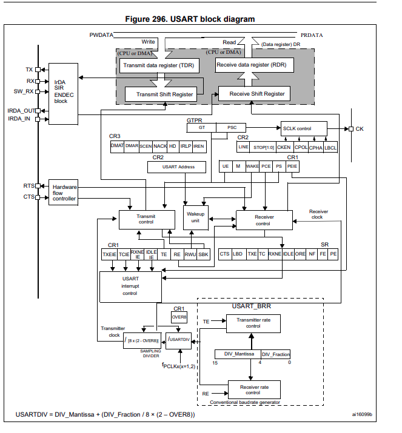
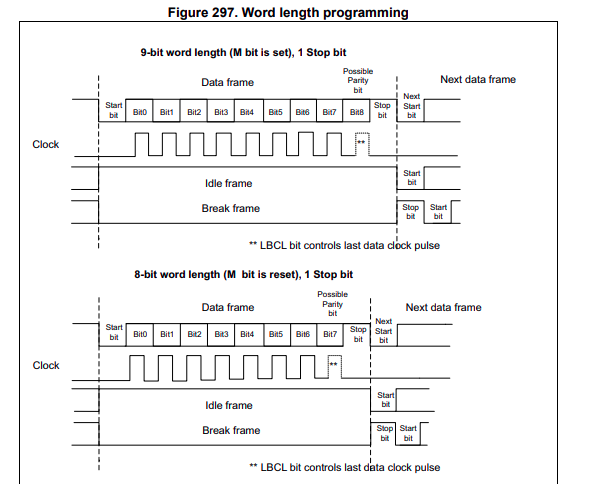
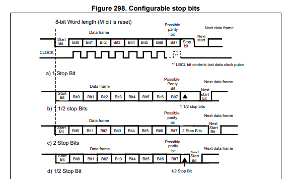
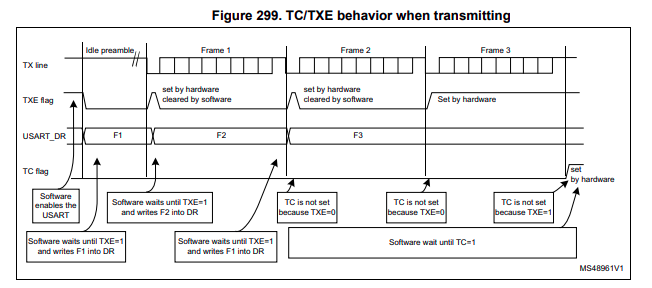
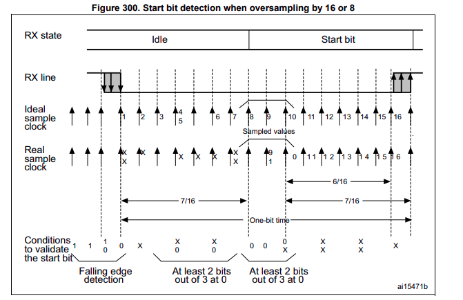
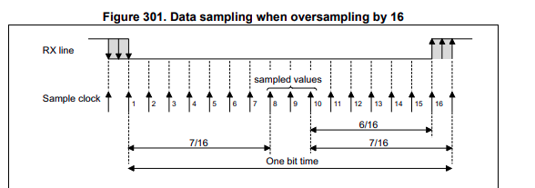
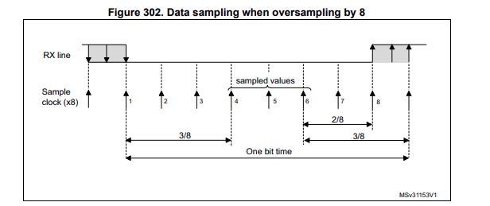

# UART/USART Driver — Lý thuyết peripheral & driver

## 1. Cấu trúc OOP/HAL

Giống mô hình các driver khác trong repo (SPI, I2C, GPIO...), USART chia làm 2 struct:

```c
USART_Config_t   // Config struct — cấu hình USART peripheral
USART_Handle_t   // Handle struct — chứa base address + config + interrupt context
```

### USART_Config_t (dự kiến)

| Field | Ý nghĩa | Giá trị |
|-------|---------|---------|
| USART_Mode | TX / RX / TXRX | `USART_MODE_TX`, `USART_MODE_RX`, `USART_MODE_TXRX` |
| USART_BaudRate | Tốc độ bit (Hz) | `USART_BAUD_115200`, hoặc số bất kỳ |
| USART_WordLength | 8 / 9 bit (CR1.M) | `USART_WORDLEN_8B`, `USART_WORDLEN_9B` |
| USART_Parity | None / Even / Odd (PCE + PS) | `USART_PARITY_NONE`, `_EVEN`, `_ODD` |
| USART_StopBits | 1 / 0.5 / 2 / 1.5 (CR2.STOP) | `USART_STOPBITS_1`, `_0_5`, `_2`, `_1_5` |
| USART_HWFlowControl | None / RTS / CTS / RTS_CTS | `USART_HWCONTROL_NONE`, ... |
| USART_OverSampling | 16 / 8 (CR1.OVER8) | `USART_OVERSAMPLING_16`, `_8` |

### USART_Handle_t (dự kiến)

| Field | Ý nghĩa |
|-------|---------|
| pUSARTx | Con trỏ tới USART peripheral (USART1/2/3, UART4/5, USART6) |
| USARTConfig | Struct config ở trên |
| pTxBuffer, pRxBuffer, TxLen, RxLen | Trạng thái nội bộ cho interrupt-mode — không set thủ công |
| TxState, RxState | `USART_STATE_READY` / `BUSY_TX` / `BUSY_RX` |
| ErrorCode | Cờ lỗi PE/FE/NE/ORE |
| Callback | `USART_Callback_t` gọi trong IRQ khi hoàn tất TX/RX hoặc lỗi |

## 2. Register map (RM0090)

Sơ đồ khối tổng quan của USART (Figure 296, RM0090) cho thấy toàn bộ thành phần phần cứng bên trong và mối liên hệ giữa các thanh ghi cấu hình (`CR1`/`CR2`/`CR3`/`BRR`/`GTPR`), thanh ghi dữ liệu (`DR` chứa `TDR`/`RDR` + 2 shift register), khối baud generator (chia `f_PCLK` theo `USARTDIV`) và các khối chức năng (Transmitter control, Receiver control, Wakeup, IrDA SIR ENDEC, Hardware flow controller, SCLK control, USART interrupt control):



Các thanh ghi chính và offset tương ứng:

| Register | Offset | Vai trò |
|----------|--------|---------|
| SR | 0x00 | Status: TXE, RXNE, TC, IDLE, ORE, FE, NE, PE, CTS |
| DR | 0x04 | Data (TX: ghi, RX: đọc) |
| BRR | 0x08 | Baud rate: mantissa[15:4] + fraction[3:0] |
| CR1 | 0x0C | UE, TE, RE, M, PCE, PS, OVER8, các IE |
| CR2 | 0x10 | STOP[1:0], LINEN, CLKEN/CPOL/CPHA/LBCL, ADD |
| CR3 | 0x14 | RTSE, CTSE, HDSEL, DMAT/DMAR, EIE |
| GTPR | 0x18 | Guard time / prescaler (smartcard, IrDA) |

Đọc sơ đồ theo hướng từ trái sang phải:

- **Bên trái** là các tín hiệu vật lý nối ra ngoài: `TX`, `RX`, `SW_RX` (single-wire RX), `IrDA_OUT`/`IrDA_IN`, `RTS`/`CTS`, `CK` (clock ra ở synchronous mode).
- **Trung tâm trên** là đường dữ liệu song song `PWDATA`/`PRDATA` nối vào bus AHB/APB — đây là cầu nối giữa CPU/DMA và 2 thanh ghi `TDR` (Transmit Data Register, chỉ ghi) và `RDR` (Receive Data Register, chỉ đọc). `TDR` nạp vào Transmit Shift Register để đẩy ra `TX`; Receive Shift Register nhận từ `RX` rồi chuyển vào `RDR`.
- **Giữa** là 3 thanh ghi cấu hình `CR1`/`CR2`/`CR3` điều khiển Transmitter control, Receiver control, Wakeup unit, IrDA SIR ENDEC block, SCLK control (chân `CK`), Hardware flow controller, USART Address (multidrop / 9-bit mode).
- **Dưới cùng** là baud generator: nhận `f_PCLK(x16 hoặc x1)` rồi qua `DIV_Mantissa[15:4]` và `DIV_Fraction[3:0]` trong `USART_BRR`, kèm `OVER8` từ `CR1` để tạo transmitter clock và receiver clock (receiver dùng thêm `Conventional baud rate generator`).
- **Cờ trạng thái `SR`** nằm giữa, vừa điều khiển logic bên trong vừa để CPU đọc qua bus.

## 3. Init sequence (dự kiến)

1. `USART_PeriClockControl()` — enable APB clock (USART1/6: APB2, còn lại APB1).
2. `USART_GpioConfig()` — TX/RX alternate function AF7 (USART1/2/3) hoặc AF8 (UART4/5/6).
3. `USART_Init()`:
   - Clear CR1/CR2/CR3, cấu hình M, PCE/PS, STOP, flow control.
   - Tính và ghi BRR từ baud rate + PCLK (OVER16 hoặc OVER8).
   - Set UE + TE/RE theo mode.
4. Optional: enable interrupt (RXNEIE/TXEIE/TCIE/IDLEIE/PEIE) + NVIC.

## 4. Baud rate calculation

OVER16:

```text
USARTDIV = fPCLK / (16 x baud)
BRR = mantissa << 4 | fraction   (fraction = round(USARTDIV_frac x 16))
```

OVER8:

```text
USARTDIV = fPCLK / (8 x baud)
fraction = round(USARTDIV_frac x 8) & 0x07   (bit 3 của BRR giữ 0)
```

Ví dụ: 115200 baud @ PCLK 16 MHz, OVER16 → USARTDIV = 8.68 → mantissa 8, fraction 0.68 x 16 = 10.88 ≈ 11 → `BRR = (8 << 4) | 11 = 0x8B`.

## 5. API dự kiến

```c
void USART_PeriClockControl(USART_TypeDef *pUSARTx, uint8_t EnorDi);
void USART_Init(USART_Handle_t *pHandle);
void USART_DeInit(USART_TypeDef *pUSARTx);
void USART_GpioConfig(USART_TypeDef *pUSARTx);
void USART_PeripheralControl(USART_TypeDef *pUSARTx, uint8_t EnorDi);
uint8_t USART_GetFlagStatus(USART_TypeDef *pUSARTx, uint32_t Flag);
void USART_ClearFlag(USART_TypeDef *pUSARTx, uint32_t Flag);

/* Blocking */
DriverStatus_t USART_Transmit(USART_Handle_t *pHandle, uint8_t *pTxData, uint16_t Len, uint32_t Timeout);
DriverStatus_t USART_Receive(USART_Handle_t *pHandle, uint8_t *pRxData, uint16_t Len, uint32_t Timeout);

/* Interrupt */
void USART_RegisterCallback(USART_TypeDef *pUSARTx, USART_Callback_t callback);
DriverStatus_t USART_Transmit_IT(USART_Handle_t *pHandle, uint8_t *pTxData, uint16_t Len);
DriverStatus_t USART_Receive_IT(USART_Handle_t *pHandle, uint8_t *pRxData, uint16_t Len);
void USART_IRQHandling(USART_Handle_t *pHandle);
```

## 6. Interrupt events (RM0090)

| Event | Cờ SR | IE | Ghi chú |
|-------|-------|----|---------|
| TXE | TXE | TXEIE | Nạp byte tiếp vào DR; disable TXEIE khi hết data |
| TC | TC | TCIE | Byte cuối đã shift xong — dùng kết thúc TX |
| RXNE | RXNE | RXNEIE | Đọc DR để clear |
| IDLE | IDLE | IDLEIE | Line rảnh sau frame cuối — phát hiện hết gói RX biến độ dài |
| PE | PE | PEIE | Parity error |
| Error (FE/NE/ORE) | FE/NE/ORE | EIE (CR3) | Chỉ phát sinh IRQ khi DMA hoặc multibuffer; đọc SR rồi DR để clear |

Clear flag rule: đa số cờ lỗi/RXNE clear bằng đọc SR rồi đọc/ghi DR; CTS/LBD clear bằng ghi 0 vào bit tương ứng trong SR.

## 7. GPIO alternate function map (STM32F407)

| Peripheral | AF | Chân thường dùng |
|------------|----|------------------|
| USART1 | AF7 | PA9/PA10, PB6/PB7 |
| USART2 | AF7 | PA2/PA3, PD5/PD6 |
| USART3 | AF7 | PB10/PB11, PC10/PC11, PD8/PD9 |
| UART4 | AF8 | PA0/PA1, PC10/PC11 |
| UART5 | AF8 | PC12 (TX), PD2 (RX) |
| USART6 | AF8 | PC6/PC7, PG9/PG14 |

## 8. Tài liệu tham khảo

- RM0090 Section 27: USART.
- Datasheet STM32F407VG: alternate function table.
- `Driver/Core/Inc/i2c_driver.h`, `spi_driver.h`: pattern handle/config tham chiếu.

---

## 9. Ánh xạ tính năng USART1/2/3/6 vs UART4/5 trên STM32F407

STM32F407 có 6 instance giao tiếp nối tiếp. **UART4 và UART5 bị cắt giảm tính năng** so với USART1/2/3/6:

| Tính năng | USART1 | USART2 | USART3 | UART4 | UART5 | USART6 |
|-----------|:------:|:------:|:------:|:-----:|:-----:|:------:|
| Asynchronous mode | ✓ | ✓ | ✓ | ✓ | ✓ | ✓ |
| Synchronous mode (chân CK) | ✓ | ✓ | ✓ | — | — | ✓ |
| Hardware flow control (RTS/CTS) | ✓ | ✓ | ✓ | — | — | ✓ |
| DMA single buffer | ✓ | ✓ | ✓ | ✓ | ✓ | ✓ |
| DMA multibuffer | ✓ | ✓ | ✓ | — | — | ✓ |
| LIN mode | ✓ | ✓ | ✓ | — | — | ✓ |
| IrDA SIR ENDEC | ✓ | ✓ | ✓ | — | — | ✓ |
| Smartcard (T=0, T=1) | ✓ | ✓ | ✓ | — | — | ✓ |
| Half-duplex single-wire (HDSEL) | ✓ | ✓ | ✓ | — | — | ✓ |

**Clock và pin mapping** (tổng hợp từ RM0090 + STM32F407 datasheet):

| Instance | Bus | Clock cấp | AF (chân) | Chân TXD/RXD thường dùng |
|----------|-----|-----------|-----------|----------------------------|
| USART1   | APB2 | PCLK2 (max 84 MHz) | AF7  | PA9/PA10, PB6/PB7         |
| USART2   | APB1 | PCLK1 (max 42 MHz) | AF7  | PA2/PA3, PD5/PD6          |
| USART3   | APB1 | PCLK1 (max 42 MHz) | AF7  | PB10/PB11, PC10/PC11, PD8/PD9 |
| UART4    | APB1 | PCLK1 (max 42 MHz) | AF8  | PA0/PA1, PC10/PC11        |
| UART5    | APB1 | PCLK1 (max 42 MHz) | AF8  | PC12 (TX), PD2 (RX)       |
| USART6   | APB2 | PCLK2 (max 84 MHz) | AF8  | PC6/PC7, PG9/PG14         |

Khi chọn instance:

- **Baud rate tối đa**: PCLK2 (84 MHz, USART1/6) cho baud cao hơn PCLK1 (42 MHz). Với OVER16: baud max = PCLK/16 → USART1/6 ≈ 5.25 Mbaud, USART2/3/UART4/5 ≈ 2.6 Mbaud.
- **Chân TXD/RXD** đa port cho mỗi instance — reroute dễ khi layout board.
- **Tính năng nâng cao** (sync, LIN, IrDA, smartcard, RTS/CTS) **chỉ có trên USART1/2/3/6**. Cần tính năng nào trong số này → chọn một trong 4 instance USART, không dùng UART4/5.
- **UART4/5** đủ cho ứng dụng thông thường (debug console, GPS, Bluetooth) vì chỉ cần async mode.

---

## 10. Ánh xạ thanh ghi cấu hình STM32F4

Tổng hợp các bit dùng để cấu hình thông số frame và baud — chi tiết timing đã mô tả ở `uart.md` (§3, §4).

### 10.1 Cấu hình frame

| Thông số | Bit / Thanh ghi | Giá trị |
|----------|-----------------|----------|
| Số data bit | `CR1.M` | `0` = 8 bit, `1` = 9 bit |
| Parity enable | `CR1.PCE` | `0` = tắt, `1` = bật |
| Parity select | `CR1.PS` | `0` = even, `1` = odd |
| Stop bits | `CR2.STOP[1:0]` | `00` = 1, `01` = 0.5, `10` = 2, `11` = 1.5 |
| TX enable | `CR1.TE` | `1` = bật transmitter |
| RX enable | `CR1.RE` | `1` = bật receiver |
| USART enable | `CR1.UE` | `1` = bật USART (bắt buộc bật cuối cùng) |

#### Word length — `CR1.M`

Figure 297 (RM0090) minh hoạ hai cấu hình word length phổ biến (M=0 8-bit, M=1 9-bit), cùng clock pulse ở chân `CK` và 2 frame đặc biệt **Idle frame** / **Break frame** (dùng trong LIN / smartcard):



Quan sát từ hình:

- **M=1 (9-bit, M bit set)**: data frame chứa `Bit0 … Bit8` — bit thứ 9 là "Possible Parity" (nếu bật `PCE`) **hoặc** bit dữ liệu thứ 9 (nếu `PCE=0`, dùng cho multidrop RS-485, address/data tagging).
- **M=0 (8-bit, M bit reset)**: data frame chứa `Bit0 … Bit7` — "Possible Parity" là bit parity (nếu `PCE=1`); nếu `PCE=0` thì parity trống, frame chỉ có 8 bit data + start + stop.
- **LBCL** (`CR2.LBCL`): quyết định có xuất clock pulse cho bit cuối của frame data hay không. Khi `LBCL=1`, clock có 1 xung thêm cho MSB — RM0090 khuyến nghị set `LBCL=1` để clock không bị cắt giữa chừng khi back-to-back frame.
- **Idle frame**: 1 frame dài bằng data frame nhưng toàn bộ bit = `1` (HIGH), xuất hiện ngay sau khi enable TE — đảm bảo TX line đứng ở idle HIGH trước frame data đầu tiên.
- **Break frame: 1 frame dài bằng data frame nhưng toàn bộ bit = `0` (LOW) — đây là phương pháp phát break trong LIN mode (không dùng nhầm với idle frame).

Khi ghi `DR` ở 9-bit mode, **phải ghi đủ 16-bit một lần** (STM32 hardware lock `DR` cho tới khi nhận đủ 9 bit, không cho phép ghi 2 lần 8-bit liên tiếp vì shift register sẽ nạp sai).

#### Stop bits — `CR2.STOP[1:0]`

Figure 298 (RM0090) minh hoạ 4 cấu hình stop bit (vẽ với M=0, 8-bit data):



Bốn cấu hình (giá trị `STOP[1:0]` ↔ thời gian HIGH ở cuối frame ↔ use case):

| `STOP[1:0]` | Tên | Thời gian | Ghi chú |
|-------------|-----|-----------|---------|
| `00` | 1 Stop bit | 1 × bit time | Mặc định, dùng cho hầu hết giao tiếp (8N1). |
| `01` | 0.5 Stop bit | 0.5 × bit time | **Chỉ dùng cho smartcard ở chiều nhận** (RM0090 yêu cầu). |
| `10` | 2 Stop bit | 2 × bit time | Tăng robustness cho receiver — cho phép clock lệch nhiều hơn. |
| `11` | 1.5 Stop bit | 1.5 × bit time | **Chỉ dùng cho smartcard ở chiều truyền** (RM0090 yêu cầu). |

Khi truyền 2 stop bit (hoặc 1.5 stop bit ở smartcard), TX line giữ HIGH đủ thời gian quy định trước khi bắt đầu frame kế tiếp; receiver dùng khoảng HIGH này để "thở" — xử lý xong byte hiện tại, reset state machine, chuẩn bị nhận start bit của byte sau.

Lưu ý quan trọng từ RM0090: **không được thay đổi `M`, `PCE`, `PS`, `OVER8`, `UE` khi USART đang truyền/nhận**. Phải tắt USART (`UE=0`) trước khi ghi lại.

### 10.2 Baud rate

Thanh ghi **BRR** (Baud Rate Register) 16-bit, chia làm 2 phần:

| Vùng | Bit | Ý nghĩa |
|------|-----|---------|
| Mantissa | `BRR[15:4]` | Phần nguyên của divisor |
| Fraction | `BRR[3:0]` | Phần thập phân (4 bit ở OVER16, 3 bit ở OVER8 với bit `BRR[3] = 0`) |

OVER16 (mặc định):

```
USARTDIV = PCLK / (16 × baud)
BRR = (mantissa << 4) | round(USARTDIV_frac × 16)
```

OVER8:

```
USARTDIV = PCLK / (8 × baud)
BRR = (mantissa << 4) | (round(USARTDIV_frac × 8) & 0x07)
```

**PCLK phải chọn đúng bus:**

- USART1, USART6 → **PCLK2** (APB2, max 84 MHz).
- USART2, USART3, UART4, UART5 → **PCLK1** (APB1, max 42 MHz).

Sai PCLK là lỗi phổ biến nhất — baud thực tế sẽ lệch khỏi mong muốn.

### 10.3 Oversampling

| `CR1.OVER8` | Hệ số | Lấy mẫu ở BCLK thứ | Fraction BRR |
|-------------|-------|----------------------|--------------|
| `0` (mặc định) | 16× | 8 | 4 bit |
| `1` | 8×    | 4 | 3 bit (bit 3 = 0) |

OVER8 tiết kiệm PCLK cho baud cao, nhưng fraction thô hơn (sai số baud tăng) và vùng dung sai clock giữa hai thiết bị hẹp hơn.

### 10.4 Hardware flow control

| Thanh ghi | Bit | Ý nghĩa |
|-----------|-----|---------|
| `CR3.RTSE` | `0` = disable RTS output, `1` = enable |
| `CR3.CTSE` | `0` = disable CTS input, `1` = enable |

Khi `RTSE = 1`: RTS output được kéo HIGH (de-asserted) khi RXNE=1 (đã nhận byte mà chưa đọc). Khi đọc data xong (RXNE clear), RTS quay về LOW (asserted) — sender tiếp tục được gửi.

Khi `CTSE = 1`: CTS HIGH (inactive) → transmitter tự động **không gửi bit tiếp theo** trong frame hiện tại (giữ nguyên frame đang gửi). Khi CTS LOW lại → transmitter tiếp tục.

Khác với TI UART (dùng FIFO trigger level): STM32F4 buffer 1 byte, nên "trigger" cho RTS là RXNE, không phải mức FIFO.

### 10.5 Transmit timing — cờ `TXE` và `TC`

Figure 299 (RM0090) mô tả trình tự set/clear của hai cờ quan trọng nhất trong khi truyền (`TXE` — Transmit Data Register Empty, `TC` — Transmission Complete) qua 3 frame liên tiếp:



#### 10.5.1 Idle preamble — ngay sau khi bật `TE`

Khi software set `TE=1` (và `UE=1`), TX line đứng ở **idle preamble** (HIGH) cho tới khi software ghi byte đầu tiên vào `DR`. Trong khoảng idle:

- `TXE = 1` — `TDR` rỗng, sẵn sàng nhận byte.
- `TC = 1` — transmitter đã rảnh, chưa gửi gì.

#### 10.5.2 Ghi byte đầu (`F1`) vào `DR`

Software đợi `TXE=1`, ghi `F1` vào `DR`. Chuỗi sự kiện:

1. `TXE` **tự clear** ngay sau khi ghi (do `TDR` không còn rỗng).
2. Hardware sao chép `TDR` → Transmit Shift Register; đồng thời `TDR` trống lại.
3. `TXE` **set lại** bằng hardware (set by hardware, cleared by software).
4. Transmitter bắt đầu đẩy frame `F1` ra TX line (start + 8/9 bit data + parity + stop).
5. Khi cả Transmit Shift Register rỗng **và** `TDR` rỗng (đã đẩy xong frame `F1`): `TC` set (do cả hai cờ điều kiện thoả mãn).

Lưu ý: trong khoảng giữa các frame, nếu software không kịp ghi byte kế tiếp thì TX line đứng HIGH (idle gap), `TXE=1` vẫn set.

#### 10.5.3 Frame `F2` — software chờ `TXE=1`, ghi `F2`

Tương tự `F1`. Tuy nhiên **quan sát kỹ cờ `TC`** ở Figure 299:

- Sau frame `F2`, `TC` **không set** dù `TDR` đã trống, vì Transmit Shift Register vẫn đang dịch frame `F2` (TXE=0 vì đã có data trong `TDR` — frame `F3` đã sẵn).

→ **`TC` chỉ set khi cả `TXE=1` và Transmit Shift Register rỗng đồng thời**.

#### 10.5.4 Frame `F3` (frame cuối) — `TC` set thật

Sau khi đẩy xong stop bit của frame `F3`:

- Transmit Shift Register rỗng.
- `TXE = 1` (vì software không ghi thêm byte nào).
- Cả hai điều kiện cùng thoả → `TC` set lần này (set by hardware).

#### 10.5.5 Cách clear cờ `TC`

Hai cách từ RM0090:

1. **Software clear TC**: đọc `SR` rồi ghi `DR` — sequence `(read SR) → (write DR)` clear TC.
2. **Ghi trực tiếp**: ghi `0` vào bit `TC` trong `SR` (bit 6). RM0090 cho phép vì TC là cờ read-write.

Trong polling mode, nếu muốn đợi truyền xong hoàn toàn (bao gồm cả stop bit) thì đợi `TC=1` chứ không phải `TXE=1`. Trong interrupt mode, dùng `TCIE` (bit 6 trong `CR1`) để được báo khi frame cuối đã rời TX line — phù hợp để tắt transceiver RS-485, đưa chân DE xuống LOW…

#### 10.5.6 Pitfall thường gặp

- Nhầm `TXE` với `TC`: `TXE=1` chỉ nghĩa là "có thể ghi byte kế tiếp", chưa nói lên byte trước đã rời TX line hay chưa. Đợi `TC` mới chắc chắn frame đã hoàn tất trên dây.
- Clear `TXE` bằng cách ghi `DR`; nếu muốn clear `TXE` mà không gửi byte (debug), vẫn phải ghi `DR` — không có cách khác.

### 10.6 Receiver timing — start bit detection và data sampling

Figure 300, 301, 302 (RM0090) mô tả chi tiết cách receiver lấy mẫu RX line ở cả hai chế độ oversampling.



#### 10.6.1 Start bit detection — Figure 300

Khi RX line đang idle HIGH, receiver liên tục lấy mẫu để chờ sườn xuống. Quy trình (theo RM0090):

1. **Falling edge detection**: phát hiện được ít nhất **1 mẫu LOW** trong 3 mẫu liên tiếp tại clock 1, 2, 3 (điều kiện `1, 0, 0` — bit 1 = 0, bit 2 = 0; bit 0 = 1 được phép vì có thể là nhiễu ngay trước sườn).
2. **Validation**: 3 mẫu kế tiếp (clock 4, 5, 6) phải có **ít nhất 2/3 mẫu là LOW**. Nếu không, huỷ start (coi như nhiễu).
3. Sau khi validate, **giữa bit start** rơi vào khoảng clock 8 (OVER16) hoặc clock 4 (OVER8) — receiver đánh dấu start hợp lệ, chuyển sang lấy mẫu các bit data.

Khoảng thời gian giữa start được validate đến giữa bit data đầu tiên (bit 0) là **7/16 bit time (OVER16)** hoặc **3/8 bit time (OVER8)**. Khoảng "thở" này chính là vùng dung sai clock cho phép sai lệch baud giữa TX và RX.



#### 10.6.2 Data sampling OVER16 — Figure 301

Với `OVER8=0` (mặc định, OVER16):

- Mỗi bit data kéo dài **16 chu kỳ clock lấy mẫu**.
- Receiver lấy mẫu RX line ở clock **8, 9, 10** (3 mẫu giữa bit).
- Kết quả bit = **majority vote** trên 3 mẫu (2/3 thắng).
- Khoảng cách từ giữa bit trước đến giữa bit kế tiếp = **7/16 + 6/16 = 13/16 bit time**? Thực tế RM0090 đánh dấu **6/16 + 7/16** = tổng 13/16 cộng với phần "thở" trước/sau. Hệ quả: dung sai clock **±1/16 bit time** trước khi majority vote chuyển sang bit lân cận.



#### 10.6.3 Data sampling OVER8 — Figure 302

Với `OVER8=1`:

- Mỗi bit data kéo dài **8 chu kỳ clock lấy mẫu**.
- Receiver lấy mẫu ở clock **4, 5, 6** (3 mẫu giữa bit).
- Majority vote 2/3 cho ra giá trị bit.
- Khoảng cách giữa các lần lấy mẫu giữa bit = **3/8 + 2/8 = 5/8 bit time** (so với 7/16 + 6/16 của OVER16).
- Dung sai clock **±1/8 bit time** — hẹp hơn OVER16 (~6.25% so với ~12.5%).

#### 10.6.4 Bảng tổng hợp — sampling rule

| Thông số | OVER16 (`OVER8=0`, mặc định) | OVER8 (`OVER8=1`) |
|----------|------------------------------|--------------------|
| Số clock mỗi bit | 16 | 8 |
| Clock lấy mẫu (giữa bit) | 8, 9, 10 | 4, 5, 6 |
| Majority vote | 2/3 thắng | 2/3 thắng |
| Validation start (samples LOW cần thiết) | 3/3 hoặc 2/3 | 3/3 hoặc 2/3 |
| Khoảng "thở" trước bit 0 | 7/16 bit time | 3/8 bit time |
| Dung sai baud ± | ±1/16 bit time (~6.25%) | ±1/8 bit time (~12.5%) |
| Sai số baud rate do fraction BRR | nhỏ (4 bit fraction) | lớn hơn (3 bit fraction, BRR[3]=0) |
| Baud tối đa (PCLK=16 MHz) | 1 Mbaud | 2 Mbaud |
| Baud tối đa (PCLK=84 MHz, USART1/6) | 5.25 Mbaud | 10.5 Mbaud |

Hệ quả thực tế:

- **Dùng OVER16** trong hầu hết ứng dụng (debug console, GPS, Bluetooth) — baud rate sai số nhỏ, dung sai lệch clock rộng, đủ robust.
- **Dùng OVER8** chỉ khi cần baud rate rất cao mà PCLK không đủ (ví dụ cần > 5 Mbaud trên USART1/6, hoặc > 2 Mbaud trên USART2/3/UART4/5). Đánh đổi: sai số baud cao hơn + receiver kém robust hơn — yêu cầu clock 2 bên phải chính xác.

#### 10.6.5 Lưu ý khi dùng OVER8

- Bit `BRR[3]` phải giữ 0 ở OVER8 (RM0090 yêu cầu) — chỉ dùng 3 bit fraction `[2:0]`.
- Không thay đổi `OVER8` khi `UE=1` (RM0090 cấm).
- Trong driver, nếu user chọn OVER8 → tính fraction khác OVER16 (× 8 thay vì × 16, rồi mask `& 0x07`).

#### 10.6.6 Lỗi ORE (Overrun Error) — cơ chế

ORE set khi RXNE=1 (data chưa đọc) **mà** byte mới đã được dịch xong vào `RDR`. Hệ quả:

- Byte mới ghi đè byte cũ → mất 1 byte.
- RXNE giữ nguyên (=1), ORE set đồng thời.
- Clear ORE bằng sequence: đọc `SR` (để latch các cờ lỗi), rồi đọc `DR` (clear RXNE/ORE).
- ORE có thể set kể cả khi `RXNEIE=0` (nếu data đến liên tục) — vì vậy driver polling vẫn cần check ORE.

Trong interrupt mode: `EIE` (bit EIE trong `CR3`) cho phép IRQ phát sinh khi có lỗi FE/NE/ORE (mà không cần RXNEIE); kết hợp với `RXNEIE` để bắt cả data và error.

---

## 11. Ánh xạ các mode nâng cao (STM32F4 bit names)

Chi tiết khái niệm của từng mode xem ở `uart.md` §6. Bảng dưới liệt kê tên bit/thanh ghi STM32F4 cụ thể để bật từng mode:

| Mode | Bit / Thanh ghi | Ghi chú |
|------|-----------------|---------|
| Half-duplex single-wire | `CR3.HDSEL` | TXD + RXD nối chung 1 chân |
| Synchronous (xuất clock CK) | `CR2.CLKEN` + `CPOL`/`CPHA`/`LBCL` | |
| LIN | `CR2.LINEN` + `LBDL` (break length 10/11 bit) | Cờ `LBDF` trong `SR` báo nhận break |
| IrDA SIR | `CR3.IREN` + `IRLP` (low-power pulse) | Giới hạn 115.2 kbaud |
| Smartcard | `CR3.SCEN` + `NACK` | Guard time qua `GTPR` |
| Oversampling by 8 | `CR1.OVER8` | Xem §10.3 |

**Khả dụng theo instance** (xem §9): tất cả mode trên chỉ có trên **USART1/2/3/6**, không có trên UART4/5.

**Mutual exclusion**: bật một mode thường disable các mode khác (chia sẻ phần cứng nội bộ). Ví dụ bật `CLKEN` thì `LINEN`/`SCEN`/`IREN` phải tắt.

Driver hiện tại chỉ triển khai async thông thường. Khi cần mode nâng cao sẽ bổ sung sau bằng cách mở rộng `USART_Config_t` với các trường cấu hình tương ứng.
